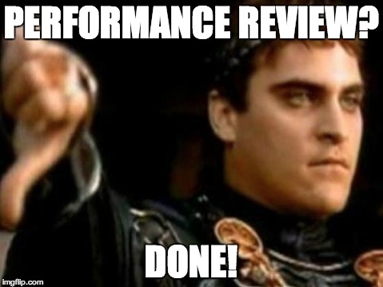
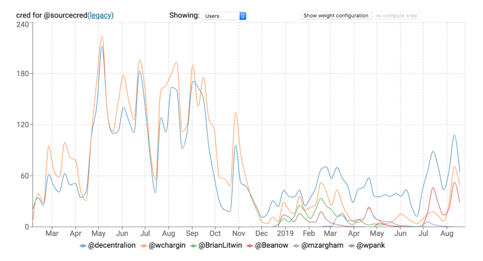
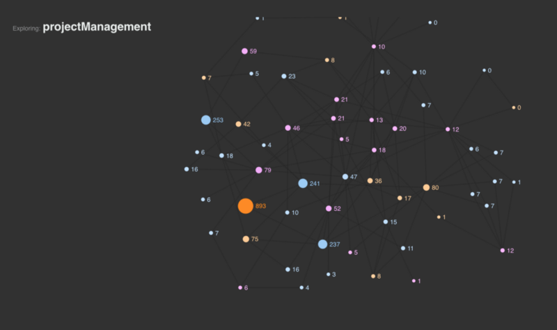

---
title: 'The DAO Missing Link: Reputation Protocols'
authors:
- Seth Benton
tags:
- Governance
- Funding
- SourceCred
- Reputation
categories:
- Blog
date: "2019-09-13T00:00:00Z"
lastmod: "2019-09-13T00:00:00Z"
featured: false
draft: false
toc: true

# Featured image
# To use, add an image named `featured.jpg/png` to your page's folder.
# Placement options: 1 = Full column width, 2 = Out-set, 3 = Screen-width
# Focal point options: Smart, Center, TopLeft, Top, TopRight, Left, Right, BottomLeft, Bottom, BottomRight
image:
  placement: 2
  caption: ''
  focal_point: ""
  preview_only: false

# Projects (optional).
#   Associate this post with one or more of your projects.
#   Simply enter your project's folder or file name without extension.
#   E.g. `projects = ["internal-project"]` references `content/project/deep-learning/index.md`.
#   Otherwise, set `projects = []`.
projects: []
---

It’s time to call it. 2019 is indeed the [year of the Decentralized Autonomous Organization (DAO)](https://hackernoon.com/2019-is-the-year-of-daos-9728618873f5). The term DAO, once tainted by the disastrous [DAO hack](https://www.coininsider.com/what-happened-to-the-dao/?source=post_page---------------------------) of 2016, has regained its luster, with an explosion of new DAOs, DAO platforms and tools to support them.

I can barely contain my excitement. DAOs are not just some conceptual pipe dream for me. I work in one. For the last year, I’ve paid my rent [working](https://medium.com/@seth.benton/i-dump-coins-on-you-ee6db4331e18) in the Decred DAO as a technical writer/developer. And it’s **_far_ better than any company I’ve worked for.** Let the revolution begin!

My excitement however, is bounded. DAOs still face some big, unsolved challenges. Until they’re addressed, DAOs cannot be truly decentralized. Centralized entities are still necessary. And those centralized entities can only responsibly delegate power to entities that they **_trust_**. This, I’ve realized, is the missing DAO link.

To establish trust, DAOs typically rely on some type of reputation system. Recently, I’ve been exploring a new reputation protocol, [SourceCred](https://sourcecred.io/), and getting excited. It could potentially solve some really difficult problems around reputation, and push decentralization forward. It’s also been a good excuse to go down the reputation system rabbit hole and see what other DAOs are doing. In this post, I’ll dive into the SourceCred algorithm, along the way defining the general problems DAOs face, and exploring the tradeoffs involved.

### What is a DAO?

What constitutes a DAO is a subject of great debate. Fundamentally, a DAO is an organization that is both autonomous and decentralized. Autonomous in the sense that there are hard-coded rules that define how the organization behaves. This can take the form of smart contracts executing pre-defined rules, members voting to enforce or change the rules, or some combination of both. The organization must also be decentralized; i.e. the DAO’s rules should not be defined and enforced by a centralized entity, but by members of the DAO. While decentralization exists on multiple dimensions, and always on a spectrum, it generally means that no centralized party (internal or external) can seize control of the organization. DAOs are typically permissionless, allowing members to be pseudonymous to avoid censorship.

### What is SourceCred?

SourceCred is a reputation protocol for open collaboration. As the name suggests, SourceCred is a tool for attributing credit for open source contributions. Its flexible plugin architecture allows any type of contribution — writing code, filing bugs, mediating forums, organizing events, making art, etc., to be credited. These contributions are connected to each other based on their relationships. For example, a pull request may fix a particular bug, and a code review may review that pull request. This network of contributions and relationships form a contribution graph. SourceCred applies the [PageRank](https://en.wikipedia.org/wiki/PageRank) algorithm (what Google uses to rank webpages) to this graph, generating a score, called cred, for every contribution. Cred is a metric that describes every contribution and contributor in a project, giving a sense of how important they were. More broadly, cred can be viewed as a proxy for reputation.

)](SourceCred_art.png)
Artistic rendering of SourceCred contribution graph (cred: [@Brutalfluffy](http://twitter.com/Brutalfluffy "Twitter profile for @Brutalfluffy"))

### Challenges

While DAOs sidestep many problems with “the firm”, and unlock potentially revolutionary new forms of collaboration and production, they face significant challenges. In particular, how to reward members. DAOs are exploring many models for this. Each with its own set of challenges. But all face fundamental challenges around coordination, governance and valuation.

### Coordination

DAO members are often pseudonymous, globally distributed and do not know each other very well. This makes it difficult for participants to build trust by traditional means. They must therefore must build trust by other means. Typically this is done using some form of reputation protocol.

Reputation protocols typically employ one of two basic strategies: measuring reputation based on past behavior, or measuring reputation based on a trust graph (i.e. the trustworthiness of connections). Both of these approaches are vulnerable to Sibyl attacks, where an attacker creates a large number of pseudonymous identities and uses them to gain a disproportionately large influence.

If DAOs measure reputation based on past behavior, an attacker can fraudulently gain reputation by simulating good behavior, or by working for Sibyl identities that rate their behavior. If measuring reputation based on trust graphs, an attacker can gain reputation by connecting to their Sibyl identities.

Reputation-based networks such as Google, Facebook and Twitter defend against Sibyl attacks (fake users, bots, spam links, etc.) by using proprietary, closed-source data and algorithms trained to identify and kill Sibyl identities. DAOs, by definition, cannot do this without introducing centralization.

Here, SouceCred can help by enabling the creation of Sybil-resistant identity models, as meaningful contributions over time are difficult for bots to fake; in cases where bots can make meaningful contributions, they may be considered valid in some contexts.

### Governance

Perhaps the most difficult coordination problem DAOs face is reaching consensus on important decisions without relying on a centralized authority (i.e. decentralized governance). While it is possible for DAOs to use off-chain governance, where decisions are made at the social layer (reddit, GitHub, etc.), to avoid centralization, most DAOs reach consensus via some form of voting.

A wide variety of voting mechanisms are being explored. From 1-person-1-vote, to stakeholder voting, to experimental new voting mechanisms such as Quadratic Voting (QV) and Knowledge-extractable Voting (KEV), DAOs are trying it all.

A major challenge here is that most voting mechanisms are identity based, opening them to Sibyl attacks. 1 person 1 vote, for instance, will be highly vulnerable to Sibyl attacks unless the DAO has highly Sibyl-resistant identities. Voting mechanisms that do not rely on human identities (e.g. stakeholder voting, or 1 coin 1 vote), risk a “rich get richer” scenario, where large holders can use their voting power to collude and form cartels to exploit smaller holders — precisely what many DAOs are trying to escape. Here, robust reputation protocols become critical.

To improve decision quality, many governance systems aim to verify not only that a voter is human, but that they also have some trustworthy characteristic, used to weight votes.

Similar to how Proof-of-Work (PoW) provides public blockchains like Bitcoin a sibyl-resistant way for miners to vote on the validity of transactions, SourceCred provides “Proof-of-Contribution” (PoC), a sibyl-resistant way to allocate governance power. Due to the richness of the SourceCred contribution graph, and the open, plugin structure that allows filtering and valuation by any heuristic, contributions can reflect any characteristic, including labor, capital invested, social impact, etc.

### Valuation

Perhaps the most vexing challenge is how to reward members for their contributions. To maintain decentralization, DAOs need mechanisms for valuing contributions that do not rely on a centralized authority. As seen in centralized systems such as corporations, subjective valuations can be used to reward loyalty or retaliate against those that challenge the existing power structure.

### Objectivity

Many DAOs attempt to avoid centralization vectors related to subjectivity by using objective metrics. This could be time spent performing a specific role ($/hr), units of work produced (e.g lines of code) or measures of performance (e.g. usage of lines of code). While this can introduce objectivity, it also suffers from a “flattening effect”, whereby value not measurable by metrics is not rewarded, shifting power to those defining and working for the metrics. This could lead to, for instance, a further devaluation of social and emotional labor in relation to coding and other more easily quantifiable work. Metrics will also be gamed, leading to less fair distribution and potentially unethical behavior. This problem is amplified in a DAO, where participants are often pseudonymous (free from IRL consequences), and often engaged in activities that transcend traditional employment roles. Members are free to add value in different domains, at different levels, and collaborate in new creative ways; if they are not paid for that work, the value prop vs traditional companies diminishes.

### Subjectivity

Humans can be brought into the loop to fill the gap left by objective metrics. However, this must be done with care. Simply delegating the subjective judgement around metrics to certain members risks reintroducing the same centralization DAOs seek to avoid.

> “Meet the new boss same as the old boss”

> \-The Who’s “Won’t Get Fooled Again”

### Intersubjectivity

Good valuation is difficult, and often [intersubjective](https://en.wikipedia.org/wiki/Intersubjectivity), blending objective data and subjective human judgement. To date, most intersubjective approaches have been successful only for certain limited use cases.

One popular approach, for instance, is bounties. With bounties, the DAO scopes an item of work (e.g. a code feature), puts a price on it, and posts a bounty to a site such as GitCoin. It then pays out only when the work has been completed to the satisfaction of the DAO. This has the benefit of being permissionless, capturing more complexity than traditional metrics are capable of, and eliminates the risk of the DAO paying for work that never materializes. However, estimating costs in projects of any complexity is notoriously difficult, and labor intensive. If the bounty is complex enough, neither party can reliably estimate how long a contribution will take, introducing risk to both parties. Further complicating matters, even if the cost of labor is estimated reasonably, the value of a contribution to the overall project is often not evident when the bounty is created, but only discovered with time.

Because the SourceCred contribution graph is composed of both contributions and contributors, it is inherently intersubjective. Cred scores are driven primarily by human judgements and interactions, similar to the way Google search rankings are driven primarily by human-curated backlinks. By combining these subjective judgements with data and sophisticated algorithms in a principled and transparent way, SourceCred is able to create scores that are better than either data or judgement alone can produce. It can also value contributions retroactively, updating cred scores over time as new information emerges, and rewarding contributions that become important.

### Proof-of-X

SourceCred’s focus has been initially on GitHub. Its default weights have been carefully designed to provide useful scores “out of the box” for Open Source Software (OSS) projects — though projects have considerable power to change the algorithm to suit their needs. Below is a graph showing cred over time for the SourceCred GitHub repo (hosted instance [here](https://sourcecred.io/cred/timeline/@sourcecred/) if you want to tweak the default weights).

Contributions need not be limited to GitHub though, or any single platform. A Discourse plugin is [in the works](https://discourse.sourcecred.io/t/sneak-peek-sourcecred-discourse-plugin/171), which will allow incorporation of more non-code contributions. Plugins that allow arbitrary-defined contributions and metrics are also on their way, which will allow DAOs to plug any type of valuation framework into SourceCred, or vice versa. At a recent hackathon, SourceCred jammed with some DAOists to visualize how this might look, with custom graphs representing project management, logistics, emotional labor, and other types of contributions (hosted instance to play with [here](https://sourcecred.io/odyssey-hackathon/)).

Because of the richness and robustness of the contribution graph, SourceCred can produce metrics that express nearly any community value. When input into consensus mechanisms, such as for governance or valuation, these metrics can serve as Sibyl-resistant votes weighted via “Proof-of-Community-Value”.

*   **Proof-of-”work”:** If just scoring activity on GitHub (the current default), cred scores serve as a proxy for labor; specifically the sum value of individual contributions a contributor has made over time.
*   **Proof-of-domain-expertise:** If contributions are filtered by domain (we only include certain repos, or use some other heuristic that filters out certain patterns (e.g. documentation)), cred scores serve as a proxy for domain expertise.
*   **Proof-of-comittment:** If contributions are weighted higher if their contributor has been contributing to the project longer than other contributors, cred serves as a proxy for commitment.
*   **Proof-of-ideation:** If contributions are weighted higher if that contribution leads to other completed work (e.g. a GitHub issue that is subsequently referenced by pull requests implementing a suggested feature), cred becomes a proxy for ideation.

*   **Proof-of-recruitment:** If contributions are given higher weight if they come from an existing contributor interacting with a new contributor who sticks around and keeps contributing, cred becomes a proxy for recruitment.
*   **Proof-of-defender:** if contributions related to identifying and killing Sibyl identities (bots, malicious actors, etc.) are given higher weight, cred becomes a proxy for defending the DAO.

The possibilities are endless. Much like google searches.

### Dogfooding Reputation

While the project is still young, DAOs are starting to notice. SourceCred is the planned reputation system for [The DAO](https://unchainedpodcast.com/why-ryan-zurrer-would-like-to-see-a-new-dao/) — another shot at the original, ill fated [DAO](https://medium.com/swlh/the-story-of-the-dao-its-history-and-consequences-71e6a8a551ee). A recent hackathon project created the [credao](https://devpost.com/software/credao), which hooks SourceCred into an Aragon DAO, allowing the DAO to airdrop tokens to participants based on cred.

SourceCred is also starting to put its protocol to use. While it does not yet have a DAO, SourceCred will soon begin dogfooding the protocol internally. Starting in October, SourceCred plans to begin paying contributors to the project via [Open Collective](https://opencollective.com/sourcecred) based on the cred they earn working on the project. For details, check out the [The CredSperiment](https://discourse.sourcecred.io/t/introducing-the-credsperiment/183). Could go horribly wrong — why they’re trying it internally first before recommending other projects put real money on it. But shouldn’t be boring:)