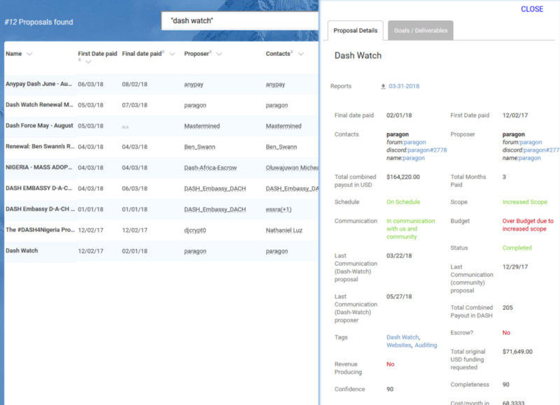
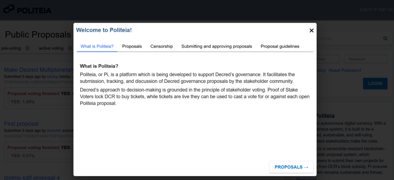

This post considers the funding of blockchain projects through treasuries owned and operated by stakeholders. Specifically, it re-visits the Dash Treasury DAO and its support services, and considers what Decred can learn from this example ahead of the upcoming launch of [Politeia](https://docs.decred.org/governance/politeia/). It also sets out some broad differences between the approaches of Dash and Decred, and considers how autonomous funding fits with [commons based peer production](https://en.wikipedia.org/wiki/Commons-based_peer_production).

### How are cryptocurrency projects funded?

Projects with autonomous funding are in the minority, before diving into those it is worth considering how funding works in the cryptocurrency space more generally, and the challenges of its effective allocation.

The following categories capture the broad strokes:

- A — **Ad hoc** funding by holders or other parties. Bitcoin follows this kind of model, some developers are independently wealthy and don’t need to be paid, others are paid by an individual or group to work on something which has value for that party. Monero also has this kind of approach, with a [Forum Funding System](https://getmonero.org/forum-funding-system/) where people can donate to specific sub-projects. Ad hoc donation drives are common to quite a few other projects.
- B — **Centralized Organization** holds funds and has a mission which includes developing software for the blockchain, and probably some other research or promotion. This could be a not-for-profit organization (e.g. [Ethereum Foundation](https://www.ethereum.org/foundation)), but often the organization holding or receiving funds is a for-profit company (e.g. [Zcash](https://z.cash/about.html) Electric Coin Company and [EOS](https://eos.io/documents/block.one - EOS Token Purchase Agreement - September 4, 2017.pdf) with Block.one). Most projects that fund(ed) development through an **ICO** have some sort of centralized organization in charge of those funds.
- C — **Decentralized Autonomous Organization** (DAO) controls funds directly, there is some mechanism for making transactions that send these funds to people in exchange for their work. Funding for this approach tends to come from a portion of the **block reward**, so it is a steady stream rather than initial lump sum.

There are very few projects with a functioning DAO so far. **Dash** is the only one I know of that’s been doing it for a while, its DAO is quite basic. I have [written in some detail about Dash’s Treasury](https://medium.com/@richardred/observations-of-the-dash-treasury-dao-c94231b2b5c4), and won’t repeat much of that here.

**PIVX** was forked from Dash and so has [the same model](https://pivx.org/governance/) — although moving to incorporate PIVX holders who don’t run MasterNodes. There are however quite a few projects which are transitioning from B to C — Decred, [Cardano](https://eprint.iacr.org/2018/435), Horizen (which is [signed up](https://blog.zencash.com/zencash-treasury-and-voting-model-update/) to use some version of the treasury system IOHK develop for Cardano), and EOS ([worker proposal system](https://medium.com/eoseoul/eos-worker-proposal-system-announcement-e6b3e8084e6b) funded by a portion of inflation).

Projects that aspire to Decentralized Autonomous funding face a number of challenges. Funding work through donations or non-profits is a much more established model where there is a rich history outside the blockchain space to learn from.

Here’s one framing of (some of) those questions/challenges:

- What kind of projects should the treasury fund? How much of the budget should be used for different aspects? These are questions of strategy.
- How can the budget be most effectively deployed to these ends? Who receives payments and when/how/why? How does the treasury get good value for money and avoid being ripped off.
- Although changing consensus rules is a separate issue, it is closely related to funding of the work required to implement a change to the consensus rules.
- Besides questions of treasury spending, what else should the project’s decentralized autonomous decision-making apparatus be used for? Conventional organizations consist of much more than a series of financial transactions, how much of that does a decentralized organization need to replicate or emulate? Should it be setting policies, hiring and firing staff, approving name changes?
- Who should have voting rights? How should votes be tallied or weighted?
- How can the expertise and time of decision-makers be best utilized? Different participants will have different backgrounds and expertise, more or less able to make informed judgments in different domains. Participants will have varying amounts of time to spend voting, too many proposals to review and vote on may result in voter fatigue and apathy. This is a general problem with any form of direct democracy.
- The system also needs to be robust against attempts to abuse it by bad actors.

### Dash

For the purposes of this post it is sufficient to state that Dash’s treasury governance happens on-chain, it is proposal-based and every month the MasterNode Operators (MNOs) vote to decide how that month’s superblock Dash will be distributed. Each proposal has a wallet address, the protocol makes transactions sending the requested Dash to the addresses of winning proposals in the superblock. Any Dash not sent to winning proposal wallets is burned.

It is worth noting that the Dash DAO funds a centralized company, the Dash Core group. MNOs have the power to de-fund the Core group, but Core usually gets the Dash it requests from the treasury. I’m not aware of any successful proposals that have interfered with the approach of the Dash Core group in any meaningful way. As of August 2018, [Dash Core has 70 paid team members, and a burn rate of $452k per month](https://www.dash.org/forum/threads/proposal-core-team-compensation-august.39328/).

Given the rough outline of the Dash treasury above, the on-chain component needs quite a lot of off-chain support to work well. The key requirement is to fund the best proposals, but that’s a complex problem to try and solve. Here are some of those needs, to frame the description of the support services below:

- MNOs should be able to access information about the proposals and voting outcomes. Their on-chain description is fairly minimalist (a short title, wallet address, requested number of Dash over number of payments).
- MNOs should have a place to discuss the proposals, and ideally gather/share information about them and perform some due diligence.
- MNOs should be able to engage in dialogue and negotiation with proposers about the details of their proposal.
- MNOs should be able to decide on and state what they’re looking to fund. The system is structured to accept or reject whatever is submitted, improving the relevance or quality of incoming submissions would make a big difference.
- MNOs should have a way of tracking funded proposals and evaluating their outcomes, to facilitate learning about the types of proposal and proposer which deliver the most value.
- Mechanisms that make it more likely the recipients of funding will deliver what they proposed would be good. Payment up front is vulnerable to exploitation, alternatives are difficult to achieve in a decentralized fashion.

#### Dash Treasury support services

The social spaces occupied by the Dash community are part of its treasury governance. The Dash Discord has a number of channels for discussing proposals, and some running proposals have their own channels. The Dash forum also has [boards for discussion of pre-proposals and funded proposals](https://www.dash.org/forum/topic/budget-proposal-discussions.141/). The pre-proposals board seems well used, it is common for people to submit a post there before the official proposal. With a proposal fee of 5 Dash, it makes sense to run a proposal past the community before submitting.

The following support services are specific to the treasury, the ones in bold are quite new and will be described below.

- [Dash Central](https://www.dashcentral.org/) — I described it in [my previous post](https://medium.com/@richardred/observations-of-the-dash-treasury-dao-c94231b2b5c4) so won’t go into any detail here. It facilitates creating Proposals, and displays all existing Proposals along with their meta-data, a description field, and a space for comments
- [Dash Vote Tracker](https://dashvotetracker.com/past.php) — Lists proposals and votes, links to Dash Central proposals
- [**Dash Nexus**](https://www.dashcentral.org/p/dashnexus-strv) — Not completed yet, but has been funded to develop a new primary platform for the treasury
- [Dash Ninja ](https://www.dashninja.pl/)— Monitors MasterNodes, also has proposal and voting information
- [**Dash Intel**](https://dashintel.org/) — Treasury monitoring data and analytics
- [**Dash Watch** ](https://www.dashwatch.org/)— Tracking progress and outcomes of funded proposals
- [**Dash Boost**](https://www.dashboost.org/) — Micro proposal system for low budget proposals

#### Dash Watch

As someone who’s interested in how the treasury performs, a service that follows up on funded proposals to see how they did sounds great. Between Dashvotetracker and Dash Central one can get a pretty good picture of what proposals were submitted/approved, and probably a good chunk of the discussion for each — but once proposals are funded they don’t see a lot of action there and many have tended to drop off the radar.

Dash Watch was [funded initially](https://www.dashcentral.org/p/Dash-Watch) in November 2017, and received [further funding](https://www.dashcentral.org/p/DashWatchRenewal) in May 2018. The funding renewal proposal asked for USD $71k per month, casual inspection of the budget suggests that around **$50k** of this is needed to cover the ongoing cost of Dash Watch, with the remainder being used to develop new features. The budget indicates there are 5–7 full time staff working on Dash Watch.

I am a big fan of Dash Watch, I think it’s one of the best projects the Dash Treasury has funded. I’m going to be frank with some criticisms though, because this post is partially about figuring out how Decred should solve some of the same challenges.

Dash Watch is not well integrated with other governance platforms. When looking at proposals on Dash Central, there is no way to follow a link to the information relevant to that proposal on Dash Watch, I couldn’t find a better way of getting there except using the dodgy search.

Dash Watch proposal view

Much of the information collected and presented about proposals is very good, it includes:

- contact details/usernames for proposer
- USD$ figures for funding requested and funding received, based on the Dash to USD exchange rate at proposal submission and at payout(s) time. Putting these together shows whether the proposal received more or less USD equivalent than they asked for
- categorizations related to progress and scope/budget changes, probably useful for filtering proposals
- information about the responsiveness of proposal contacts
- A field for whether the proposal uses Escrow — i.e. were they given the Dash directly or is someone holding it in escrow until they meet targets
- some numbers for “Confidence” and “Completeness”
- payout schedule, whether payouts are complete
- a set of events and milestones — these don’t render very well on the proposal page but there are calendars and timelines where they work well

Each month, Dash Watch produces a pdf report about each of the active proposals. I think the monthly reports are progress updates and the final one has more detail.

My understanding is that a template is sent around to the owners or leaders on proposals and they fill it in and send it back to DW. Some of that information ends up on the proposal’s overview on DW, but there is a lot more detail in the report.

These reports are usually 4–8 pages long, they provide an executive summary, some information about how budget was used, any adjustments to plan, and a review of milestones met. Milestones have a verification status, which usually links to some evidence that shows the milestone was met.

There is no doubt considerable value in this reporting. For multi-month proposals or follow-on proposals, deciding whether to fund the project should in large part be about assessing whether it is making adequate progress and dealing with any unforeseen challenges in a sensible way.

There is also a cost to this reporting, in terms of DW time spent requesting and processing the reports, but also the time of all the proposal owners who complete these monthly reports. The MNO time spent reading them could also be considered as part of their cost.

The core challenge here is furnishing the MNOs with good information about how funded proposals are progressing, so that they can 1) decide whether to continue funding them, and 2) understand whether and why a proposal exceeded expectations or unperformed.

DW has inserted itself between the proposal owners and MNOs, it interacts with them on the MNOs behalf and presents that information to the wider community.

In terms of how this challenge could be tackled differently, I’m wondering:

- whether the proposal owners couldn’t submit their reports and verification materials directly to a public repository in most cases
- what role DW plays, or could play, in giving proposals a thumbs up or down to receive more funding

The value of DW to the treasury is proportional to how much use the MNOs make of it. Detailed reports are great, but if only 10% of MNOs are reading them their value in serving their intended purpose could be quite limited.

I’m curious about the numbers for Completeness and Confidence that DW provides for each proposal, they look like 0–100 scores. Providing this kind of simplistic high-level overview, or even a direct recommendation about continued funding, would make the work of DW much easier to digest for MNOs. However, this would come at a cost of giving DW significant influence over the treasury’s funding decisions. If DW were seen as an arbiter of a proposal’s esteem with the MNOs, that position would be vulnerable to corruption.

This kind of dynamic crops up repeatedly. There are many decisions to be made where one can’t really make an informed choice without investing quite a bit of time to understand the detail, or bringing some background knowledge to the table. A large set of voters can’t all do that, and so in practice they will, and should, rely to some degree on the perspectives of trusted individuals. These trusted individuals become important within their domains, and to the overall success of the endeavor.

#### Dash Boost

Dash Boost (DB) is a solution to another manifestation of this problem of MNO attention. The Dash Treasury is not equipped to handle a large number of proposals, because MNOs do not have the capacity to review a large number of proposals. The 5 Dash proposal fee limits the total number of proposals and effectively excludes small budget proposals.

Dash Boost aims to solve this with a “micro-treasury”, where proposal fees are lower (although still 1 Dash) and budgets are limited to 15 Dash. Decisions about what proposals to fund are made by coin-voting, users can sign up with DB and associate an address with their account, then vote with the weight of their available Dash.

According to the [original proposal](https://www.dashcentral.org/p/gc-dash-boost), successful DB proposals would be funded by surplus funds in the “GreenCandle escrow services wallets” — GreenCandle is a user who provides escrow services to proposals, sometimes they don’t claim all the Dash GreenCandle was holding for them.

DB itself would be maintained by collecting the proposal fees of micro-proposals.

DB follows some of the principles of the Treasury, but is a centralized service provided by GreenCandle, who makes payouts to successful micro-proposals directly.

As of August 2018, there are 226 users registered with DB. There have been 62 proposals, 22 funded. Many of the funded proposals are for small amounts (e.g. 0.25 Dash, for proposals like “[Tip the Venezuelan kiosk lady](https://www.dashboost.org/proposals/view/22/Tip the Venezuelan kiosk lady (or: 1 less Lambo for TroyDash))”).

It is hard to tell how much value has been derived from DB funded micro-proposals, and for small sums it doesn’t make sense to put much effort into assessing that. DB is quite susceptible to manipulation, but GreenCandle could just refuse to play along with proposals that looked like manipulation. As the stakes are small DB probably isn’t worth manipulating anyway.

I like the idea of a funding mechanism for small projects, quite a lot. I’m not sure coin-voting is a good fit for this, but as decisions are ultimately at the discretion of an individual what matters more is whether it’s producing good outcomes. I’m not going to spend the time to form an opinion on that.

#### Dash Nexus

Dash Nexus is [still in development](https://www.dashcentral.org/p/dashnexus-strv), it aims to provide a new platform for coordinating proposal submission, discussion and voting information.

One of the promised features of Dash Nexus is tighter integration with Dash Watch. For me, information about proposals pre, during and post-funding should be available on the same platform, with as much detail about the history of the proposal as possible.

#### Dash Intel

[Dash Intel](https://dashintel.org/) and [Dash Ninja](https://www.dashninja.pl/) are like block explorers but dedicated to data on the Treasury and MasterNode voting. Dash Intel also adds some categorizations for proposals, similar to the coding I used for my last post on Dash.

### Proposal assessment or due diligence

When reviewing the history of Dash Treasury proposals it quickly became apparent that the MNOs have quite a hard task there. There are often 20 or more proposals in a month, scattered across a variety of domains, and there can be several asking for large sums or presenting detailed plans.

Making this even harder is the fact that winning proposals by default immediately receive the Dash they requested for the first month’s work. This means that trust in the proposers and confidence that they are not scammers who will disappear with the Dash comes strongly into play. Beyond that, there is usually also the question of how *well* the proposers will deliver what they promised, and usually something that has been done well is worth a lot more than an equivalent product that has been completed to some minimal acceptable standard or as a box-checking exercise.

The treasury needs to behave with quite a high degree of intelligence in this regard, and it could be worth funding services that aim to provide it with better intelligence.

I am aware of only one successful proposal from Dash’s history which attempted something like this. A proposal by two brothers to [record a video each month about all of the new proposals](https://www.dashcentral.org/p/Proposal-Reporting) was funded in November 2017, it received 3 payments totaling $41k in USD equivalent. According to the [final report on Dash Watch](https://dashwatch.org/files/1520242171182.pdf), the videos received relatively few views (around 400 each, there were over 4,000 MasterNodes).

Choosing trusted experts to review all of the new proposals is an interesting approach worthy of consideration.

The Mason Brothers proposal seems flawed in that it is unlikely two people would have the breadth of expertise necessary to provide insightful reviews on the range of subjects the proposals touch. This would be better approached on the basis of domain expertise.

Nominating experts is tricky because those experts could become a weak point for corruption to seep in. If an expert’s verdict on a proposal holds enough sway to deliver a Yes vote, that’s open to abuse.

Ideally a range of experts would just chime in with their independent views on the value or feasibility of a proposal. This is actually quite feasible for a blockchain community, depending on the community. There can be a range of genuine experts on a subject who care enough to provide evaluations or critiques of proposals.

I haven’t seen much evidence of this on the Dash Central proposals, but it might happen on the Dash forum, which I have spent much less time looking at. On Dash Central one does see some comments from prominent community members who are effectively vouching for the proposer as someone they know or who they spoke to and seemed legit. I didn’t analyse this formally, but on casual observation it seemed to help a proposal’s chances of success.

In some areas, like marketing, it seems less likely that there would be a panel of experts willing to do the necessary fact-checking and legwork (for free) to establish whether the proposal’s approach is realistic or delivers value for money.

Funding the work that goes into these reviews would be quite worthwhile, if it could be done in a way which delivered solid impartial information to the decision-makers and was resistant to bribery. That’s a tough nut to crack. Some sort of reputation system that associated a reviewer’s recommendations with proposal outcomes may be a good starting point.

### Decred

As this is written with Decred and Politeia in mind, it is worth briefly describing how Decred’s approach contrasts with Dash’s.

Taken from latest iteration of [test-proposals.decred.org](http://www.test-proposals.decred.org/), “Read More” page — September 4th 2018

Decred’s treasury governance is for now an entirely off-chain affair. The portion of Decred’s governance that is on-chain relates to validating the work of miners and changing the consensus rules.

Ten per cent of Decred’s block reward goes into a [treasury address](https://explorer.dcrdata.org/address/Dcur2mcGjmENx4DhNqDctW5wJCVyT3Qeqkx). So far, that wallet is administered by the Decred Holdings Group. That will continue to be the case for some time, in Politeia’s first incarnation it will effectively be about making signal votes that tell the human operators of that wallet what to do with it.

Treasury funds sit in a wallet with no special rules about when they must be spent, unlike Dash’s “spend it or burn it” superblocks. Decred’s treasury has savings.

Decred’s treasury uses US Dollars as the unit of account, rates of pay are specified in USD and paid out in DCR at a rate averaged out over the month in which the work was conducted. The volatility of cryptocurrency prices has caused numerous issues for Dash, as proposals regularly receive payouts that represent significantly more or less value than they had budgeted for.

A number of [blog](https://blog.decred.org/2017/07/25/Decred-Recruiting/) [posts](https://medium.com/@NoahPierau/how-to-join-the-decred-development-team-ad2475d8d99c) have been written about Decred’s recruitment philosophy. Here’s my bullet-point take on it:

- Show up, see what’s going on.
- Say what you’d like to work on, do people seem enthusiastic? If they are enthusiastic they’ll probably give you some advice on what to do next.
- Do a small amount of work, ask for it to be reviewed.
- If established contributors in that domain think your work is good, you’ll be invited to bill for it at an hourly rate.
- Work on stuff the community values, bill by the hour. It will be reviewed and if it is approved you will be paid.

So far, the question of what constitutes useful work is answered on the basis of rough consensus. The project’s [constitution](https://docs.decred.org/getting-started/constitution/) is relevant to this too, as it defines some objectives and exclusions (e.g. proprietary software).

When Politeia launches for real, there will be a mechanism for formalizing, refining, extending and amending the definition of what constitutes valued work.

Although the data for Politeia is stored off-chain (to conserve block space), it is anchored to the Decred blockchain in a couple of ways:

- [**dcrtime**](https://github.com/decred/dcrtime) is used to make proposals “**censor-proof**” — users can prove when they have been censored, and what has been censored. Politeia content is hashed and the hash is embedded in the Decred blockchain. Politeia users have cryptographic public/private key pairs, they receive censorship tokens when submitting proposals and can use these to demonstrate that a specific proposal was submitted before a specific time/block.
- **Snap votes** are used to approve or reject proposals, when voting opens for a proposal every **ticket** that was live in that block can signal a Yes or No vote for that proposal within the voting window (default 1 week). Voting happens from within a wallet that holds live tickets.

Doing treasury governance off-chain allows Decred to take a more iterative and agile approach to figuring out how it should work.

Some other considerations that have gone into Politeia’s design:

- There is a small registration fee (< $10), to serve as a barrier to spammy comments and manipulation of the reddit-style up/down voting.
- The platform is highly transparent, non-members can see all proposals and comments, and also which accounts the up/down votes on comments came from.
- Proposals can be edited by the proposer in response to community feedback until voting begins. This is to give the community greater scope to shape a proposal or negotiate terms with the proposer.
- The version history of proposals is retained, and comments are indexed against proposal versions.

### Treasury Problems and Solutions

#### Payment up front or in arrears

Project treasury type funds are interesting in that they don’t belong to anyone in particular but are instead created to serve some purpose — it can look a bit like “free money”, and attract scammers who try to obtain it.

The goal of a Treasury is to distribute this money in a way which efficiently furthers the project’s aims. A big question here is **whether to make payments up-front or in arrears**, or some combination of the two, or different approaches in different contexts.

Dash’s Treasury is geared towards payment up front, but payment in arrears happens too through indirect means:

- The MNOs increasingly prefer proposals that ask for smaller amounts in monthly installments. This seems like an obvious choice, but earlier in Dash’s history it seemed that once a multi-month proposal was funded it would usually remain funded for the duration. Now the preference seems to be for proposals that cover 3–5 months and cover some phase of a project, with later phases to be submitted as new proposals. Payment on an ongoing basis is more resilient to scammers than one-off payments.
- Escrow providers are quite common, they are trusted parties that hold the Dash until milestones are met. Dash Core group acts as an escrow provider sometimes.

The [Cardano Treasury paper](https://eprint.iacr.org/2018/435) makes (or made) some harsh criticisms of Dash’s Treasury DAO but had absolutely nothing to say about whether payment should be made up front or in arrears, defaulting to payment up front. Through [engaging in some discussion](https://forum.cardano.org/t/the-cardano-treasury-paper-refers-to-the-dash-treasury-as-an-example-but-doesnt-address-any-of-the-issues-that-can-be-observed-from-the-history-of-the-dash-dao-some-statements-it-makes-about-dash-are-inaccurate-and-unsourced/13525/4) about the paper I realized this has big implications for the role of **trust** in the system.

When payments are made up-front it is important that the treasury trusts the recipient, proposals from people or groups who are unknown to the community or who have no stake in it will be less likely to secure any significant funding. This works to the advantage of the “core team”, or whoever has been building the blockchain until its treasury is switched on. This entity has a huge advantage in that it is already trusted by the community, the risk that they turn into a bad actor would be perceived to be low. Every other entity is at a disadvantage because they have had no opportunity to prove that they can be trusted with the community’s funds.

Payment in arrears shifts some of that trust onto the entity or mechanism for deciding when payment has been earned. If the entity that approves payment is trusted, this mitigates some of the risk associated with proposals from unknown proposers.

#### Setting a strategy

One weakness of Dash’s Treasury is that it struggles to allow the MNOs to tell the world of potential proposers what they want to fund. It is structured around accepting or rejecting whatever proposals are presented as complete packages.

It is possible to use a Dash Treasury proposal to hold a vote on some matter of policy, but the 5 Dash fee to submit proposals makes this unlikely. With the financial best case scenario being the return of that 5 Dash, it is an unattractive proposition to anyone who is not a Dash whale.

These proposals do happen, and I described some in my last post about Dash. Policy type proposals from outside the Core group are rare, and their approval is even rarer. Here’s a [recent one](https://www.dashcentral.org/p/demote-ryan-taylor-to-an-advisory-role) as an example, and [one from the Core group](https://www.dashcentral.org/p/coreteammerge0918).

I think it’s fair to say that the 5 Dash fee limits the degree to which proposals can be used by people outside the core group to try and amend the course the project is taking.

#### **Spam resistance**

A fee of 5 Dash sets quite a high barrier for all potential proposal submitters, for six months out of the last year it has been worth USD $2,000 or more. This excludes many potential proposal submitters, and biases the system towards a smaller number of bigger-budget proposals.

The stated reason for the fee is to prevent spam, and it does quite a good job of this. The on-chain footprint of proposals might introduce a need to limit their number, but this decision also relates to the MNOs capacity to assess and vote on proposals.

Decred also adopts a fee for submitting proposals but sets this much lower, at around $10. A team of administrators will review incoming proposals and censor those which violate a set of rules, so that proposals that are approved for public display do not break any laws and meet some minimum threshold.

Spam can come in forms other than proposals though. Any open community platform that facilitates a project’s governance well is likely to be subjected to spam and sybil style attacks. These may be just about denial of service , or they may attempt to spoof community support for some perspective or course of action.

If I recall correctly based on discussions with some Dash community members, Dash Central is no longer open for anyone to create an account and participate in discussions of proposals, because this was abused. I believe new accounts are limited to MNOs now.

Decred’s Politeia is looking for a balance between openness of participation and cost to sybil attack. A fee of less than $10 for creating an account sets quite a low barrier to participation, but increases the cost of a sock-puppet army significantly.

Politeia will also record the history of accounts’ contributions in some detail and up/down voting on comments will be a matter of public record. Transparency is another way to limit the influence an entity can have by controlling multiple accounts.

#### Proposals and/or people

Dash Treasury proposals bundle the work and the people who will complete it together tightly, but this may not always be the best approach. It is possible to address the following questions separately:

- what constitutes valuable work that should be funded?
- who should be paid to complete that work?

The answers can be configured in various ways:

- people can be hired or appointed to decide what constitutes valuable work, the same (or other) people can hire and manage staff to do that work, or contract it out — this is how conventional companies predominantly operate
- the collective decides what constitutes valuable work directly, and appoints/hires managers to get it done, either by hiring other people to do that work or contracting it out
- the collective decides what constitutes valuable work directly and also hires or contracts for the completion of that work directly
- the collective decides what constitutes valuable work directly by funding projects that bundle the work and the workers together

One relevant piece of scholarly work on this subject is Ronald Coese’s [The Nature of the Firm](https://onlinelibrary.wiley.com/doi/pdf/10.1111/j.1468-0335.1937.tb00002.x), which frames this (broadly) as a balance between transaction costs of a market-based approach (contracting the work out) and administration/efficiency costs of hiring and managing employees.

Dash’s model mixes conventional hierarchical organization of employees (Dash Core Group) with contracting (the remainder of the budget). In a kind of weird quirk, the conventional centralized organization with employees is embedded within the smart-contract-constituted DAO, as a contractor.

At the DAO smart contract level the MNOs have a fairly passive role which is mostly about saying Yes or No to whatever potential contractors propose. Crucially, there are usually no formal legal contracts. The Dash MasterNode collective [is represented by a legal entity now](https://www.dashforcenews.com/dash-core-group-becomes-first-legally-dao-owned-entity/), but that legal entity’s purpose seems to just be owning Dash Core. I’m not clear on whether that entity can enter into contracts with proposal owners. Contractual obligation doesn’t seem to have been a feature of how the Treasury has operated thus far.

One of the big takeaways from Dash’s history for me is that the proposals that delivered the most value were typically quite small in budget, but allocated that budget to **people who had a strong and sustained presence in the community**.

Dash’s Treasury is not designed to facilitate that kind of sustained collaboration and the building up and retention of skill-sets within the community. People who rely on the Dash Treasury for their income are living on the edge, there is always a chance that their active proposal could be pushed down the ranks and out of the funding in the next superblock by some last-minute MasterNode votes.

### Funding fit for commons-based peer production

In [*Coase’s Penguin, or Linux and the Nature of the Firm*](https://arxiv.org/abs/cs/0109077)*,* Yochai Benkler describes commons based peer production as a kind of third way of organizing the production of information goods — one which doesn’t have to rely on a centralized authority to direct the endeavor and intellectual property law to control it and make it profitable, but instead invites anyone to make use of the information good, see how it works, add to it, and build livelihoods on top of it.

Open Source Software is one of the most compelling examples of commons based peer production, producing by far the best solutions to some of our most critical computing needs.

One way to look at **cryptocurrencies** is as **very successful vehicles for funding open source software projects**. When a blockchain has a built-in mechanism for funding development work, it is in a sense open source software that can fund its own development. That is pretty awesome.

This is more or less how I understand **Decred’s ideal approach to treasury governance** now: it would be something that’s **custom made to fit with commons based peer production**, an upgrade to bolster the efficiency of this means of production and tailor it to the blockchain context.

OSS developers, or their supporting organizations, usually have to do something tangential to writing code that they freely give away in order to derive an income from that activity. Decred is free of that constraint, it generates its own money, and 10% of it is designated at its creation to furthering the project’s aims.

Decred is attempting to make the answer to the question “how do I get paid for contributing to this project?” as similar as possible to “how do I make a useful contribution to this open source project?”. The philosophy that “If you make good contributions they’ll be incorporated” is extended with “and we have a pot of money to pay you for that”.

**Autonomy** is a key concept for Decred, and this is not just for the collective but for the individual stakeholders and contributors. This is also true of commons based peer production, where one of the advantages of the approach is derived from the efficiency with which individual actors can direct their own efforts — or circumventing the inefficiency of management and top-down control.

Decred contributors do not boss or manage other contributors, they choose what to work on and can ask for help with things. For individual contributors to be empowered to exercise their initiative and problem-solving ability, there has to be some room for decision-making that is delegated to the people who are working most directly on a problem. Quite a few of the community’s discussions recently are about where to draw this line.

Attracting talented people to join the community is going to be an important determinant of which projects succeed. The way the treasury operates has a big impact on workers, it should be designed to make working on the project attractive. That doesn’t have to mean a high rate of pay. Many people value things like autonomy and flexibility in their work, and have a desire to work on cool projects. Many people also value security, so having one’s income be tied to the outcomes of last-minute MasterNode vote jockeying could be quite off-putting.

Blockchains are a special class of open source software though, where forks are particularly costly and changes to the software can have significant socioeconomic implications. **Another objective of Decred’s governance is making sure the network coheres around a single chain**. That means limiting the autonomy of contributors to working on software which follows the consensus rules as determined and enforced by the Voter constituency.

The blockchain is the foundation or heart of the whole endeavor, it should shape how the many off-chain components of the project operate. **Contributing should be permission-less, but should have to fall within the consensus view of what a useful contribution is, to be compensated**.

I would guess that people generally don’t want to be bossed around by or at the whim of an inhuman assortment of smart contracts, or have to consult this to make low-level decisions. A decentralized Autonomous Entity (DAE) that is oblivious to the humanity of its constituents and treats them as cogs in a machine would not be a lot of fun to work for. Ultimately, that would undermine its chances of success.

Hierarchical and market based production both have strong associations with centralized authority. Peer production diminishes the power of centralized authorities, but in the blockchain space the decentralized organization does need some way of ensuring consensus and coherence, that the contributions of individuals come together to form part of a meaningful whole.

**Politeia then, is for me mostly about making sure that everyone is on the same page about where this project is going, and what constitutes useful work**. It distributes the power to make these decisions among stakeholders, proportional to the number of tickets they have.

The Decred Treasury is a pot of money that contributors can draw on to compensate them for their time and pay for useful services. **Politeia is in part a conflict resolution mechanism, for finding consensus on controversial issues by having ticket-voters step in where there would usually be an authority figure (formally or informally).** It is also partially about guarding the Treasury against malfeasance and waste, because a big common pool of money that people help themselves to is itself a tragedy of the commons waiting to happen.

Elinor Ostrom’s work on the [governance of common pool resources](https://books.google.co.uk/books/about/Governing_the_Commons.html?id=4xg6oUobMz4C&hl=en) is also highly relevant here, I am still unpicking how it applies in this context and mining it for ideas.

Blockchains are more than software, they derive their value from their networks of users. This means that the scope of Decred’s Treasury extends beyond paying software developers into other domains which may not fit so neatly into a system designed to fit commons based peer production. That’s where things will get really interesting, where the challenges that Decred’s treasury faces are more similar to conventional organizations and where solving them in an decentralized open source way could be quite significant.

### Decred’s consensus

When I started following Decred almost one year ago, I was waiting for Politeia to launch so that the *real* governance could start. It took me some time to realize that it was already happening, mostly on [Slack and the other bridged communication platforms](https://decred.org/community/).

Now, with the launch of Politeia imminent, my sense is that there is already strong consensus in the Decred community on what the project is about, and Politeia is just a tool to push that forward and avoid getting stuck discussing controversial issues *ad nauseum*. The community has already benefited from Politeia, in that arguments have been shelved on the basis of “let’s just wait for Politeia to sort this out”.

I’m excited about Decred because of what that consensus is about. If you look at what key contributors talk about when they’re setting the agenda, it is mostly about how to derive public benefits from this technology.

The Politeia platform itself is [designed to address issues of silent censorship](https://blog.decred.org/2017/10/25/Politeia/) and social media manipulation. These are broad problems and Decred is deliberately taking them on and making its solution accessible, to other projects in the space but also beyond. When Politeia first appeared, it came with a [competition](https://medium.com/decred/politeia-platform-challenge-e8542c31ad1d) that encouraged people to develop use-cases that had no direct benefit to Decred. There are already [politicians in Brazil using dcrtime](https://www.reddit.com/r/decred/comments/8znzaq/votolegal_first_presidential_candidate_in_brazil/) to record their donations transparently through a service called [VotoLegal](https://votolegal.com.br/).

A [new kind of Decentralized Exchange (DEX)](https://blog.decred.org/2018/06/05/A-New-Kind-of-DEX/) seems to be the big ticket item that Jake Yocom-Piatt at least is most looking forward to putting to Politeia. His case for that proposal is all about the societal need for a good DEX and what he thinks it would look like. The most common criticism I have seen of that proposal is “What’s in it for Decred? Won’t this also help our competitors?”, and the answer is that helping the space more broadly is not a bad thing but in fact quite desirable.

I really hope that this broader view of what the project treasury is for prevails when people start voting on proposals. For me, **Decred is about building strong open source decentralized infrastructure solutions to problems that actually exist**. The need for those goes far beyond the cryptocurrency space, and I hope that as the project grows so too will the scope and ambition of the challenges it takes on.

I think this could also be a shrewd move for DCR. Consider the kind of money that is being spent on marketing in the cryptocurrency space, and what that’s being spent on. Decred could get good value in terms of exposure and brand by sponsoring work that’s in this broader wheelhouse of open source approaches to societal problems. I know that would make me feel pretty good about holding and voting, and it’s quite a unique value proposition in the space.

Plus, we have some pretty big societal problems to be dealing with globally, so always good to bang on those.

### What does this mean for Politeia?

It means that Politeia is about much more than making payments from the treasury wallet, that is just one of the functions of the DAE and it can only be accomplished to good effect with a solid and agreed upon strategy in place.

If autonomy of contributors is worth retaining and nurturing, and I would argue it is, then much of Decred’s treasury governance is going to be about how people relate to and interact with the project and each other. Attracting, developing and retaining human resources is a big deal for organizations, decentralized organizations should be no exception.

One of the big challenges here will be about protecting the fund from unscrupulous actors who would lie or cheat to get a piece of it.

**Policies, guidelines and practices** are going to be important in defining how people conduct themselves when acting as a Decred contributor. These are in my view good fodder for Politeia proposals. That doesn’t mean Politeia is the answer to how those policies are developed. **Politeia is a tool for giving the community’s seal of approval to a rough consensus that has already been worked out,** openly, by whichever community members were interested to participate. It is also a tool for resolving disputes about what the consensus is or should be.

Working on almost anything that’s funded by the treasury should involve at least some degree of dialogue with the broader community. It would be a rare proposal/project that didn’t interact with the work of some other individuals or groups.

I think Politeia should be used to record **as much information as possible about proposals**, their full history from pre-voting discussions through to the completion of objectives. It should however aim to present a consolidated view of what has been decided and what is being actively worked on. As this relates to policies, there should be relatively few documents but these should be living things that are edited — instead of a collection of isolated proposals that each make their own policy decisions.

I don’t think there is a need for an entity that interfaces with active proposals on the community’s behalf, they should have a presence in the community and progress should be tracked publicly. I don’t want to see people spending a lot of time writing reports for this purpose, but short updates and the presence of links to where the work is happening would be good.

To the extent that the Treasury’s operations are about funding the right people, I think Politeia should also present some information about what individual contributors work on, probably with links to their GitHub accounts or wherever their work product can be found.

Politeia should also be the place where information about Treasury spending can be found. Good information about where the DCR is going is important for allowing stakeholders to make informed judgments. Exactly what form this information should take is tricky, because the easiest and most transparent approach involves making the earnings of every Decred contributor public knowledge. That lack of privacy could be quite off-putting to contributors, and it would be better to present this information in a more aggregated way for this reason. There’s a balance to be found there between what voters need to know, and what contributors are comfortable with the public knowing about their earnings.

#### Models for funding work

Here’s an outline of some different types of proposal and approval I can see being useful on Politeia:

- Proposals that approve the use of treasury funds for some purpose.
- Peer review (*not* ticket voting) and approval of contributors to receive payment — for new contributors this is more granular (i.e. do a small amount of work before asking for review).
- Approved contributors could bill for time spent working on any approved projects, other contributors in the relevant domain check whether the bill is reasonable or conforms to relevant policy.
- “External” projects, where some external party takes on a specific task, probably also make sense — these could work similarly to the Dash proposals in that a proposal includes a plan, budget, and nominates the party that is to complete the project. Differences would be payment in arrears as the default, and more open communication between the funded party and the community, which enables broad peer/community review. There may also be a place for contributors with domain expertise to work more closely with funded external parties and liaise between them and the community.

To conclude, it is worth reiterating that the contents of this post are a mix of my interpretation of how the Decred community wants Politeia to work, and my take on how to go about that. This post is an effort to help the Decred community figure out the answers, not to provide those answers. It is about developing some blueprints for what to start building on the foundation of Politeia, a new phase in Decred’s development that will soon begin.

This post was originally published on [Medium](https://medium.com/@richardred/decentralized-autonomous-funding-of-blockchain-projects-3c0c233ae4ad).