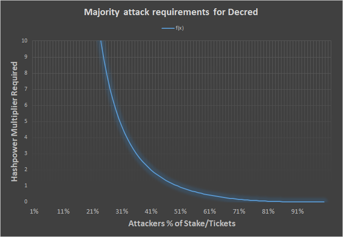

This post introduces the concept of a majority (51%) attack and gives a short account of the role that Decred’s voters play in defending against these. I will briefly describe how majority attacks against Proof of Work (PoW) currencies work first, then explain how the additional Proof of Stake (PoS) component changes the dynamic in Decred’s case.

Performing a double spend attack means having the power to reorg (reorganize, or rewrite) the blockchain. In pure PoW currencies like Bitcoin this comes down to hashpower. Here’s a simplified account of this kind of attack:
Spend in block X by sending to an exchange, start mining a parallel chain in private (don’t broadcast blocks to the network). Once the required number of confirmations have passed, trade the coins for something else and withdraw that from the exchange. When the withdrawal clears, release the parallel chain, and if it has more PoW (blocks) than the chain everyone else was mining and transacting on, the network will accept it as the legitimate chain and the version of history represented by the previous chain (including the attacker’s deposit) will disappear. The attacker is then free to spend these coins again.

This kind of attack has become relatively common in the last year, with the following blockchains all falling victim to successful majority attacks: [ETC](https://blog.coinbase.com/ethereum-classic-etc-is-currently-being-51-attacked-33be13ce32de), [VTC](https://medium.com/coinmonks/vertcoin-vtc-is-currently-being-51-attacked-53ab633c08a4), [ZEN](https://bitcoinist.com/zencash-target-51-attack-loses-500k-double-spend-transactions/), [XVG](https://blockexplorer.com/news/third-times-a-charm-verge-suffers-51-attack-yet-again/) (x3), and [BTG](http://fortune.com/2018/05/29/bitcoin-gold-hack/).

If a double spend attack was happening on your favorite pure PoW cryptocurrency right now, there would be a chain being mined by some actor(s) in secret which we wouldn’t be able to see. Once it is unveiled, if it has more accumulated PoW, miners will choose to build on it and it will be accepted unquestioningly as the legitimate chain, in preference to the chain everyone thought was real until the secret chain appeared. Re-writing the most recent portion of the blockchain is what allows the attacker to spend their funds a second time.

The depth of the reorg is the number of blocks re-written on the replacement chain, deeper reorgs require the attack to be sustained for longer, which tends to be more costly. Transactions with more confirmations have greater finality because they could only be undone by a deeper reorg, which is less likely.

One of a blockchain’s primary purposes is to stop deep reorgs from happening, so when this happens it is a fairly epic failure. I won’t go into any more detail on Proof of Work majority attacks here because that subject is very well covered by a number of sources ([this recent article](https://blog.sia.tech/fundamentals-of-proof-of-work-beaa68093d2b) provides an accessible yet detailed overview).

Majority attacks leading to significant reorgs are a profound failure of the network’s nodes to coordinate and prevent something which **all of them will know** is fraudulent/criminal behavior and *explicitly against the blockchain’s purpose*.

If you are still learning about blockchain technology, you may be wondering, why would the nodes allow a deep reorg that re-spent funds if they were all able to witness it happen on the public network?

In pure Proof of Work (PoW) currencies like Bitcoin and Ethereum, nodes record and relay transactions/blocks, but only miners can interact with the blockchain directly. Nodes have no weight or presence on-chain unless they are participating in the competition to mine blocks (with significant hashpower). Even among those who mine, the majority delegate their chance to produce new blocks to a mining pool, in exchange for a more regular share of the mining rewards.

#### Checkpoints

There are some projects which have implemented, or are implementing, new consensus rules that lock in specific historical blocks. Bitcoin itself has hard-coded blocks that serve as [checkpoints](https://github.com/bitcoin/bitcoin/pull/4541), but they are deep in the blockchain’s history and serve only to prevent the spamming of alternative chains that fork off the Bitcoin chain at low heights to spam low-difficulty blocks and waste nodes’ disk space.

Manually inserting a checkpoint block is inherently centralized. Developers directly write a new consensus rule in the software and choose which block to include. In Bitcoin checkpoints have only referenced blocks which were already quite old, and were therefore not controversial.

Bitcoin Cash ABC developers [manually added a checkpoint](https://www.theblockcrypto.com/2018/11/16/bitcoin-cash-abc-adds-a-controversial-checkpoint-is-it-centralized/) during the chain split [hash cold war](https://medium.com/@richardred/hash-war-theater-67d3fcac3e97), without announcing that they were going to do this until shortly before the software was released. This checkpoint referenced a block in recent history (hours old) following the chain split with BCH SV, and was intended to prevent BCH SV miners from interfering with the ABC chain. This was controversial, because the lack of advanced notice from the developers precluded a discussion in the community about whether to adopt this important rule change. It is likely that some node operators adopted it without understanding or consent.

BCH ABC subsequently moved to a rolling 10-block checkpoint (this [article](https://blog.bitmex.com/bitcoin-cash-abcs-rolling-10-block-checkpoints/) provides a very good overview) operated by nodes directly. There are potential problems with these kinds of checkpoints, they exchange one set of threat vectors for another. They also create the possibility of an irrevocable chain split if different components of the network settle on different versions of a checkpoint block.

#### Decred’s solution: A Proof of Stake component

In Bitcoin, Ethereum and other pure PoW blockchains, only miners can interact with the chain directly. This simplifies threat modeling, but places significant power in the hands of the PoW Miners who are investing the most (efficiently) in securing the network.

Decred establishes another constituency which has a role in the production of each block, Proof of Stake Voters. Decred holders time-lock their DCR to buy tickets, and in each block 5 tickets are randomly selected and called to vote. When a ticket is called it makes two kinds of vote:

- To approve or reject any open consensus rule change proposals
- To approve or reject the regular transaction tree of the previous block

New blocks cannot be built upon until they incorporate the votes of at least 3 of the 5 tickets selected, with the selection of tickets being random and based on the previous block. As a miner, the only way to collect those votes and start working on the next block is to show your block to the rest of the network. This makes selfish/secret mining much more difficult, it means that in addition to the hashpower needed to mine blocks, the attacker must also control enough tickets to vote on their own blocks in secret.

The level of hashrate and proportion of tickets required interact with each other as depicted in this graph sourced from an [article on the subject](https://medium.com/decred/decreds-hybrid-protocol-a-superior-deterrent-to-majority-attacks-9421bf486292) by Zubair Zia. That article provides great detail about the relative cost of majority attacking Decred, as compared to a pure PoW currency.

PoW and PoS fraction that is required to keep up with the Honest chain

This excellent [reddit post](https://www.reddit.com/r/decred/comments/7f9ie1/detailed_analysis_of_decred_fork_resistance/) by Dave Collins goes into detail about how a forked Decred chain with a minority of tickets would fare in a scenario where an attacker controlled 25% of tickets and 50% of hashpower.

In the case of secret mining, the nodes/wallets/tickets who are being kept in the dark about the existence of a rival chain cannot be called to vote on it.

Most of the blocks the PoW miners found on the minority chain would be invalid, as the blocks they mine would call tickets that do not respond. The miner must then look for another block that satisfies the PoW difficulty, and hope that its hash results in calling tickets they control.

As you can see in the above graph, the amount of hashpower one requires relative to the honest chain increases sharply if one commands less than 50% of tickets. An attacker controlling 40% of live tickets would require twice as much hashpower as the honest chain to keep up (half of the blocks they mine would be invalid because they lack the required 3 votes). When controlling 25% of the tickets (as in Dave’s example), 10x the honest hashpower would be required to keep up when mining a rival chain.

There is a further problem for an actor attempting a majority attack on Decred. Decred wallets operate with a default policy about not voting for blocks that are further than 5 blocks behind their current chain tip. This means that even if an attacker could mine a secret chain faster than the honest one — the honest voting nodes would not accept it if it involved a reorg of greater than 5 blocks relative to the chain they were on before.

Ticket-voting nodes are perfectly placed to perform this task because they are highly sybil-resistant. The only way to obtain tickets is to time-lock DCR. Ticket-voting nodes have significant skin in the game, and therefore can be trusted, in aggregate, to honestly attest to the state of the network. As of writing, 47% of all the available DCR is time-locked in tickets, and this percentage has been stable for some time.

Live tickets as of writing are worth 4.1 million DCR, which even at today’s low prices is $75 million. If a new actor like an attacker were to try and buy up half of the ticket supply, this would increase demand and the ticket price would rise (in line with [DCP-0001](https://github.com/decred/dcps/blob/master/dcp-0001/dcp-0001.mediawiki)). There are a limited number of ticket purchases per block, so this is something that would have to be done over time. It is reasonable to assume that the cost of acquiring half of the live ticket pool would be significantly greater than the value of half the live tickets before the attempt began (currently $32.5 million).

As DCR is time-locked to buy tickets, an attacker that bought tickets to attack the chain would be exposed to the consequences of that attack on the value of DCR.

An attacker that gained control of half the live tickets would still need to match the network’s honest hashpower. As Decred is mined by ASICs (from a variety of manufacturers), finding the hashpower to match the honest chain would itself be very difficult, and likely leave the attacker holding another class of asset that has no purpose except to mine Decred, and would consequently be devalued by their attack.

Considering that the network’s honest voters will never accept a reorg of greater than 5 blocks, an attacker that’s trying to double spend with a reorg of 6 or more blocks (the number of confirmations exchanges tend to require, not coincidentally) would see their chain rejected by voters even once it was unveiled to the network. Instead of re-writing the Decred blockchain, they would have created a forked chain that nobody else cares about or builds on.

This elegant solution is possible because Decred is designed and built around key roles for a second class of decentralized participants: holders who stake their coins. Voters are incentivized to keep a close eye on the blockchain so that they can vote when called, and collect their reward. Voters can be trusted in aggregate because they have skin in the game. Voting rewards are large enough to incentivize participation but not large enough to prevent voters from being diluted by inflation. 30% of new DCR goes to voters, 60% to miners and 10% to a [Treasury](https://explorer.dcrdata.org/address/Dcur2mcGjmENx4DhNqDctW5wJCVyT3Qeqkx) fund which supports development— holders cannot maintain or increase their relative share just by staking.

Decred’s two-factor consensus model combines the strengths of Proof of Work and Proof of Stake consensus to maximize the chain’s resistance to majority attacks.

The same dynamic works against the viability of any minority forked chain, such as one resulting from a change to the consensus rules that does not have majority support. Changes to consensus rules can only be adopted by following a [formal on-chain process](https://docs.decred.org/governance/consensus-rules-voting/) where support from 75% of voting tickets is the key requirement. This [longer piece](https://medium.com/@richardred/a-users-perspective-and-introduction-to-blockchain-governance-80fbe2050222) goes into much more detail on why it is important to have a formal and decentralized method for deciding whether a change to consensus rules should be adopted.

Decred gives PoS voters the power to enforce the rules, and to decide when they should be changed. Changes can only happen when they have the support of the great majority of holders who put their DCR at stake.

In the end, much about blockchains comes down to agreeing on which is the right chain. Decred is built from the ground up to give stakeholders a strong say in this process, affording them an active and vital role, and the power to decide that an unwanted secondary chain is not Decred.