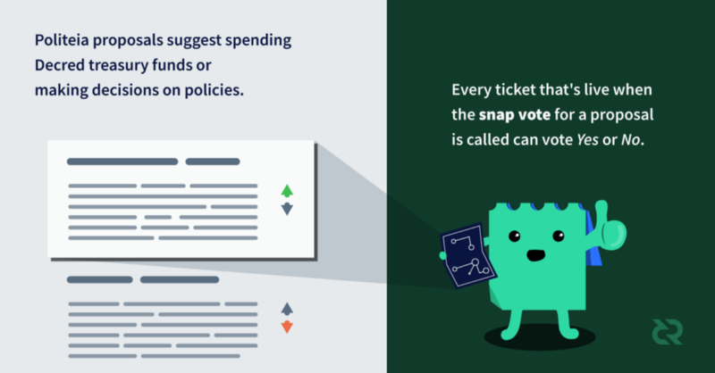

The launch of Politeia marks a significant step in Decred’s development, expanding stakeholder governance beyond its core function of adopting or rejecting changes to the consensus rules, and equipping stakeholders with a means of making other kinds of decisions.

These decisions can be as fundamental as extending or refining the project’s very purpose. Ticket-voting stakeholders are about to assume full control of the project’s direction. Some sort of amendment to the Decred [constitution](https://docs.decred.org/getting-started/constitution/) is highly likely, and proposals for a number of other high-level policies have been discussed.

This blog post considers how we are positioned for Politeia’s launch, gives a re-cap of how Politeia works, speculates on how it is likely to be used, and considers it as a step on the path to a Decentralized Autonomous Entity (DAE).

I have [written about Politeia’s role in Decred before](https://medium.com/decred/governance-of-the-decred-project-subsidy-through-politeia-e6393b2bab1f), back in March. That post was the start of my active participation in the Decred project, which so far I am enjoying a lot. It has been fun to follow along with Politeia’s development, chipping in with copy, bugs and suggestions now and again. I am excited on a personal level to see this system go into production and to find out what the Decred stakeholders are going to do with it.

### The Decred Economy — internal and external spending

The Decred [Treasury](http://explorer.dcrdata.org/address/Dcur2mcGjmENx4DhNqDctW5wJCVyT3Qeqkx) is in good shape, stocked with over 550k DCR and still growing with every block.

Treasury spending can be either *internal* (people with an ongoing relationship with the project) or *external* (service providers or contractors whose contribution is isolated or transactional).

There is a lot to be said for how Decred approaches recruitment of and engagement with workers. The progress made since Decred’s launch has been excellent, [considering the resources expended](https://twitter.com/lukebp_/status/1052201974928723968), and speaks to the merit of this approach.

From a worker’s perspective the level of autonomy is high, which should be attractive for people who value independence in their working life. Decred’s focus on work product and disregard for qualifications levels the playing field — you don’t need accreditation or prestige to become a paid contributor. What is required is a demonstration that you can make useful contributions.

There is also no barrier to participation in discourse and decision-making about the project’s aims or approaches.

I would prefer to see mostly *internal* Treasury spending, as I believe the greatest opportunities lie in engaging people to *participate* in Decred. The project benefits from a robust, active, contributor community, committed to its long-term success. The Treasury is a way to pay people who find useful ways to contribute.

Decred takes a novel approach to the governance and funding of common goods ([highlighted in this post](https://medium.com/@richardred/decentralized-autonomous-funding-of-blockchain-projects-3c0c233ae4ad#fd26)), and the lessons we learn as we experiment to refine Decred’s approach will be relevant for other [commons based peer production](https://en.wikipedia.org/wiki/Commons-based_peer_production) endeavors.

Advances in our understanding of how to decentralize control of an organization like Decred could have far-reaching significance. Autonomous funding for open source projects could be a big deal.

**Decred embraces open source principles deeply**. One of the advantages of the open source approach is that individual contributors are empowered to take on the work most suited to their skills and interests, and to complete it the best way they know how.

One of the challenges for Politeia is to **balance the autonomy of contributors with the sovereignty of stakeholders**. Contributing to Decred is permissionless, but receiving Treasury funds cannot be.

Politeia proposals will define work packages and stakeholders will endorse that work as useful by voting Yes. Established Decred contributors in the relevant domain will review the work to ensure that it is of a sufficient standard to merit payments as milestones are met.

Decred is an active project with established programs of work and sets of contributors. Work by established contractors on core aspects of the project will continue. Politeia is primarily about approving new uses of the Treasury’s funds and making other high-level decisions.

### How does Politeia work?

Graphic by [@marcelolustosa](https://twitter.com/marcelolustosa)

Anyone who pays a small fee ( 0.1 DCR) can register an account and submit proposals. Proposals are screened by admins to remove inappropriate content (illegal or spam). Proposals that pass screening are displayed publicly and open for discussion, they can be edited by their owner in response to feedback.

When the proposal’s owner is ready, the voting window is opened for 2,016 blocks (~1 week). Every wallet that controls tickets *that were live when voting opened* can use those tickets to vote Yes or No on the proposal.

If you’re new to Decred, this [beginner’s guide](https://docs.decred.org/getting-started/beginner-guide/) explains what tickets are — they are a staking mechanism through which Decred holders lock their funds in exchange for votes.

**For a vote to be valid, at least 20% of the live tickets must vote Yes or No. For a proposal to pass, at least 60% of voting tickets must vote Yes.**

These hurdles, and the registration and proposal fees, can themselves be amended through future Politeia proposals, and they will likely be fine-tuned over time.

Initially, proposal voting outcomes serve as instructions to the human custodians of the Treasury, who will manually process payments. Later, the system will be augmented to handle payments autonomously.

For a more complete description of Politeia see [here](https://docs.decred.org/governance/politeia/). For more technical information about its architecture see [this blog post](https://medium.com/decred/an-overview-of-decreds-politeia-system-architecture-8741c13b35d8).

### How will Politeia be used?

These are some of the types of proposal I expect to see:

- Proposals for some **new use of treasury funds**. These will **set a budget** and explain **what** it would be used for, **why** it would be valuable, **how** it would be accomplished, **who** would complete the work, and **when** the work would be completed and payments made (i.e. what are the deliverables or **milestones**).
- Proposals that **make policy decisions**. Policies can be used to set higher-level aims of the project (like amending the [constitution](https://docs.decred.org/getting-started/constitution/)) or set rules or procedures for how paid contributors engage with or represent the project.
- Proposals that **resolve disputes**. Decred’s stakeholders govern the project and hold the ultimate decision-making power. While there will be social processes and policies in place for handling disputes between contributors, escalating these to a stakeholder vote for resolution will be an option for contributors who aren’t happy with how something was handled within the organization.
- Proposals that **support a change to the consensus rules**. Changes to the consensus rules can only be made following the [on-chain voting process](https://docs.decred.org/getting-started/user-guides/agenda-voting/), but Politeia proposals will likely be used to gauge stakeholder support and give developers the green light to go ahead with the required work.

Politeia is a tool to augment the Decred stakeholders’ capacity for coordination, by allowing for contentious issues to be resolved with representative and binding votes. Decred’s governance does not begin with Politeia’s launch, and detail-oriented decisions will continue to be discussed and made on other platforms using established social processes.

**If you have an idea for how to improve some aspect of Decred, talk to the people who work on that aspect already.** There is usually an open [communications channel](https://www.decred.org/community/) where you can see what people are discussing (and join in). Many sub-projects [on GitHub](https://github.com/RichardRed0x/decred-on-github/blob/master/README.md) use Issues to collect and discuss ideas for improvements and organize the work.

### Building the Decentralized Autonomous Entity (DAE)

The goal of giving stakeholders direct control of the project through a DAE is an ambitious one. It requires new tools, spaces and services that support the stakeholder community and enable it to make decisions in ways which harness and enhance its collective intelligence.

Politeia itself is an example of a coordination tool that is vital for this endeavor, combining resistance to spam and Sybil attack with a check on the powers of admins through transparent censorship. Politeia will continue to be iterated and evolve to better serve the Decred community.

**Tracking the progress of funded proposals** is important, so that stakeholders can make an informed judgment about whether programs are generating sufficient value to justify their costs. Politeia can be extended to track the progress of funded proposals, with a public space for progress reports and dialogue with stakeholders.

There will likely be other tools and services, approved through Politeia, which come to be important parts of Decred’s governance system. A contractor management system has already been discussed, and this would be a significant new component of Decred’s DAE.

Decred relies on its stakeholders being informed and equipped with the knowledge needed to make good decisions. Initiatives like the [Decred Journal](https://xaur.github.io/decred-news/) which compile information about what’s going on in the project already exist to serve this need. I expect to see more **initiatives which gather or process information that is useful to the stakeholder community**.

Making decisions about which proposals to fund, and evaluating the success of previously funded proposals, are key functions for the Decred DAE.

One of the key priorities for Decred at this stage should be strengthening the stakeholder and contributor communities; increasing the number, skills, diversity and knowledge of their constituents.

I am in favor of extending the scope of the project strategically, on the basis that

- a good way to raise Decred’s profile is to sponsor cool projects that wouldn’t otherwise happen
- it is desirable that people encounter and think of Decred as a project they can participate in, expanding the Decred umbrella will create a broader set of opportunities for a more diverse set of potential contributors
- spending treasury funds on initiatives that lead to more informed stakeholders and a greater collective intelligence is a good idea
- projects with benefits beyond Decred, to the cryptocurrency space or society more broadly, are good

Decred has the potential and opportunity to become a leader in the cryptocurrency space, and I don’t see how we can achieve the project’s aims without doing so. With Politeia, we should act in a way that other projects and people will be inspired to follow our lead. The fact that Politeia itself is open source and free for re-use by other projects is a strong step in this direction.

In the first phase of Decred’s development, the focus was on the [on-chain voting process for changing consensus rules](https://docs.decred.org/getting-started/user-guides/agenda-voting/), because those rules are fundamental. With the power to change the consensus rules we can change anything about Decred, but that’s (intentionally) a heavy tool to wield.

The launch of Politeia marks the start of phase two, which is about allowing the decentralized organization that’s building Decred to make more nuanced decisions and more accurately gauge the sentiment of stakeholders towards them.

Politeia allows us to decide, collectively with our tickets, where we want this project to go, and how we should spend our Treasury funds to get there.

As Politeia and its associated processes mature, we should be thinking about how well it leverages the strengths of the community and how we can scale that effectively. We should be perpetually striving to enhance our collective intelligence, as well as finding ways to engineer out the dependence on trusted humans to manually process Treasury transactions.

Before a DAE that pulls the Treasury’s purse strings autonomously becomes viable, we must formalize and hone the processes involved in running a decentralized organization. I see the formalization of these social processes as a necessary precursor to an autonomous organization. It is only once decentralized governance through Politeia is established as highly functional that we should develop the system’s autonomy, because that will mean committing to particular ways of doing things and making those ways more resistant to change going forward.

If you’re new to Decred, you’re arriving at a great time, because it’s about to get a whole lot easier to find out if the stakeholder community recognizes value in what you have to offer and the direction you want to take this project.

Originally posted on [Medium](https://medium.com/decred/on-the-launch-of-decreds-politeia-b305d06d8bda).