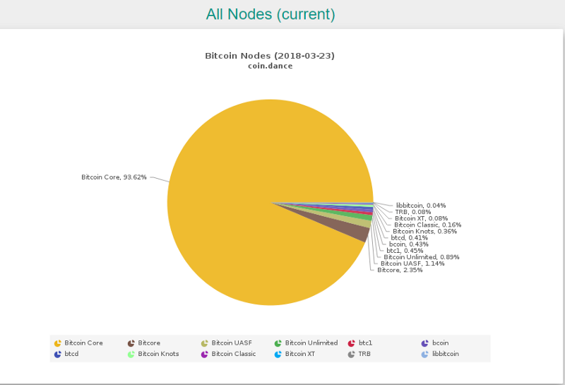
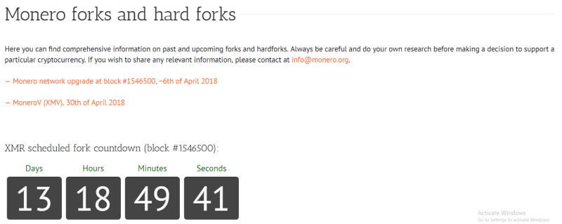
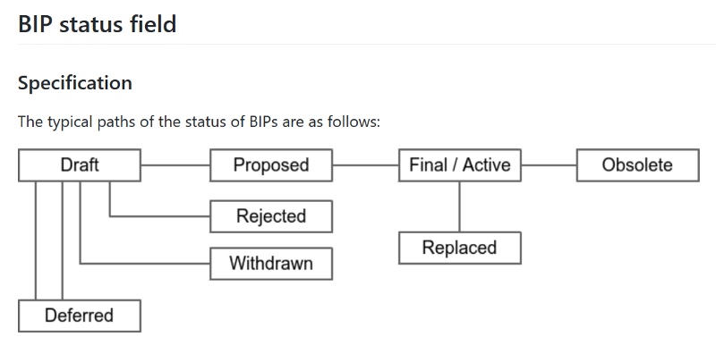
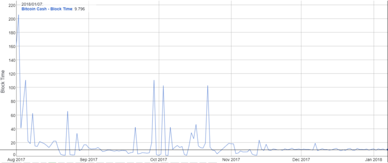
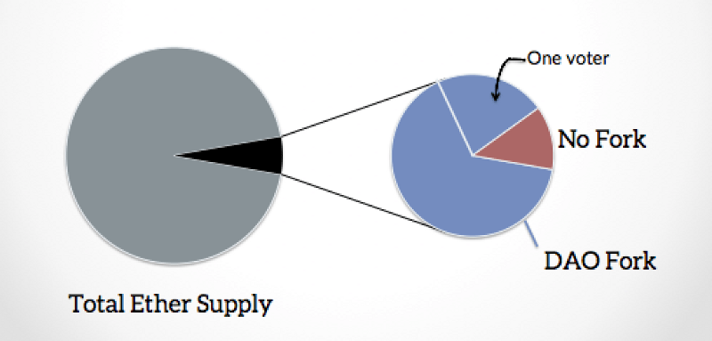
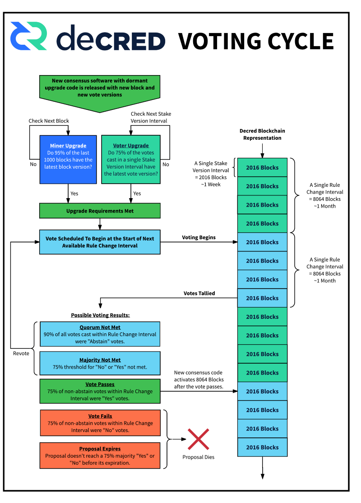
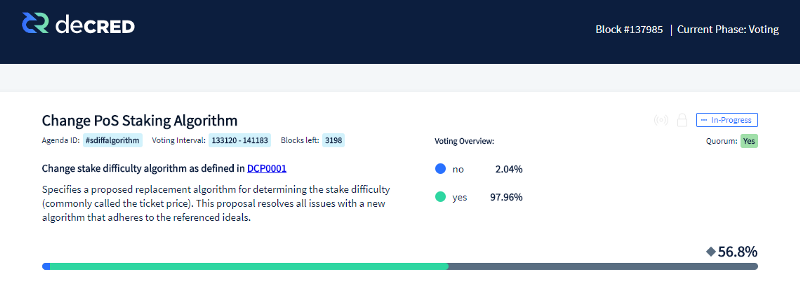
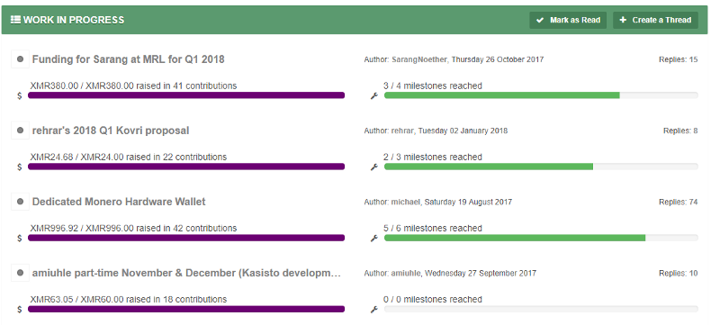

This article gives my perspective on the governance of blockchains and cryptocurrencies. I didn’t take much interest in the blockchain space until summer of 2017, when the Bitcoin Cash fork and the underlying reasons for it caught my attention. I started looking into this and discovered an interest in how these decentralized networks/projects/currencies make decisions about how they should evolve. On the one hand these are (mostly) open source software projects, but on the other hand the software is being used to run networks that hold hundreds of millions of dollars in value. Who decides when to change this software and the rules it enforces, and how does that process work? If the expectation that blockchains will have a major impact on the world is correct, it’s going to be important to understand the answers to these questions.

This post is an attempt to summarize what I’ve learned in a way which introduces newcomers to the ongoing and recently intensified debate about how cryptocurrencies are governed. It covers some illuminating stories from the history of major projects, and considers the emerging variety in approaches to governance.

This post got a lot longer than I’d intended, so I will probably re-write some chunks as standalone posts. I’m in this to learn, so if there are flaws or gaps in my understanding I’m hoping people will let me know. A more comprehensive description of how I arrived at my perspective should facilitate that. If you’ve been following the blockchain space for a while you could probably skip ahead to [section 14](/post/user-perspective/#14-contemporary-debates-in-blockchain-governance) without missing much.

As I see it there are two aspects of governance:

- How does a cryptocurrency ensure that users follow the rules?
- How are those rules determined?

I’m more interested in the second, but it’s impossible to consider that in any depth without an understanding of the first.

Cryptocurrencies are in essence software, everybody using a blockchain has to run software that is compatible with its rules. Often there are dominant versions of this software that the majority of participants run. It is this software and the computers that run it which enforce the rules, so any change to the rules means participants running a new version of the software. These rules are referred to as the **consensus rules**, because everyone has to agree on them for the network to function as a whole. There must be consensus as to what the rules are. This is common to every cryptocurrency and blockchain. There is divergence around how exactly the software enforces the rules, and how the users of a blockchain decide to run a new version of that software which changes the rules.

### 1. Bitcoin

Bitcoin is a good place to start because it is the original and most established cryptocurrency. Consequently, it is the most well known, researched and discussed.

Bitcoin is complex, it’s possible to write whole books about “how Bitcoin works” ([and people have](https://github.com/bitcoinbook/bitcoinbook)) and what it’s for. It’s not even easy to define “[what Bitcoin is](https://www.coindesk.com/nobody-understands-bitcoin-thats-ok/)” (software, a network, a currency). To go beyond that and understand “why Bitcoin is the way it is” is an even more ambitious undertaking.

### 2. Enforcing Bitcoin’s consensus rules

The enforcers of Bitcoin’s rules are Proof of Work (PoW) miners. Miners are people (running computers) competing to find the answer to a complex and arbitrary problem. Miners prepare a block that they want to broadcast by filling it with transactions that are waiting to be processed (in the mempool). In order for this new block to be accepted, it must pass a very specific test. Miners [combine a set of inputs and run these through a hash function: the header of the previous block, a current timestamp, a merkle tree representing the transactions they want to include in the new block, and an arbitrary value. ](https://www.coindesk.com/bitcoin-hash-functions-explained/)The hash that comes out of this function must start with a certain number of of zeroes (determined by the current difficulty level) for the new block to be accepted by the network. There is no way to know whether a hash will be acceptable other than to try it and see, then change the arbitrary value and guess again. This is the “work” in Proof of Work. This process is often referred to as hashing. The rate at which a computer can make guesses depends on how quickly it can run the hash function, its hashpower.

The difficulty of the problem adapts every two weeks so that when more miners are guessing it becomes more difficult to find the solution. The intention of this adjustment is to keep the average time between blocks at around 10 minutes. We’re talking about random guessing though, so the actual interval between blocks fluctuates.

People running full nodes in the network are listening for these new blocks. Full nodes runs software that has the full Bitcoin blockchain (a history of every transaction ever made), this is what makes Bitcoin a decentralized ledger. It is through storing and processing this blockchain that full nodes know which Bitcoins can be spent by which private keys (and where those Bitcoins came from).

Full nodes check that new blocks follow the rules, including:

- That the hash of the block meets the difficulty criteria, and that when it is decoded through the same hash function its contents match the specification of a Bitcoin block. This constitutes **proof that the required work has been done** by the miner.
- That each transaction has been signed by the private key for the wallet it comes from (ensuring that only the holder of the private key can spend the Bitcoin).
- That the wallets making transactions held enough Bitcoin to make those transactions (ensuring that people cannot “double spend” their Bitcoin).

If the new block is valid the nodes will add it to their version of the blockchain and broadcast that version. The contents of this block determine the possible solutions to broadcast the next block. One of the required inputs to the hash function has been changed, and so the guessing process begins anew.

Each new block allows some new Bitcoin to be claimed, the **block reward**. Miners claim the block reward by including a transaction sending it to a wallet they control. Miners also collect the fees for transactions they include in the block (and so are incentivized to include the transactions that offer to pay the highest fees).

The fact that anyone can find a solution that allows them to broadcast the next block is another reason why Bitcoin is said to be decentralized.

These days, Bitcoin is mined almost exclusively by ASICs. These are custom built computer chips whose only purpose is to make guesses by running Bitcoin’s hash function. They are designed to do this as efficiently as possible. In principle, and in the past, one could mine Bitcoin using any computer. Faster processors are better because they can make more guesses per second or watt of electricity, graphics cards are better still. Now, it is inefficient to compete with ASICs. While it is possible that I could mine a block with my CPU it is highly unlikely that I will ever find a solution before one of the many ASICs that I’m competing with — and I still have electricity costs to run that CPU, so the chances are I would be doing so at a loss.

Taking this a step further, there are so many ASICs mining Bitcoin now that even if I have one running I might never find a valid block, or it could take years. So, most miners participate in mining pools, where you send the proof of your work to the pool along with many others. When one of the participants finds a valid solution the pool uses that to form a new block on behalf of the pool, and distributes the rewards between pool participants according to how much work they contributed towards finding that solution. Pools make Bitcoin mining not quite so decentralized, because there are a countable number of pools that actually produce new blocks. It is however relatively easy for a miner to switch between pools, switching costs are low. If miners don’t agree with the actions of the mining pool operator they can easily move their hashpower to another pool.

Miners are stakeholders in that they have invested in hardware and pay ongoing electricity costs to run that hardware in search of new blocks. The blocks a miner broadcasts must follow the rules of the software running on Bitcoin nodes or those nodes won’t accept their blocks as part of the chain. It is only because nodes collectively accept my version of block 1234567, saying that the reward goes to wallet X that I control, that I get any reward for my work. Miners must follow the same rules as nodes to be on the same network, part of the same blockchain.

Understanding how a cryptocurrency works goes beyond just knowing the rules, **incentives** are also key to understanding the behavior of the network. There is no rule that says how a miner should choose the transactions to include in a new block, or that a miner has to include any transactions at all. [Miners sometimes mine empty blocks](https://bitcoinmagazine.com/articles/why-do-some-bitcoin-mining-pools-mine-empty-blocks-1468337739/). An individual miner (or, more realistically, mining pool) could decide not to include certain transactions. If they wanted to, they could blacklist an address.

Miners typically include the transactions with the highest fees because they are incentivized to do so. That’s what maximizes their profit. If Miner A gives preference to the wallets of their friends and allows them to make low-fee transactions, Miner B can pick up the rewards for the higher fee transactions. Over time Miner B will earn more rewards, which they could re-invest to grow their mining operation faster than Miner A.

Miners also have a broader incentive to look out for the health of the network. If all miners started to mine empty blocks Bitcoin would be paralyzed and have no utility. Without utility it would have no value, this would hurt the miners because the rewards they’re earning would have no value. The expensive ASICs they’re using would have no means of earning a return because they have no utility besides mining Bitcoin. Bitcoin’s value proposition, of being able to transfer value in a way which is reliable and resistant to censorship, relies on miners not only following the rules but **acting in a way which is aligned with their incentives**.

As an aside, this is why decentralization is such a big topic among blockchain enthusiasts. The system is based on the premise that because I can offer a fee to mine my transaction and include it in the blockchain I can be assured that it will be possible for me to make that transaction. I can make any transaction that the rules permit me to make if I offer to pay a high enough fee. If all of the new blocks were mined by eight pools that would introduce a degree of centralization. If all of those pools decided (or were persuaded) that transactions from my address shouldn’t be mined then my Bitcoin would become worthless.

### 3. Setting Bitcoin’s rules

The software which Bitcoin runs on, along with most other cryptocurrencies, is open source. Cryptocurrency is all about not having to trust individual actors but being able to rely on *cryptographic truth* and the following of rules and incentives. Proprietary software is anathema to this ideal as it necessitates trusting the (closed) source of that software. Open source software means being able to inspect that software and know, intimately, what it will do when you run it. In practice, most of us trust certain sources to give us software that behaves as described, because we lack the expertise or inclination to verify it ourselves. This trust is underpinned by the fact that people can and do perform this auditing, and they have channels through which they can communicate any problems they observe.

[Bitcoin Core](https://github.com/bitcoin/bitcoin) is the software that most of the full nodes in the Bitcoin network run, as of now 93.6% of the 10,923 Bitcoin full nodes are running this software. Bitcoin Core is the original Bitcoin full node, for almost two years after the launch of Bitcoin it was the *only* full node implementation. There are now alternative implementations of a Bitcoin full node that follow the same consensus rules and are therefore compatible and can run on the same network/chain.

Software Bitcoin Nodes are running — source: https://coin.dance/nodes

Open source software allows for broad participation in its development, anyone can make a copy of (clone) the software, fix bugs or add new features. If I clone Bitcoin Core and fix a bug or improve something, I can make a **pull request** whereby I propose that the changes I made in my version be merged back into the master version and become part of Bitcoin Core. Anyone can do this. To date, the Bitcoin Core github repository lists 522 contributors who have all contributed something to the software. I can also clone Bitcoin Core (or any full node software) and make some changes with no intention of merging those changes back in, this is a **fork**.

As the software running on full nodes enforces Bitcoin’s rules, one can change those rules by changing the software. T**he stakes are high when deciding whether changes that will affect the consensus rules should be committed or merged** into Bitcoin full node software for inclusion in a new release.

There are only certain people who have permission to commit changes to the Bitcoin Core repository. I couldn’t find a particularly good source for this but[ this reddit comment](https://www.reddit.com/r/Bitcoin/comments/7q6me4/there_are_only_5_core_maintainers_who_have_access/dsmsza8/) says only two people have commit access, [this bitcointalk post](https://bitcointalk.org/index.php?topic=1774750.0) had it at four people/accounts a year ago, with a total 12 accounts in Bitcoin Core’s history ever having commit access. That there are a limited number of people with the technical permission to accept changes to a master branch is true of every software project. The amount of decision-making power these individuals have depends on the social method of governance of the project. I couldn’t find much documentation on Bitcoin Core’s decision-making process, [this (potentially biased) reddit comment describes a yes/no vote of Bitcoin Core contributors](https://www.reddit.com/r/btc/comments/5hn3ij/blockstream_and_core_vs_blockstream_core/db2asl8/), with the maintainers interpreting how to proceed on this basis, which seems plausible.

A release of Bitcoin Core (or any cryptocurrency full node software) that changes the rules of consensus differs from most software projects in the importance of obtaining stakeholder approval prior to release.

### 4. Soft forks, hard forks, chain splits and free coins!

[Soft forks and hard forks both involve some change to Bitcoin’s rules of consensus](https://bitcoinmagazine.com/articles/why-some-changes-to-bitcoin-require-consensus-bitcoin-s-layers-1456512578/). I will offer a short summary, see [here](https://medium.com/@lightcoin/the-differences-between-a-hard-fork-a-soft-fork-and-a-chain-split-and-what-they-mean-for-the-769273f358c9) for a more comprehensive description, and I also found [Vitalik Buterin’s post on the subject](https://vitalik.ca/general/2017/03/14/forks_and_markets.html) informative.

A **soft fork** introduces a new rule or makes the rules more restrictive. For Bitcoin, miners are the key actors who decide if a soft fork is adopted. If the majority of miners agree to enforce a soft fork it will be adopted, because miners are the actors who decide how new blocks are constructed. Soft forks are in a sense backwards compatible. Full nodes that don’t upgrade will still recognize new blocks as valid because the blocks still follow the old rules that the nodes are checking. However, a full node that doesn’t upgrade may misinterpret some transactions that make use of the new rules.

A **hard fork** removes or relaxes consensus rules. Once a hard fork has activated and miners start producing blocks according to these relaxed rules, any node that hasn’t been updated to follow the new rules will reject these new blocks. This can cause a **chain split** if some miners and nodes continue on the old software and some switch to the new.

**Some forking examples** (taken from [here](https://blog.bitmex.com/bitcoins-consensus-forks/))**:** Bitcoin originally did not have a block size limit. A 1mb limit was added in September 2010. This was a soft fork because it added a new rule. Nodes that didn’t upgrade would continue to follow the right chain because they didn’t care what size the blocks were. Any miners in the minority who didn’t want this limit would be forced to upgrade to software that followed the new rules, because any blocks they mined which were greater than 1MB would be rejected by nodes and miners following the new rules. This change was added as a soft fork, it could not be undone without a hard fork — this is true for any soft fork that has been adopted.

Bitcoin has had **three chain split events**. The first of these occurred in 2010 when a transaction was mined which spent 184.5 billion Bitcoin — the rules as implemented by the software had a bug which allowed massive transactions to be accepted. This was fixed with a soft fork which addressed the bug and added an explicit rule that no transaction could spend more than 21 million Bitcoins (the maximum supply). It took five hours before the patch was released, and 51 blocks were mined on this “bad chain” before the good (patched) chain overtook it in terms of PoW. This raises an interesting point, in the case of a chain split of Bitcoin the accepted method of deciding which chain “is Bitcoin” is to consider the length of the PoW chain — the chain with the most accumulated work “is Bitcoin”.

Orphaned blocks happen semi-regularly because it takes time for news of a new block to propagate in the network, and the hash of the latest block determines the solution for the next block. If Miner A and Miner B broadcast a new block at exactly the same time, and half the nodes see block A first and half see block B first, then until the next block is found there are two competing chains (stubs). If the next miner to find a block was working on block B, then block B will be the good chain and block A will be an orphan, as nodes will switch to regarding stub B “as Bitcoin” when it has a longer PoW chain.

This is why merchants often wait for two or more confirmations before accepting a payment. A number of confirmations is another way to say that the block including the transaction has been built on by X subsequent blocks. It’s always possible that the latest block will become [an orphan](https://blockchain.info/orphaned-blocks) (i.e. turns out to not be a part of the Bitcoin chain), but once a few blocks have been mined on top of it it the transactions become an immutable part of Bitcoin’s ledger.

**Some hard forks are intended as upgrades.** If there is consensus that a change to the rules will be beneficial, users coordinate to implement that change at a specific block height. As it is important that everyone changes to the new rules simultaneously, a version of the software is typically released that incorporates both sets of rules, with some logic that says “until block X use these rules, after block X use these other rules”. [Monero has hard forks that aren’t intended to split the chain roughly every six months](https://monero.org/forks/). These are announced well in advance so that node operators have time to download a version of the software that follows the new rules. The Bitcoin Segwit2X hard fork was intended to be an upgrade (increasing the maximum allowed block size to 2MB). It was abandoned due to a perceived lack of stakeholder support. More on this later.

**Some hard forks are intended to cause a chain split**. Bitcoin Cash (BCH) is a well known example, and there have been several similar hard forks of Bitcoin since then. Monero also has a hard fork that is intended to split its chain coming up (MoneroV). This kind of hard fork happens when a subset of a coin’s users decide to change the rules, on the understanding that not everyone will change to the new rules. These are also usually announced well in advance. People who use the new software know that they’ll be forking to their own chain after a specific block, and what the consensus rules will be for that branch of the chain.

Source: https://monero.org/forks/

Some people regard a chain split as offering **free coins.** Bitcoin Cash mined its first block as block 478559 on top of Bitcoin’s block 478558. If you had 1 BTC at block 478558, you still had 1 BTC at block 478559, but your private key also worked on the BCH chain, and so you had 1 BCH there too because their blockchains are identical up to this point. You could see this as receiving 1 BCH for free, but one could also argue that your 1 BTC was split, like the chains, because most of the resources that gave BTC value (people buying it, people mining it, people accepting it as payment) were now being shared between BTC and BCH.

### 5. How does Bitcoin (BTC) evolve?

There’s no easy answer to that question, but since August 2011 there has been a defined process: [Bitcoin Improvement Proposals](https://en.bitcoin.it/wiki/Bitcoin_Improvement_Proposals) (BIPs). BIPs have [their own github repository](https://github.com/bitcoin/bips), the process for handling BIPs was laid out in the original [BIP-001](https://github.com/bitcoin/bips/blob/master/bip-0001.mediawiki), but this has been replaced by [BIP-002](https://github.com/bitcoin/bips/blob/master/bip-0002.mediawiki). There follows my take on the process which BIP-002 describes.

Source: https://github.com/bitcoin/bips/blob/master/bip-0002.mediawiki

Each BIP needs a champion/author to shepherd it through this process.

1. Submit an idea for discussion to the [Bitcoin development mailing list](https://lists.linuxfoundation.org/mailman/listinfo/bitcoin-dev)
2. If members of that list seem receptive, submit a draft BIP to the same [Bitcoin development mailing list](https://lists.linuxfoundation.org/mailman/listinfo/bitcoin-dev)
3. No red flags? Submit the BIP to the BIPs git as a pull request. BIPs have a set format that should be followed
4. The BIPs editor (Luke Dashjr) will review it and if it passes some minimum criteria it will be accepted, assigned a number and a category
5. The BIPs editor now decides if it progresses to Proposed or Final/Active status (see image above), while the BIP’s author can change the status to Deferred or Withdrawn
6. To move from “Draft” status to “Proposed”, the BIP needs to nail down the details and provide a reference implementation. This is significant, a developer/champion must go to the effort of implementing their idea in usable code before the BIP can progress.
7. BIP-002 also defines a method of soliciting commentary on a BIP through a public wiki space that anyone can contribute to, but where “Participants should freely refrain from commenting outside of their area of knowledge or expertise. However, comments should not be censored, and participation should be open to the public.”

> A soft-fork BIP strictly requires a clear miner majority expressed by blockchain voting (eg, using BIP 9)

Miners can use the “version” field in the [block header](https://www.cryptocompare.com/coins/guides/what-is-a-block-header-in-bitcoin/) to signal support for a proposed soft fork. A vote runs for a set interval and you can know whether miners support the change (weighted by their hashpower) by looking at the number of blocks that signal support.

A majority of Bitcoin miners (i.e. miners controlling the majority of hashpower) has the power to adopt a soft fork (adding new rules). This is true because miners make the blocks. If a majority of miners decide that 50kb is the new block size limit, other nodes will still accept those blocks as valid — and a majority of mining power following the same set of more restrictive rules will produce the longest PoW chain. Those miners won’t recognize or build on any blocks which don’t follow the new rules.

Things are more complex for BIPs that involve hard fork consensus changes, because they move to “Final/Active” status only when they have been adopted by “the entire Bitcoin economy”. BIP-002 has this to say:

> A hard-fork BIP requires adoption from the entire Bitcoin economy, particularly including those selling desirable goods and services in exchange for bitcoin payments, as well as Bitcoin holders who wish to spend or would spend their bitcoins (including selling for other currencies) differently in the event of such a hard-fork. Adoption must be expressed by de facto usage of the hard-fork in practice (ie, not merely expressing public support, although that is a good step to establish agreement before adoption of the BIP)…

> …Miners are not included in the economy, because they merely *rely on* others to sell/spend their otherwise-worthless mined produce. Therefore, they must accept everyone else’s direction in deciding the consensus rules.

> Exchanges are not included in the economy, because they merely provide services of connecting the merchants and users who wish to trade. Even if all exchanges were to defect from Bitcoin, those merchants and users can always trade directly and/or establish their own exchanges.

> Developers are not included in the economy, since they merely write code, and it is up to others to decide to use that code or not…

> This BIP does not aim to address what “should” be the basis of decisions. Such a statement, no matter how perfect in its justification, would be futile without some way to force others to use it. The BIP process does not aim to be a kind of forceful “governance” of Bitcoin, merely to provide a collaborative repository for proposing and providing information on standards, which people may voluntarily adopt or not. It can only hope to achieve accuracy in regard to the “Status” field by striving to reflect the reality of *how things actually are*, rather than *how they should be*.

The BIP process has very little to say about how a BIP that requires a hard fork should go about obtaining the approval of “the entire Bitcoin Economy” (defined as merchants who accept Bitcoin as payment and holders), it just defines this criteria for the status of the BIP to be changed in the GitHub repository.

I understand the logic here, that participants in the Bitcoin economy have the freedom to choose which software they run and which consensus rules that software follows; but how does one go about getting the entire Bitcoin economy to adopt a hard fork change to the consensus rules? This seems difficult, given that this entire Bitcoin economy would have to adopt said hard fork at the same time to avoid a chain split. It is perhaps unsurprising that none of the hard-fork BIPs listed have ever achieved this “Active” status.

From my outsider’s perspective, it seems like the best chance of achieving adoption of a hard-fork change to Bitcoin’s consensus rules would be to push that change out in a new version of Bitcoin Core, the software which 96.5% of full nodes are running. I would also guess that a lot of merchants, the ultimate decision-makers according to BIP-002, may not even particularly care about a change to Bitcoin’s rules that doesn’t affect them directly.

BIP-002 lists a number of stakeholders and explains why they’re not included in “the economy”, and therefore don’t get to decide whether a BIP is accepted — **miners, exchanges and developers**. This seems backwards to me, because from my observations these three groups are exactly the actors that **do have power** to decide how Bitcoin evolves.

My observations are based primarily on the Bitcoin Cash and the “Segwit2X” hard forks, I will recount them here to explain why I think these stakeholders have power. As a small scale user/holder of Bitcoin, in principle I fall into the group that is supposed to decide whether hard forks “are Bitcoin”. It didn’t feel that way, in fact I struggled to make any sense of what was going on as all of this was unfolding.

**Developers** have power because any change to consensus rules must be manifested in code. Bitcoin Core developers specifically seem to have a lot of power, because 96.5% of full nodes are running this software. I’m going to go ahead and assume that a lot of those node operators trust new versions of Bitcoin Core without auditing the code themselves — and this trust might well extend to a new version that changes the consensus rules. I don’t know how the Bitcoin Core developers make decisions, but they have weekly open meetings on IRC and [publish the logs](https://bitcoincore.org/en/meetings/). That’s great, truly, I am all for transparency, but I don’t have time to follow all of these meetings, and there’s a steep learning curve to doing so.

**Miners** have power because any version of Bitcoin that changes the consensus rules needs miners to be on board or it will go nowhere. The rules covering “which blockchain is Bitcoin”, to the extent that they exist in a form that’s not social consensus, also point to the chain with the most Proof of Work (i.e. mining power).

Miners decide what goes in every new block, and if the majority of mining power agrees on a new rule they can enforce that new rule as a soft fork. [BIP-0016](https://github.com/bitcoin/bips/blob/master/bip-0016.mediawiki) was adopted with approval of 55% of the mining power, the miners who didn’t upgrade along with the herd ended up producing a number of invalid blocks over the following months.

The only kind of power that the rest of the Bitcoin economy has to oppose the majority of miners is that in principle they could “veto” the miners by changing the PoW algorithm (meaning that all of those ASICs would no longer be able to mine “Bitcoin”). This would require a tremendous degree of coordination between other stakeholders, who would have to collectively agree and convince the world that the thing which has always been Bitcoin (the blockchain started by Satoshi with the longest SHA-256 PoW chain) is no longer Bitcoin. The Bitcoin Gold fork changed the PoW hash function recently, but I don’t think they ever really planned to “be Bitcoin”, and their cause wasn’t helped by the fact that they [set aside a two week window where they only allowed themselves to mine 100,000 coins](https://bitcoingold.org/premine-endowment/).

Bitcoin Cash was a hard fork of Bitcoin because it relaxed a rule, increasing the block size limit from 1MB to 8MB. The rationale was that 1MB blocks were too small for the usage that Bitcoin was seeing, leading to people paying fees that were too high for Bitcoin to work as a currency. There’s [a whole debate here](https://medium.com/@jcliff/understanding-the-block-size-debate-351bdbaaa38), which I understand has been playing out for years, about whether scaling of Bitcoin should be “on-chain” (bigger blocks) or via “second-layer” solutions — I’m not touching that.

In addition to the block size limit increase, Bitcoin Cash’s rules added a fall-back where if new blocks weren’t coming fast enough the difficulty would drop, sharply. An adjustment of this nature was needed to keep BCH alive in the event that the majority of miners did not switch to mining it instead of BTC. Bitcoin Cash didn’t change the PoW hash function, so all those Bitcoin ASIC operators could choose which chain to mine on.

This “Emergency Difficulty Adjustment” (EDA) had interesting consequences. When BCH’s difficulty dropped after an EDA it became more profitable to mine because it was much easier to find new blocks and claim the reward (even though each unit of BCH had a lower value). Bitcoin miners, as a group, behaved in a predictable way — they followed the incentives (profitability). If BCH difficulty was low, some miners would switch to mining that chain. When it re-adjusted upwards they would switch back to BTC. This kept both chains moving, but in an inconsistent way, as the chart below shows. When BCH difficulty was high most miners weren’t interested, it could take 100 minutes for a new block to be found. When the difficulty adjusted downwards sharply this attracted many more miners and blocks were being found every few minutes, until difficulty re-adjusted upwards and those miners went back to BTC. This also affected BTC block time, but to a smaller degree, as BTC was worth more and so more miners would stick with it even when BCH difficulty was low.

Showing the time between blocks for Bitcoin Cash, August 2017 — January 2018. Source: [https://bitinfocharts.com/comparison/bitcoin%20cash-confirmationtime.html](https://bitinfocharts.com/comparison/bitcoin cash-confirmationtime.html)

In a sense this was good, because it confirmed that the behavior of miners, key actors in Bitcoin, could be predicted (controlled?) by economic incentives — you’ll recall that Bitcoin needs this to be true. From a user’s perspective, this was bad, because it became harder to predict how long it would take for a transaction to be mined. This dynamic got fairly spicy in early November, when the [price of Bitcoin Cash increased rapidly as Bitcoin’s price fell](https://www.forbes.com/sites/laurashin/2017/11/12/bitcoin-cash-skyrockets-bitcoin-price-drops-as-civil-war-continues/#7a4d797435b5). This price action was accompanied by a surge in low-value transactions on the Bitcoin chain, causing Bitcoin’s transaction fees to increase sharply. This was described in some circles as a [civil war](https://www.forbes.com/sites/laurashin/2017/11/12/bitcoin-cash-skyrockets-bitcoin-price-drops-as-civil-war-continues/#7a4d797435b5), there were rumors of a [dragon slayer conspiracy](https://coincodex.com/article/1114/operation-dragonslayer/) to dethrone Bitcoin. There was even speculation that Bitcoin may suffer a [chain death spiral](https://cointelegraph.com/news/how-close-did-bitcoin-get-to-disastrous-chain-death-spiral) whereby people sell it because they can’t make transactions, this pushes its price lower which in turn makes it less attractive to miners and slows the creation of new blocks, triggering a feedback loop that could drive the price down so far that there would no longer be enough hashpower to find new blocks.

Bitcoin Cash underwent [another hard fork (of the upgrade variety) to make the difficulty adjustment smoother on November 14th](https://www.coindesk.com/bitcoin-cash-hard-forks-blockchain-bid-ease-mining-difficulties/), and as the chart shows this returned consistency to the block time.

**Exchanges** are important as public spaces because they are the venues where the price of a cryptocurrency is negotiated, and they also have direct power. In the Bitcoin Cash example the exchanges had power in that they decided Bitcoin Cash was not Bitcoin (BTC). However, [many of the larger exchanges](https://steemit.com/bitcoin/@evilmonkey/countdown-timer-to-bitcoin-cash-hardfork-exchange-support-list-bitcoin-bcc-bch) decided to support Bitcoin Cash and trade it as BCH. Many exchanges decided to honor the principle that people who owned BTC at block 478558 also became owners of an equivalent amount of BCH. Exchanges didn’t have to do this, when Bitcoin is stored on an exchange the exchange holds the private keys to spend it — I doubt the exchanges had terms which said their clients would become the owners of the coins on new chains forked from the coins in their accounts.

Many exchanges also opened markets for trading BCH, and this bolstered its legitimacy. The relative price of BTC and BCH is important because it dictated what holders of those coins could buy and it influenced the behavior of miners — this was negotiated on exchanges.

Exchanges were perhaps even more influential in relation to the Bitcoin Segwit2x fork that never really happened.

**Segwit2x Background:** On May 23rd 2017 a statement was released following a meeting of certain Bitcoin stakeholders at a conference (the [New York Agreement](https://medium.com/@DCGco/bitcoin-scaling-agreement-at-consensus-2017-133521fe9a77)). The attendees at this meeting had apparently reached an agreement on how Bitcoin should scale — a soft fork to implement [segregated witness](https://en.wikipedia.org/wiki/SegWit), followed by a hard fork to double the block size limit from 1mb to 2mb within six months. This agreement seemed to have the support of some major players, including miners that controlled 83.28% of the Bitcoin hash power, and a list of companies that together accounted for a significant proportion of “the Bitcoin economy” — for example BitPay, a payment processor that handles the receipt of Bitcoin by merchants in exchange for goods and services.

This agreement proved to be controversial (more on that later). Exchanges played a role here as when it “became clear” that the Segwit2x fork was contentious they started announcing that they would support trading of both the Segwit2x chain and the legacy BTC chain. This is itself significant, because Segwit2x was supposed to be an upgrade hard fork. If exchanges are planning to support trading of two chains that’s a strong indication that they don’t expect the upgrade to go smoothly, they expect a chain split. Furthermore, [the labels they gave to these chains tended to give primacy to the legacy BTC chain](https://bitcoinmagazine.com/articles/b2x-or-not-b2x-how-exchanges-will-list-segwit2x-coin/) (example: BTC and B2X). Perhaps even more significantly, some exchanges started to offer trading on “Segwit2x futures”, where people could speculate on [the value of Segwit2x](https://coinmarketcap.com/currencies/segwit2x/#charts) relative to legacy BTC. The message from participants in these markets was that they expected Segwit2x to be worth significantly less than legacy BTC.

### 6. Gauging the mood of “the Bitcoin economy”

How did it become clear that the Segwit2x upgrade was controversial, or how did the controversy about Segwit2x manifest?

In the absence of an accepted way of obtaining the “approval of the Bitcoin economy” for a hard fork, getting a lot of the major players in that economy in a room and hashing out an agreement seems like a reasonable starting point to me. However, making decisions in a way which is transparent and open also seems like an important part of Bitcoin’s governance philosophy. An in-person meeting that wasn’t recorded or transcribed, and which millions of participants in the Bitcoin economy were not invited to, does not fit with this philosophy. When the outcome of that meeting was expressed as two bullet-points explaining “this is how we’ve decided Bitcoin is going to be”, it is not surprising that a lot of those people who weren’t invited to the meeting seem to have felt left out.

This raises some interesting questions for me, like how do you involve “the entire Bitcoin economy” in the process of deciding how the rules should change? There seems to be an expectation that this process should be transparent and inclusive, but how do you include that many people in a meaningful way?

There are a lot of people who hold Bitcoin, [this paper](https://www.jbs.cam.ac.uk/fileadmin/user_upload/research/centres/alternative-finance/downloads/2017-global-cryptocurrency-benchmarking-study.pdf) estimates 2.9 to 5.8 million people hold some sort of cryptocurrency, to be conservative and keep things simple let’s say 1 million people hold Bitcoin. As I suggested earlier, a lot of these people probably don’t care about any given change to the consensus rules, but if even 10% of holders care that’s still 100,000 people who want to participate or at least feel included.

We have the internet now, social media, all of those people can speak, and some proportion of them can even be heard. Anyone can join Bitcointalk and post there, but who’s got the time to read those 50 page threads? Lots of crypto folk are on Twitter, but there one’s capacity to be heard depends on being known and followed (and is subject to the whims of the twitter administrators). Reddit seems to offer a solution which works at scale because support for perspectives can be indicated through voting — although that’s not how you’re supposed to use those up/down buttons, up-votes are for posts and comments that contribute to the discourse constructively!

The problem is that all of these public spaces are vulnerable to a) censorship and b) abuse/distortion/gaming. Moderators can make posts and comments disappear. /r/Bitcoin actually has a rule which states:

> Promotion of client software which attempts to alter the Bitcoin protocol without overwhelming consensus is not permitted.

A BIP can’t be considered to be Proposed until it has a working implementation, and the largest Bitcoin subreddit doesn’t allow discussion of client software which attempts to alter the protocol unless there is overwhelming consensus. That would seem to exclude /r/Bitcoin as a public space where the Bitcoin community might work towards this consensus. Will discussion of a

Actors with resources (time to create and cultivate sock-puppet accounts, money to pay people) can make it seem like the community support for a perspective is greater than it actually is. All of this happens in a way which is opaque and hard to quantify, we just see indicators that something doesn’t seem right from time to time.

Returning to Segwit2x specifically, users of /r/bitcoin seemed to be opposed to this, many of them vehemently. The nature of this opposition seemed to stem more from their lack of inclusion rather than the specific change from a 1MB to 2MB block limit. People objected to the perception of a backroom deal which sought to dictate Bitcoin’s future to them. But, there [have been accusations of censorship on /r/bitcoin](https://medium.com/@johnblocke/a-brief-and-incomplete-history-of-censorship-in-r-bitcoin-c85a290fe43) which marginalizes certain points of view.

Reddit is also susceptible to manipulation (all sides seem to accept that the other side is capable of this). So how much weight should we place on reddit-expressed sentiment? Was sentiment against Segwit2x on social media the reason it was cancelled? Did the poor showing for Segwit2x futures play a part in this? These futures markets had fairly low volume and were therefore also vulnerable to manipulation. The only people who really know why the Segwit2x fork was cancelled are the six who signed the email [announcing the cancellation](https://lists.linuxfoundation.org/pipermail/bitcoin-segwit2x/2017-November/000685.html).

### 7. Characterizing Bitcoin’s governance

Bitcoin’s governance is characterized by inertia and confusion. The inertia stems from the high barrier to accepting a change in consensus rules. The entire Bitcoin economy has to adopt software which implements the new rules — and there is no accepted procedure for establishing that new consensus before the magical moment when everyone starts following the new rules.

This lack of an accepted procedure also induces confusion, without an established procedure nobody knows what to expect. Miners can signal what they want to happen as a group on the blockchain, developer groups also have channels through which they can be heard — but when it comes to the users we are left with a cacophony of unreliable signals in various social media forums, and speculation on the relative price of the new chain if it does in fact split. Users lack an accepted and robust way of signalling their wishes, this limits their capacity to coordinate and diminishes their power.

### 8. (How) could a Bitcoin hard fork happen?

I see three scenarios:

1. **Bitcoin never changes the rules of consensus in a way which causes a hard fork.** Bitcoin is in a sense encumbered by the scale and diversity of its user-base, and the fact that there is no established method to gauge whether an attempt to collectively hard-fork will succeed or split the chain. Maybe that’s fine and how it should be, maybe inertia is actually resilience. This is true, to a degree, because it would be dangerous for Bitcoin if it was easy to change the consensus rules. It is good that it’s hard to change the rules, but I don’t see how Bitcoin can be the world’s digital currency in future if it is *impossible* to change the rules. For example, even if the lightning network is a huge success, massive use is still going to mean a large number of on-chain transactions to open and close channels, those are going to be expensive without at least modest increases in the block size. If we accept that rule changes will be necessary, then we’re back to the mechanism for making those changes being important.
2. **Bitcoin Core developers push a new version which causes a hard fork.** I think it’s quite likely that this will happen, and that it’s the most likely way for Bitcoin to hard fork without chaos. Inertia works in Bitcoin Core’s favor, 96.5% of full nodes already use and trust their software, some proportion of these nodes would go along with a Bitcoin Core hard fork, and I think that proportion would be high. There’s no guarantee of course, Bitcoin Core’s developers don’t have the authority to force a hard fork by any means, but my impression is that they are in the strongest position to achieve this.
3. **Another Bitcoin developer group pushes a hard fork and takes over as the dominant full node implementation, probably after a chain split.** Bitcoin Cash could conceivably have achieved this, could conceivably still achieve this (although I think it was more likely in the early days before the chains diverged too much). Segwit2x didn’t have the support of Bitcoin Core developers, if the attempt had gone ahead it would have been as an alternative full node implementation. It is worth noting that Bitcoin Core played an active part in how the Segwit2x story unfolded, by publishing [a warning ](https://bitcoin.org/en/alert/2017-10-09-segwit2x-safety)which proclaimed that: “This hard fork is not supported by the majority of the Bitcoin users and developers and is therefore a contentious hard fork. By adopting this hard fork, we believe the supporters of this agreement are shifting their users to an alternative currency (an altcoin) which is incompatible with Bitcoin.” In this warning Bitcoin Core speaks on behalf of Bitcoin’s users, while advising them to be wary of the entities who supported the fork.

### 9. A worm’s-eye view of Bitcoin’s governance

> A worm’s-eye view is a view of an object from below, as though the observer were a worm; the opposite of a bird’s-eye view. It can be used to look up to something to make an object look tall, strong, and mighty while the viewer feels child-like or powerless. — [Wikipedia](https://en.wikipedia.org/wiki/Worm's-eye_view)

The question of whether to increase Bitcoin’s block size limit was the subject of debate for quite some time before supporters of big blocks abandoned ship and launched the Bitcoin Cash fork. That fork not only divided Bitcoin’s users, network effect and hashpower — it spawned two communities whose most vocal members spend a lot of time and effort hating on the other chain and its users. Calling this a [civil war](https://www.forbes.com/sites/laurashin/2017/11/12/bitcoin-cash-skyrockets-bitcoin-price-drops-as-civil-war-continues/#7a4d797435b5) may be extreme, but it has that kind of vibe sometimes.

The proposed Segwit2x fork also saw /r/bitcoin getting pretty ugly, with the anti-Segwit2x case being made loudly and unpleasantly (including ad hominem attacks on Segwit2x supporters) and /r/bitcoin refugees turning up on /r/btc claiming they’d been banned for voicing pro-Segwit2x opinions.

Users of Bitcoin have notional power, but without a designated channel for exercising that power those users are reduced to supporters/spectators cheering and jeering from the stands. The supposed sovereignty and significance of these users makes things worse, because other stakeholders like developers and miners are *supposed to listen to them*. This means there’s an incentive to shout the loudest and be heard — in fact, the perception that an individual, group or community speaks on behalf of the Bitcoin’s users *is power*.

As the value of Bitcoin and the Bitcoin economy grows, it becomes more worthwhile for actors to invest resources in manipulating the Bitcoin community or what that community appears to say. The public spaces where the Bitcoin community congregates (forums, reddit, twitter) are vulnerable to manipulation, through censorship and [sybil attacks](https://en.wikipedia.org/wiki/Sybil_attack).

I mentioned censorship earlier, [this post](https://np.reddit.com/r/BitcoinMarkets/comments/6rxw7k/informative_btc_vs_bch_articles/dl8v4lp/) gives another account of censorship on /r/bitcoin, framed as part of a broader effort to manipulate the Bitcoin community. I’m not taking a position on whether accusations like these are true, but they are plausible, and that’s enough to make them damaging. I see suspicions about manipulation on every cryptocurrency subreddit I look at (also true for other subjects, like politics), sometimes with evidence.

Platforms like reddit, twitter, and public fora are all susceptible to [sybil attacks](https://en.wikipedia.org/wiki/Sybil_attack). If a social media platform allows you to sign up without verifying your identity that platform is vulnerable to a sybil attack — it’s just a case of whether a potential attacker stands to gain enough to justify their investment of resources (time/money to cultivate, steal, buy or bribe accounts). As the value and adoption of cryptocurrency increases there is more at stake, more to be gained from influencing public perception, hence social media will likely be more heavily manipulated.

Bitcoin is a big enough deal now for this to be a serious problem. I don’t see how anyone can get a signal from the Bitcoin user community that they can trust. If you can’t trust the like or vote-weighted opinions of pseudonymous strangers on the internet, who can you trust? You can trust that the wishes of Bitcoin’s miners are being accurately conveyed through on-chain signalling, because hashpower can’t be faked. You can also choose to pay attention to specific entities that you trust who have established communications channels (i.e. social media accounts, github accounts, websites). If you’re a user that doesn’t have an established name in the space, your part in this discourse can be spoofed or marginalized in a cost-effective manner by any actor with an agenda and resources to pursue it.

In addition to the problems with gauging user sentiment, I believe **Bitcoin’s community suffers from** **the lack of a process which can bring resolution to contentious issues**.

If I’m a member of a group that wants to change Bitcoin’s rules in a certain way, when should we give up? If our BIP proposal doesn’t have a lot of support among developers should we give up? Developers don’t speak for Bitcoin. If miners signal a lack of support, should we give up? Miners don’t speak for Bitcoin. If the majority of people on /r/bitcoin and bitcointalk forums criticize our plan, should we give up? Those fora are vulnerable to manipulation. If we go ahead and make our own Bitcoin fork and it trades at 0.1 or 0.01 or 0.001 BTC, should we give up on the idea that our vision is Bitcoin? The only thing that will kill a fork (or any blockchain) outright is if miners stop mining new blocks.

The role Bitcoin’s users have to play in governance doesn’t much appeal to me. That’s fine because I can just choose to not participate. If I’m not buying, holding or using Bitcoin it probably won’t affect me. That’s true because Bitcoin is still relatively small scale, but it will no longer be true if Bitcoin becomes the de facto global currency of the internet. With an eye to the future, it is worth considering the dynamics of governance as a blockchain increases in adoption and significance.

### 10. Blockchain governance as projects scale

A new blockchain begins as software — for mining new blocks and for running full nodes that validate the blockchain. An individual or organisation creates this software with an initial set of consensus rules. It is also standard practice to publish a white paper or road map which explains how the blockchain is intended to function and what the intended use case is. It is considered best practice to announce the launch of a new cryptocurrency before mining begins. A pre-launch announcement is considered fair because it gives those outside the project an opportunity to participate in mining from the start.

When the software developers mine their own blockchain before announcing its launch, this is known as a [*pre-mine*](https://www.cryptocompare.com/coins/guides/what-is-a-premine/). An *instamine* is a similar concept, where initial block rewards are very high and this allows the initial miners (probably people within the project team) to mine a considerable proportion of the total supply. Projects that hold Initial Coin Offerings (ICOs) are all pre-mined to a degree, because this is where the coins that are sold to ICO participants come from. Some projects are 100% “pre-mined”, in that the entire circulating supply exists at the project’s launch (e.g. [Ripple ](https://en.wikipedia.org/wiki/Ripple_(payment_protocol)#Distribution)and [EOS](https://eos.io/faq)). These projects could also be described as “not mineable”, because they have an alternative method of distributing tokens to users. Blockchains that were pre-mined, completely or partially, have a genesis which is fundamentally different to those which were openly mined from the start. This has implications for governance in the early stages of the project, so I will consider these cases separately.

**Bitcoin is a good example of a cryptocurrency which began with no premine**. [On October 31st 2008 Satoshi Nakamoto posted to a cryptography mailing list announcing:](https://www.investopedia.com/terms/b/bitcoin.asp)

> I’ve been working on a new electronic cash system that’s fully peer-to-peer, with no trusted third party. The paper is available at http://www.bitcoin.org/bitcoin.pdf.

On January 3rd, 2009, the Bitcoin genesis block was mined by Satoshi, on January 8th the Bitcoin software was released and on January 9th mining began in earnest. Bitcoin’s blockchain and software began with a set of consensus rules, but to start with Satoshi was the only participant. As others began to mine on the blockchain it could be said to have a network, these others accepted the consensus rules established by Satoshi.

For a long time after it launched, Bitcoin had no discernible value. It wasn’t until [October 2009 that the first Bitcoin exchange opened](https://99bitcoins.com/price-chart-history/), [New Liberty Standard offered a rate of 1,309 BTC for one USD](https://web.archive.org/web/20091229132610/http://newlibertystandard.wetpaint.com/page/Exchange+Rate), or about $0.008 per BTC.

Whatever asset a blockchain’s distributed ledger tracks has no value until someone is willing to accept it in exchange for something else. At this stage there’s nothing that distinguishes the governance of a cryptocurrency project from any other open source software project. The miners and developers are probably the same people. While the asset being mined has little value there’s little reason for anyone outside the development team to take much interest in the project. The governance of the project could probably follow any [model for governance of an open source project](http://oss-watch.ac.uk/resources/governancemodels) at this point without issues.

At the point when the assets being tracked by the blockchain have established value, governance starts to become more complicated because there are stakeholders involved who do not participate in development. Miners may mine the chain because they perceive an economic benefit in doing so. Users buy, sell and transact in the asset because it offers them utility or they speculate that its value will increase. The value of the blockchain is bound to its network, not its software. As the value the blockchain represents increases, so too does the power associated with governing its development.

This introduces a dynamic which is unfamiliar for open source projects and their governance models. Where a group of developers on an open source project have an irreconcilable difference of opinion on how to proceed, forking is usually a good solution. Developers in the legacy group may have the benefit of name recognition but there’s very little lock-in effect because the software doesn’t usually derive its value from network effects. Nobody lost out when Ubuntu forked from Debian, we all benefited from greater choice in Linux distributions.

Cryptocurrencies are different because they are more like protocols, they derive their value from the things that are built on top of them, and they rely on everyone in the network following the same rules. The software is also the means of enforcing these rules. From the genesis of any blockchain, there is a norm whereby new participants are adopting a set of rules (and at least initially, software) from the developer(s) who launched that blockchain. There is a default to trust those developers, and this gives them influence.

**Projects that held an ICO** are different in that their coins/tokens have value before a blockchain exists, sometimes before any software exists. The balance of power is also different, because the development team has been paid up-front for work that they said they will do. They might hold 40% of the assets and also $10 million that others paid for the remaining 60%. Developers in these projects are likely not as beholden to other stakeholders because they’ve already been well compensated. Even if the project amounts to nothing they can still cash in whatever assets they received in exchange for the tokens they sold. This is why some people regard ICO projects as inherently scam-like.

I see a lot of **similarities between cryptocurrencies and companies**. Stakeholders like developers and miners are providing a service to users/customers and the value of that service is being determined by market forces. The people who are engaged in providing this service share a common interest in increasing its perceived value. Developers often have significant holdings of the asset from the early days when it had little value and garnered little external interest. Miners have invested in hardware and their potential return on investment is tied to the perceived value of the asset they’re mining.

Some cryptocurrencies are governed more or less as companies, because there is an organisation which explicitly controls the network. [NEO](http://storeofvalueblog.com/posts/a-definitive-guide-to-neo/) and XRP rely on a small set of trusted validator nodes to run their networks, and those validators are selected by companies (OnChain and Ripple respectively). For now at least it seems like the governance of those blockchains is intimately tied to the governance of specific companies.

Most cryptocurrencies are different to companies because there is no central authority that decides who can perform a particular role in the network. Conventional hierarchical organisations can be important players in these networks but they have no means of imposing their will on the network. While the aims of the network may be similar to that of a company, the network can’t rely on conventional approaches to governance.

I also see similarities between cryptocurrencies and companies when it comes to failure. Failure of a cryptocurrency hurts the people who were participating, the developers, holders, miners and users — but we haven’t yet reached a point where the failure of any cryptocurrency would have much impact beyond these stakeholders. At this point it doesn’t matter so much if a project’s governance is flawed and begins to produce bad decisions or no decisions — failure means abandoning ship and trying something else.

Widespread adoption is the aim of every cryptocurrency project, they aim to disrupt industries and supplant institutions and organisations. If and when a cryptocurrency project achieves its aim of providing a new infrastructure for some aspect of the economy or society, it will achieve a degree of lock-in that we haven’t yet seen. At the point when a cryptocurrency becomes too big to fail (without causing significant collateral damage), will it also be too big to change its rules or method of governance?

Altavista and Friendster failed without causing much of an effect, Google and Facebook won their battles and now seem too entrenched and powerful to easily fail. As a society we may have been wise to consider the business models of our search engines and social networks, but the longer-term implications of an exchange of data for services was lost on most of us and we went with the providers who offered the most appealing service. It is hard to imagine a scenario where Google or Facebook’s users migrate to another service *en masse* as a rejection of that company’s practices. Google and Facebook are however conventional, hierarchical, centralized companies. They answer to their shareholders and to the national governments where they operate, we can in principle exert some degree of control over their behavior through those institutions.

Cryptocurrencies are by their decentralized nature resilient to coercion and control, that’s one of their selling points. The idea that Bitcoin aims to become the world’s currency makes me uncomfortable about its governance model. Is a currency that affords miners sovereignty to change the rules, where our only recourse is to collectively say “that’s not Bitcoin any more”, really more desirable than central banks? Looking at how Bitcoin has handled a change in the block size limit makes me glad it’s something I can just walk away from. The prospect of this as the governance model of our global currency does not appeal to me.

Democracy offers us a means of representation in decision-making. While we can argue that certain formulations are better than others there is a lot of value simply in having a process that people are for the most part willing to go along with. Elections and referenda can be divisive, but those divisions are firewalled and contained because there is a process, and even if we didn’t get what we wanted this time there are peaceful means through which we can pursue our aims — or if nobody shares them, know that and give up.

### 11. Flexibility to institute or reform governance

As a cryptocurrency becomes more significant and valuable it likely becomes more difficult to change its approach to governance. The stakeholders that the model of governance empowers and enriches become more powerful as the network gains value. Bitmain, a major player in Bitcoin (and other PoW coins) mining,[ made $3–4 Billion profit in 2017](http://fortune.com/2018/02/24/bitcoin-mining-bitmain-profits/). Bitcoin miners have an interest in maintaining their power, and resources to pursue that agenda.

Bitcoin’s users (or full nodes) could in principle decide to institute a new form of governance which diminished or balanced the power of miners, but 1) without a process to follow there is a significant barrier to making that change, and 2) if miners don’t approve of that change they have resources to oppose it.

In the early stages of a cryptocurrency it is much easier to change the rules because there are fewer stakeholders and their interests tend to be more aligned. Some combination of **follow the leader** and **follow the plan** is sufficient to make decisions. **Every project starts with a leader**, the person or organisation whose idea the project is based on and who produces the first iteration of the software and genesis block. People take an interest in the project because they believe in the ideal it aims for, this usually extends to faith in the person/team who started the project’s capability and dedication to following it through.

Bitcoin’s leader was of course Satoshi, and it seems like in the early phase of the project Satoshi’s word was as good as law. Bitcoin is interesting in this regard because Satoshi abdicated from his position and disappeared, we’ll never know how long he could have dictated Bitcoin’s course for. This can be viewed as a strength of Bitcoin, a single leader that people follow is a centralized point of failure. An individual can make mistakes or be coerced into taking actions which weaken the network.

In the absence of a leader **there is still a plan for Bitcoin**, the original white paper. These documents are important because they help to align the expectations of participants, they set a frame for what the project aims to achieve. People who don’t want to achieve that aim have no business joining the project. Bitcoin is a “peer-to-peer electronic cash system”, participants should agree on that at least. However, no plan can foresee every issue that will arise or every decision that will need to be taken en route to its goal. If the leader is absent, there is nobody who can definitively interpret what the correct course of action is to follow their plan. Supporters of Bitcoin and Bitcoin Cash make reference to “Satoshi’s vision”, but they interpret it, and the course of action it indicates now, in different ways.

A shared plan is a good basis for making governance decisions, until situations arise that aren’t explicitly addressed and the course to take is ambiguous. Following a leader is an efficient means of governance, until that leader disappears or participants lose confidence in their decisions.

### 12. Ethereum and the DAO hard fork

“The DAO” was an interesting experiment in governance *on the blockchain*, when a vulnerability was found and exploited this yielded interesting observations of *governance of the (Ethereum) blockchain*. The DAO was to be a [Decentralized Autonomous Organization which investors would collectively control through a complex arrangement of smart contracts](https://en.wikipedia.org/wiki/The_DAO_(organization)). It was to operate as a kind of venture capital fund where anyone could invest capital, capital invested gave one a share of the proceeds and also voting rights to determine what the DAO would do. It had no conventional (human) management structure like a CEO or Board of Directors that would interpret and implement the votes of stakeholders — decisions would be made and implemented directly on the Ethereum blockchain through smart contracts.

Before the DAO got going, some party found a way to [exploit a vulnerability in these smart contracts and take control over all the Ether that had been committed by stakeholders in the DAO](https://www.coindesk.com/understanding-dao-hack-journalists/) — worth $150 million at its peak. The DAO had a built-in waiting period before funds could be spent by recipients. The attack triggered a 27 day period where the Ethereum community could take action to mitigate the attack before the funds could be dispersed into the wider Ethereum ecosystem. In the post where Vitalik Buterin (Ethereum founder) [announced this exploit on the Ethereum blog](https://blog.ethereum.org/2016/06/17/critical-update-re-dao-vulnerability/), he also proposed a soft-fork which would effectively lock or blacklist the stolen Ether if a majority of miners adopted it. The soft-fork seemed to have approval of the miners and was set to be implemented, but [a vulnerability was found which would have exposed the whole Ethereum network to a Denial of Service attack](https://blog.ethereum.org/2016/06/28/security-alert-dos-vulnerability-in-the-soft-fork/) — reading between the lines, this post tells miners they should now vote against the soft fork.

So, in the absence of a soft-fork solution, the Ethereum community were left with a decision of whether to adopt a hard-fork which would effectively re-write history as recorded on the Ethereum blockchain. [A hard-fork was proposed by the Ethereum foundation which would take all of the Ether held by the DAO’s smart contracts and move it to a new contract where the people who had sent it to the DAO could re-claim it](https://blog.ethereum.org/2016/07/15/to-fork-or-not-to-fork/). This proposal came with a[ voting tool to allow Ethereum stakeholders to express their opinion about how to proceed](http://v1.carbonvote.com/), with the outcome of this vote being used to set a default for a parameter in a new version of the full-node software, to fork or not to fork.

**The vote was conducted on the basis of one vote per Ether**, not on the basis of one vote per wallet or individual. It was a **coin vote**. The largest stakeholders had the greatest say. There is a tendency for any vote on the governance of a blockchain to work on this basis, because the blockchain is a record of which private keys own which assets. Any full node can know how much Bitcoin or Ether a private key controls, but there is no way to know how many individuals have Ethereum wallets or how many wallets an individual controls. There is no way to hold a vote on the basis of one vote per person, because it would be trivial to game any proxy for this (like one vote per wallet or node), a sybil attack.

In this case, 87% of the Ether that voted said Yes to a hard fork, and [the hard fork went ahead with 85% of the mining power switching to the new chain](https://blog.ethereum.org/2016/07/20/hard-fork-completed/) on which everyone got their DAO Ether back. This outcome is not that surprising because 15% of the entire circulating supply of ETH at the time was at stake. A considerable proportion of ETH holders must have been exposed to this and contemplating significant personal losses. That’s a strong motivation to vote Yes to the fork, whereas the motivation to vote No would have been more principled. The DAO hack would likely have left a cloud hanging over what was still a young project, with the prospect that the hacker could dump their ETH on the market, and maybe also some drawn-out legal proceedings against the group who set up the DAO. The catastrophic failure of what had become a flagship project for Ethereum would have been a significant setback, nullifying the damage was an attractive option.

In this case the leaders (Ethereum foundation) offered software which would contradict not only the Ethereum plan but a fundamental rule shared by all blockchains — immutability. The Ethereum Foundation seems to have played a leading role in how this played out (I didn’t see any of this first-hand but it’s the impression I get from [this article](http://www.iqdupont.com/assets/documents/DUPONT-2017-Preprint-Algorithmic-Governance.pdf)). The [first blog post about this](https://blog.ethereum.org/2016/06/17/critical-update-re-dao-vulnerability/) from the foundation by Vitalik offers a soft-fork solution if people (miners) want it. This post didn’t say “you should do this”, and so the choice seems to be left to the miners— but it could have said “we at the foundation have no intention of forking to address this, that would be a gross violation of the principles this project is founded on” and things would likely have played out differently.

The relationship between the Ethereum foundation and Ethereum holders is an interesting one. Ethereum held a crowd-sale to fund development of the project in 2014, [which raised around 25,000 BTC (or around $17 million at 2014 rates)](https://blog.ethereum.org/2014/08/08/ether-sale-a-statistical-overview/). I can’t find information on whether the foundation also kept some of the initial ETH for itself or bought it back using the BTC, but [this article](https://www.trustnodes.com/2017/05/25/ethereum-foundation-now-richest-blockchain-company-assets-nearly-200-millions) says they held 800K ETH in May 2017. The Ethereum foundation was funded at least initially by buyers of ETH.

What early investors got in exchange for their investment was not an asset that could be used but a promise to develop software, launch the Ethereum blockchain, and distribute coins that could be used on that blockchain to investors. **Trust in the Ethereum foundation** is woven into the fabric of the Ethereum community. This background creates a different dynamic between the Ethereum foundation and holders as compared to that between Bitcoin Core and Bitcoin holders.

The Ethereum Foundation didn’t (and couldn’t) mandate that the Ethereum blockchain hard fork to undo the DAO, but they made that option possible, and doing so constituted a signal of sorts to ETH holders. I like that they held a vote to gauge the opinion of ETH holders. 87% of the ETH that voted was in favor of a hard fork, but [only 4.5% of circulating ETH participated in that vote](https://vitalik.ca/general/2017/12/17/voting.html), and as I noted above people who invested in the DAO had a strong incentive to vote Yes.Showing the time between blocks for Bitcoin Cash, August 2017 — January 2018. Source: [https://bitinfocharts.com/comparison/bitcoin%20cash-confirmationtime.html](https://bitinfocharts.com/comparison/bitcoin cash-confirmationtime.html)

In a sense this was good, because it confirmed that the behavior of miners, key actors in Bitcoin, could be predicted (controlled?) by economic incentives — you’ll recall that Bitcoin needs this to be true. From a user’s perspective, this was bad, because it became harder to predict how long it would take for a transaction to be mined. This dynamic got fairly spicy in early November, when the [price of Bitcoin Cash increased rapidly as Bitcoin’s price fell](https://www.forbes.com/sites/laurashin/2017/11/12/bitcoin-cash-skyrockets-bitcoin-price-drops-as-civil-war-continues/#7a4d797435b5). This price action was accompanied by a surge in low-value transactions on the Bitcoin chain, causing Bitcoin’s transaction fees to increase sharply. This was described in some circles as a [civil war](https://www.forbes.com/sites/laurashin/2017/11/12/bitcoin-cash-skyrockets-bitcoin-price-drops-as-civil-war-continues/#7a4d797435b5), there were rumors of a [dragon slayer conspiracy](https://coincodex.com/article/1114/operation-dragonslayer/) to dethrone Bitcoin. There was even speculation that Bitcoin may suffer a [chain death spiral](https://cointelegraph.com/news/how-close-did-bitcoin-get-to-disastrous-chain-death-spiral) whereby people sell it because they can’t make transactions, this pushes its price lower which in turn makes it less attractive to miners and slows the creation of new blocks, triggering a feedback loop that could drive the price down so far that there would no longer be enough hashpower to find new blocks.

Bitcoin Cash underwent [another hard fork (of the upgrade variety) to make the difficulty adjustment smoother on November 14th](https://www.coindesk.com/bitcoin-cash-hard-forks-blockchain-bid-ease-mining-difficulties/), and as the chart shows this returned consistency to the block time.

**Exchanges** are important as public spaces because they are the venues where the price of a cryptocurrency is negotiated, and they also have direct power. In the Bitcoin Cash example the exchanges had power in that they decided Bitcoin Cash was not Bitcoin (BTC). However, [many of the larger exchanges](https://steemit.com/bitcoin/@evilmonkey/countdown-timer-to-bitcoin-cash-hardfork-exchange-support-list-bitcoin-bcc-bch) decided to support Bitcoin Cash and trade it as BCH. Many exchanges decided to honor the principle that people who owned BTC at block 478558 also became owners of an equivalent amount of BCH. Exchanges didn’t have to do this, when Bitcoin is stored on an exchange the exchange holds the private keys to spend it — I doubt the exchanges had terms which said their clients would become the owners of the coins on new chains forked from the coins in their accounts.

Many exchanges also opened markets for trading BCH, and this bolstered its legitimacy. The relative price of BTC and BCH is important because it dictated what holders of those coins could buy and it influenced the behavior of miners — this was negotiated on exchanges.

Exchanges were perhaps even more influential in relation to the Bitcoin Segwit2x fork that never really happened.

**Segwit2x Background:** On May 23rd 2017 a statement was released following a meeting of certain Bitcoin stakeholders at a conference (the [New York Agreement](https://medium.com/@DCGco/bitcoin-scaling-agreement-at-consensus-2017-133521fe9a77)). The attendees at this meeting had apparently reached an agreement on how Bitcoin should scale — a soft fork to implement [segregated witness](https://en.wikipedia.org/wiki/SegWit), followed by a hard fork to double the block size limit from 1mb to 2mb within six months. This agreement seemed to have the support of some major players, including miners that controlled 83.28% of the Bitcoin hash power, and a list of companies that together accounted for a significant proportion of “the Bitcoin economy” — for example BitPay, a payment processor that handles the receipt of Bitcoin by merchants in exchange for goods and services.

This agreement proved to be controversial (more on that later). Exchanges played a role here as when it “became clear” that the Segwit2x fork was contentious they started announcing that they would support trading of both the Segwit2x chain and the legacy BTC chain. This is itself significant, because Segwit2x was supposed to be an upgrade hard fork. If exchanges are planning to support trading of two chains that’s a strong indication that they don’t expect the upgrade to go smoothly, they expect a chain split. Furthermore, [the labels they gave to these chains tended to give primacy to the legacy BTC chain](https://bitcoinmagazine.com/articles/b2x-or-not-b2x-how-exchanges-will-list-segwit2x-coin/) (example: BTC and B2X). Perhaps even more significantly, some exchanges started to offer trading on “Segwit2x futures”, where people could speculate on [the value of Segwit2x](https://coinmarketcap.com/currencies/segwit2x/#charts) relative to legacy BTC. The message from participants in these markets was that they expected Segwit2x to be worth significantly less than legacy BTC.

### 6. Gauging the mood of “the Bitcoin economy”

How did it become clear that the Segwit2x upgrade was controversial, or how did the controversy about Segwit2x manifest?

I’m not going to dig into the details of this controversy, but I can give my outsider’s perspective, and as I didn’t really have a horse in this race I think my perspective is fairly unbiased. In the absence of an accepted way of obtaining the “approval of the Bitcoin economy” for a hard fork, getting a lot of the major players in that economy in a room and hashing out an agreement seems like a reasonable starting point to me. However, making decisions in a way which is transparent and open also seems like an important part of Bitcoin’s governance philosophy. An in-person meeting that wasn’t recorded or transcribed, and which millions of participants in the Bitcoin economy were not invited to, does not fit with this philosophy. When the outcome of that meeting was expressed as two bullet-points explaining “this is how we’ve decided Bitcoin is going to be”, it is not surprising that a lot of those people who weren’t invited to the meeting seem to have felt left out.

This raises some interesting questions for me, like how do you involve “the entire Bitcoin economy” in the process of deciding how the rules should change? There seems to be an expectation that this process should be transparent and inclusive, but how do you include that many people in a meaningful way?

There are a lot of people who hold Bitcoin, [this paper](https://www.jbs.cam.ac.uk/fileadmin/user_upload/research/centres/alternative-finance/downloads/2017-global-cryptocurrency-benchmarking-study.pdf) estimates 2.9 to 5.8 million people hold some sort of cryptocurrency, to be conservative and keep things simple let’s say 1 million people hold Bitcoin. As I suggested earlier, a lot of these people probably don’t care about any given change to the consensus rules, but if even 10% of holders care that’s still 100,000 people who want to participate or at least feel included.

We have the internet now, social media, all of those people can speak, and some proportion of them can even be heard. Anyone can join Bitcointalk and post there, but who’s got the time to read those 50 page threads? Lots of crypto folk are on Twitter, but there one’s capacity to be heard depends on being known and followed (and is subject to the whims of the twitter administrators). Reddit seems to offer a solution which works at scale because support for perspectives can be indicated through voting — although that’s not how you’re supposed to use those up/down buttons, up-votes are for posts and comments that contribute to the discourse constructively!

The problem is that all of these public spaces are vulnerable to a) censorship and b) abuse/distortion/gaming. Moderators can make posts and comments disappear. /r/Bitcoin actually has a rule which states:

> Promotion of client software which attempts to alter the Bitcoin protocol without overwhelming consensus is not permitted.

A BIP can’t be considered to be Proposed until it has a working implementation, and the largest Bitcoin subreddit doesn’t allow discussion of client software which attempts to alter the protocol unless there is overwhelming consensus. That would seem to exclude /r/Bitcoin as a public space where the Bitcoin community might work towards this consensus. Will discussion of a

Actors with resources (time to create and cultivate sock-puppet accounts, money to pay people) can make it seem like the community support for a perspective is greater than it actually is. All of this happens in a way which is opaque and hard to quantify, we just see indicators that something doesn’t seem right from time to time.

Returning to Segwit2x specifically, users of /r/bitcoin seemed to be opposed to this, many of them vehemently. The nature of this opposition seemed to stem more from their lack of inclusion rather than the specific change from a 1MB to 2MB block limit. People objected to the perception of a backroom deal which sought to dictate Bitcoin’s future to them. But, there [have been accusations of censorship on /r/bitcoin](https://medium.com/@johnblocke/a-brief-and-incomplete-history-of-censorship-in-r-bitcoin-c85a290fe43) which marginalizes certain points of view.

Reddit is also susceptible to manipulation (all sides seem to accept that the other side is capable of this). So how much weight should we place on reddit-expressed sentiment? Was sentiment against Segwit2x on social media the reason it was cancelled? Did the poor showing for Segwit2x futures play a part in this? These futures markets had fairly low volume and were therefore also vulnerable to manipulation. The only people who really know why the Segwit2x fork was cancelled are the six who signed the email [announcing the cancellation](https://lists.linuxfoundation.org/pipermail/bitcoin-segwit2x/2017-November/000685.html).

### 7. Characterizing Bitcoin’s governance

Bitcoin’s governance is characterized by inertia and confusion. The inertia stems from the high barrier to accepting a change in consensus rules. The entire Bitcoin economy has to adopt software which implements the new rules — and there is no accepted procedure for establishing that new consensus before the magical moment when everyone starts following the new rules.

This lack of an accepted procedure also induces confusion, without an established procedure nobody knows what to expect. Miners can signal what they want to happen as a group on the blockchain, developer groups also have channels through which they can be heard — but when it comes to the users we are left with a cacophony of unreliable signals in various social fora, and speculation on the relative price of the new chain if it does in fact split. Users lack an accepted and robust way of signalling their wishes, this limits their capacity to coordinate and diminishes their power.

### 8. (How) could a Bitcoin hard fork happen?

I see three scenarios:

1. **Bitcoin never changes the rules of consensus in a way which causes a hard fork.** Bitcoin is in a sense encumbered by the scale and diversity of its user-base, and the fact that there is no established method to gauge whether an attempt to collectively hard-fork will succeed or split the chain. Maybe that’s fine and how it should be, maybe inertia is actually resilience. This is true, to a degree, because it would be dangerous for Bitcoin if it was easy to change the consensus rules. It is good that it’s hard to change the rules, but I don’t see how Bitcoin can be the world’s digital currency in future if it is *impossible* to change the rules. For example, even if the lightning network is a huge success, massive use is still going to mean a large number of on-chain transactions to open and close channels, those are going to be expensive without at least modest increases in the block size. If we accept that rule changes will be necessary, then we’re back to the mechanism for making those changes being important.
2. **Bitcoin Core developers push a new version which causes a hard fork.** I think it’s quite likely that this will happen, and that it’s the most likely way for Bitcoin to hard fork without chaos. Inertia works in Bitcoin Core’s favor, 96.5% of full nodes already use and trust their software, some proportion of these nodes would go along with a Bitcoin Core hard fork, and I think that proportion would be high. There’s no guarantee of course, Bitcoin Core’s developers don’t have the authority to force a hard fork by any means, but my impression is that they are in the strongest position to achieve this.
3. **Another Bitcoin developer group pushes a hard fork and takes over as the dominant full node implementation, probably after a chain split.** Bitcoin Cash could conceivably have achieved this, could conceivably still achieve this (although I think it was more likely in the early days before the chains diverged too much). Segwit2x didn’t have the support of Bitcoin Core developers, if the attempt had gone ahead it would have been as an alternative full node implementation. It is worth noting that Bitcoin Core played an active part in how the Segwit2x story unfolded, by publishing [a warning ](https://bitcoin.org/en/alert/2017-10-09-segwit2x-safety)which proclaimed that: “This hard fork is not supported by the majority of the Bitcoin users and developers and is therefore a contentious hard fork. By adopting this hard fork, we believe the supporters of this agreement are shifting their users to an alternative currency (an altcoin) which is incompatible with Bitcoin.” In this warning Bitcoin Core speaks on behalf of Bitcoin’s users, while advising them to be wary of the entities who supported the fork.

### 9. A worm’s-eye view of Bitcoin’s governance

> A worm’s-eye view is a view of an object from below, as though the observer were a worm; the opposite of a bird’s-eye view. It can be used to look up to something to make an object look tall, strong, and mighty while the viewer feels child-like or powerless. — [Wikipedia](https://en.wikipedia.org/wiki/Worm's-eye_view)

From the perspective of a Bitcoin user, I have little hesitation in declaring that **Bitcoin’s governance is broken**. Confusion is the tip of the iceberg, an iceberg made of vitriol and hate. Let’s revisit the Bitcoin Cash and Segwit2X examples again briefly.

The question of whether to increase Bitcoin’s block size limit was the subject of debate for quite some time before supporters of big blocks abandoned ship and launched the Bitcoin Cash fork. That fork not only divided Bitcoin’s users, network effect and hashpower — it spawned two communities whose most vocal members spend a lot of time and effort hating on the other chain and its users. Calling this a [civil war](https://www.forbes.com/sites/laurashin/2017/11/12/bitcoin-cash-skyrockets-bitcoin-price-drops-as-civil-war-continues/#7a4d797435b5) may be extreme, but it has that kind of vibe sometimes.

The proposed Segwit2x fork also saw /r/bitcoin getting pretty ugly, with the anti-Segwit2x case being made loudly and unpleasantly (including ad hominem attacks on Segwit2x supporters) and /r/bitcoin refugees turning up on /r/btc claiming they’d been banned for voicing pro-Segwit2x opinions.

Users of Bitcoin have notional power, but without a designated channel for exercising that power those users are reduced to supporters/spectators cheering and jeering from the stands. The supposed sovereignty and significance of these users makes things worse, because other stakeholders like developers and miners are *supposed to listen to them*. This means there’s an incentive to shout the loudest and be heard — in fact, the perception that an individual, group or community speaks on behalf of the Bitcoin’s users *is power*.

As the value of Bitcoin and the Bitcoin economy grows, it becomes more worthwhile for actors to invest resources in manipulating the Bitcoin community or what that community appears to say. The public spaces where the Bitcoin community congregates (forums, reddit, twitter) are vulnerable to manipulation, through censorship and [sybil attacks](https://en.wikipedia.org/wiki/Sybil_attack).

I mentioned censorship earlier, [this post](https://np.reddit.com/r/BitcoinMarkets/comments/6rxw7k/informative_btc_vs_bch_articles/dl8v4lp/) gives another account of censorship on /r/bitcoin, framed as part of a broader effort to manipulate the Bitcoin community. I’m not taking a position on whether accusations like these are true, but they are plausible, and that’s enough to make them damaging. I see suspicions about manipulation on every cryptocurrency subreddit I look at (also true for other subjects, like politics), sometimes with evidence.

Platforms like reddit, twitter, and public fora are all susceptible to [sybil attacks](https://en.wikipedia.org/wiki/Sybil_attack). If a social media platform allows you to sign up without verifying your identity that platform is vulnerable to a sybil attack — it’s just a case of whether a potential attacker stands to gain enough to justify their investment of resources (time/money to cultivate, steal, buy or bribe accounts). As the value and adoption of cryptocurrency increases there is more at stake, more to be gained from influencing public perception, hence social media will likely be more heavily manipulated.

Bitcoin is a big enough deal now for this to be a serious problem. I don’t see how anyone can get a signal from the Bitcoin user community that they can trust. If you can’t trust the like or vote-weighted opinions of pseudonymous strangers on the internet, who can you trust? You can trust that the wishes of Bitcoin’s miners are being accurately conveyed through on-chain signalling, because hashpower can’t be faked. You can also choose to pay attention to specific entities that you trust who have established communications channels (i.e. social media accounts, github accounts, websites). If you’re a user that doesn’t have an established name in the space, your part in this discourse can be spoofed or marginalized in a cost-effective manner by any actor with an agenda and resources to pursue it.

In addition to the problems with gauging user sentiment, I believe **Bitcoin’s community suffers from** **the lack of a process which can bring resolution to contentious issues**.

If I’m a member of a group that wants to change Bitcoin’s rules in a certain way, when should we give up? If our BIP proposal doesn’t have a lot of support among developers should we give up? Developers don’t speak for Bitcoin. If miners signal a lack of support, should we give up? Miners don’t speak for Bitcoin. If the majority of people on /r/bitcoin and bitcointalk forums criticize our plan, should we give up? Those fora are vulnerable to manipulation. If we go ahead and make our own Bitcoin fork and it trades at 0.1 or 0.01 or 0.001 BTC, should we give up on the idea that our vision is Bitcoin? The only thing that will kill a fork (or any blockchain) outright is if miners stop mining new blocks.

The role Bitcoin’s users have to play in governance doesn’t much appeal to me. That’s fine because I can just choose to not participate. If I’m not buying, holding or using Bitcoin it probably won’t affect me. That’s true because Bitcoin is still relatively small scale, but it will no longer be true if Bitcoin becomes the de facto global currency of the internet. With an eye to the future, it is worth considering the dynamics of governance as a blockchain increases in adoption and significance.

### 10. Blockchain governance as projects scale

A new blockchain begins as software — for mining new blocks and for running full nodes that validate the blockchain. An individual or organisation creates this software with an initial set of consensus rules. It is also standard practice to publish a white paper or road map which explains how the blockchain is intended to function and what the intended use case is. It is considered best practice to announce the launch of a new cryptocurrency before mining begins. A pre-launch announcement is considered fair because it gives those outside the project an opportunity to participate in mining from the start.

When the software developers mine their own blockchain before announcing its launch, this is known as a [*pre-mine*](https://www.cryptocompare.com/coins/guides/what-is-a-premine/). An *instamine* is a similar concept, where initial block rewards are very high and this allows the initial miners (probably people within the project team) to mine a considerable proportion of the total supply. Projects that hold Initial Coin Offerings (ICOs) are all pre-mined to a degree, because this is where the coins that are sold to ICO participants come from. Some projects are 100% “pre-mined”, in that the entire circulating supply exists at the project’s launch (e.g. [Ripple ](https://en.wikipedia.org/wiki/Ripple_(payment_protocol)#Distribution)and [EOS](https://eos.io/faq)). These projects could also be described as “not mineable”, because they have an alternative method of distributing tokens to users. Blockchains that were pre-mined, completely or partially, have a genesis which is fundamentally different to those which were openly mined from the start. This has implications for governance in the early stages of the project, so I will consider these cases separately.

**Bitcoin is a good example of a cryptocurrency which began with no premine**. [On October 31st 2008 Satoshi Nakamoto posted to a cryptography mailing list announcing:](https://www.investopedia.com/terms/b/bitcoin.asp)

> I’ve been working on a new electronic cash system that’s fully peer-to-peer, with no trusted third party. The paper is available at http://www.bitcoin.org/bitcoin.pdf.

On January 3rd, 2009, the Bitcoin genesis block was mined by Satoshi, on January 8th the Bitcoin software was released and on January 9th mining began in earnest. Bitcoin’s blockchain and software began with a set of consensus rules, but to start with Satoshi was the only participant. As others began to mine on the blockchain it could be said to have a network, these others accepted the consensus rules established by Satoshi.

For a long time after it launched, Bitcoin had no discernible value. It wasn’t until [October 2009 that the first Bitcoin exchange opened](https://99bitcoins.com/price-chart-history/), [New Liberty Standard offered a rate of 1,309 BTC for one USD](https://web.archive.org/web/20091229132610/http://newlibertystandard.wetpaint.com/page/Exchange+Rate), or about $0.008 per BTC.

Whatever asset a blockchain’s distributed ledger tracks has no value until someone is willing to accept it in exchange for something else. At this stage there’s nothing that distinguishes the governance of a cryptocurrency project from any other open source software project. The miners and developers are probably the same people. While the asset being mined has little value there’s little reason for anyone outside the development team to take much interest in the project. The governance of the project could probably follow any [model for governance of an open source project](http://oss-watch.ac.uk/resources/governancemodels) at this point without issues.

At the point when the assets being tracked by the blockchain have established value, governance starts to become more complicated because there are stakeholders involved who do not participate in development. Miners may mine the chain because they perceive an economic benefit in doing so. Users buy, sell and transact in the asset because it offers them utility or they speculate that its value will increase. The value of the blockchain is bound to its network, not its software. As the value the blockchain represents increases, so too does the power associated with governing its development.

This introduces a dynamic which is unfamiliar for open source projects and their governance models. Where a group of developers on an open source project have an irreconcilable difference of opinion on how to proceed, forking is usually a good solution. Developers in the legacy group may have the benefit of name recognition but there’s very little lock-in effect because the software doesn’t usually derive its value from network effects. Nobody lost out when Ubuntu forked from Debian, we all benefited from greater choice in Linux distributions.

Cryptocurrencies are different because they are more like protocols, they derive their value from the things that are built on top of them, and they rely on everyone in the network following the same rules. The software is also the means of enforcing these rules. From the genesis of any blockchain, there is a norm whereby new participants are adopting a set of rules (and at least initially, software) from the developer(s) who launched that blockchain. There is a default to trust those developers, and this gives them influence.

**Projects that held an ICO** are different in that their coins/tokens have value before a blockchain exists, sometimes before any software exists. The balance of power is also different, because the development team has been paid up-front for work that they said they will do. They might hold 40% of the assets and also $10 million that others paid for the remaining 60%. Developers in these projects are likely not as beholden to other stakeholders because they’ve already been well compensated. Even if the project amounts to nothing they can still cash in whatever assets they received in exchange for the tokens they sold. This is why some people regard ICO projects as inherently scam-like.

I see a lot of **similarities between cryptocurrencies and companies**. Stakeholders like developers and miners are providing a service to users/customers and the value of that service is being determined by market forces. The people who are engaged in providing this service share a common interest in increasing its perceived value. Developers often have significant holdings of the asset from the early days when it had little value and garnered little external interest. Miners have invested in hardware and their potential return on investment is tied to the perceived value of the asset they’re mining.

Some cryptocurrencies are governed more or less as companies, because there is an organisation which explicitly controls the network. [NEO](http://storeofvalueblog.com/posts/a-definitive-guide-to-neo/) and XRP rely on a small set of trusted validator nodes to run their networks, and those validators are selected by companies (OnChain and Ripple respectively). For now at least it seems like the governance of those blockchains is intimately tied to the governance of specific companies.

Most cryptocurrencies are different to companies because there is no central authority that decides who can perform a particular role in the network. Conventional hierarchical organisations can be important players in these networks but they have no means of imposing their will on the network. While the aims of the network may be similar to that of a company, the network can’t rely on conventional approaches to governance.

I also see similarities between cryptocurrencies and companies when it comes to failure. Failure of a cryptocurrency hurts the people who were participating, the developers, holders, miners and users — but we haven’t yet reached a point where the failure of any cryptocurrency would have much impact beyond these stakeholders. At this point it doesn’t matter so much if a project’s governance is flawed and begins to produce bad decisions or no decisions — failure means abandoning ship and trying something else.

Widespread adoption is the aim of every cryptocurrency project, they aim to disrupt industries and supplant institutions and organisations. If and when a cryptocurrency project achieves its aim of providing a new infrastructure for some aspect of the economy or society, it will achieve a degree of lock-in that we haven’t yet seen. At the point when a cryptocurrency becomes too big to fail (without causing significant collateral damage), will it also be too big to change its rules or method of governance?

Altavista and Friendster failed without causing much of an effect, Google and Facebook won their battles and now seem too entrenched and powerful to easily fail. As a society we may have been wise to consider the business models of our search engines and social networks, but the longer-term implications of an exchange of data for services was lost on most of us and we went with the providers who offered the most appealing service. It is hard to imagine a scenario where Google or Facebook’s users migrate to another service *en masse* as a rejection of that company’s practices. Google and Facebook are however conventional, hierarchical, centralized companies. They answer to their shareholders and to the national governments where they operate, we can in principle exert some degree of control over their behavior through those institutions.

Cryptocurrencies are by their decentralized nature resilient to coercion and control, that’s one of their selling points. The idea that Bitcoin aims to become the world’s currency makes me uncomfortable about its governance model. Is a currency that affords miners sovereignty to change the rules, where our only recourse is to collectively say “that’s not Bitcoin any more”, really more desirable than central banks? Looking at how Bitcoin has handled a change in the block size limit makes me glad it’s something I can just walk away from. The prospect of this as the governance model of our global currency does not appeal to me.

Democracy offers us a means of representation in decision-making. While we can argue that certain formulations are better than others there is a lot of value simply in having a process that people are for the most part willing to go along with. Elections and referenda can be divisive, but those divisions are firewalled and contained because there is a process, and even if we didn’t get what we wanted this time there are peaceful means through which we can pursue our aims — or if nobody shares them, know that and give up.

### 11. Flexibility to institute or reform governance

As a cryptocurrency becomes more significant and valuable it likely becomes more difficult to change its approach to governance. The stakeholders that the model of governance empowers and enriches become more powerful as the network gains value. Bitmain, a major player in Bitcoin (and other PoW coins) mining,[ made $3–4 Billion profit in 2017](http://fortune.com/2018/02/24/bitcoin-mining-bitmain-profits/). Bitcoin miners have an interest in maintaining their power, and resources to pursue that agenda.

Bitcoin’s users (or full nodes) could in principle decide to institute a new form of governance which diminished or balanced the power of miners, but 1) without a process to follow there is a significant barrier to making that change, and 2) if miners don’t approve of that change they have resources to oppose it.

In the early stages of a cryptocurrency it is much easier to change the rules because there are fewer stakeholders and their interests tend to be more aligned. Some combination of **follow the leader** and **follow the plan** is sufficient to make decisions. **Every project starts with a leader**, the person or organisation whose idea the project is based on and who produces the first iteration of the software and genesis block. People take an interest in the project because they believe in the ideal it aims for, this usually extends to faith in the person/team who started the project’s capability and dedication to following it through.

Bitcoin’s leader was of course Satoshi, and it seems like in the early phase of the project Satoshi’s word was as good as law. Bitcoin is interesting in this regard because Satoshi abdicated from his position and disappeared, we’ll never know how long he could have dictated Bitcoin’s course for. This can be viewed as a strength of Bitcoin, a single leader that people follow is a centralized point of failure. An individual can make mistakes or be coerced into taking actions which weaken the network.

In the absence of a leader **there is still a plan for Bitcoin**, the original white paper. These documents are important because they help to align the expectations of participants, they set a frame for what the project aims to achieve. People who don’t want to achieve that aim have no business joining the project. Bitcoin is a “peer-to-peer electronic cash system”, participants should agree on that at least. However, no plan can foresee every issue that will arise or every decision that will need to be taken en route to its goal. If the leader is absent, there is nobody who can definitively interpret what the correct course of action is to follow their plan. Supporters of Bitcoin and Bitcoin Cash make reference to “Satoshi’s vision”, but they interpret it, and the course of action it indicates now, in different ways.

A shared plan is a good basis for making governance decisions, until situations arise that aren’t explicitly addressed and the course to take is ambiguous. Following a leader is an efficient means of governance, until that leader disappears or participants lose confidence in their decisions.

### 12. Ethereum and the DAO hard fork

“The DAO” was an interesting experiment in governance *on the blockchain*, when a vulnerability was found and exploited this yielded interesting observations of *governance of the (Ethereum) blockchain*. The DAO was to be a [Decentralized Autonomous Organization which investors would collectively control through a complex arrangement of smart contracts](https://en.wikipedia.org/wiki/The_DAO_(organization)). It was to operate as a kind of venture capital fund where anyone could invest capital, capital invested gave one a share of the proceeds and also voting rights to determine what the DAO would do. It had no conventional (human) management structure like a CEO or Board of Directors that would interpret and implement the votes of stakeholders — decisions would be made and implemented directly on the Ethereum blockchain through smart contracts.

Before the DAO got going, some party found a way to [exploit a vulnerability in these smart contracts and take control over all the Ether that had been committed by stakeholders in the DAO](https://www.coindesk.com/understanding-dao-hack-journalists/) — worth $150 million at its peak. The DAO had a built-in waiting period before funds could be spent by recipients. The attack triggered a 27 day period where the Ethereum community could take action to mitigate the attack before the funds could be dispersed into the wider Ethereum ecosystem. In the post where Vitalik Buterin (Ethereum founder) [announced this exploit on the Ethereum blog](https://blog.ethereum.org/2016/06/17/critical-update-re-dao-vulnerability/), he also proposed a soft-fork which would effectively lock or blacklist the stolen Ether if a majority of miners adopted it. The soft-fork seemed to have approval of the miners and was set to be implemented, but [a vulnerability was found which would have exposed the whole Ethereum network to a Denial of Service attack](https://blog.ethereum.org/2016/06/28/security-alert-dos-vulnerability-in-the-soft-fork/) — reading between the lines, this post tells miners they should now vote against the soft fork.

So, in the absence of a soft-fork solution, the Ethereum community were left with a decision of whether to adopt a hard-fork which would effectively re-write history as recorded on the Ethereum blockchain. [A hard-fork was proposed by the Ethereum foundation which would take all of the Ether held by the DAO’s smart contracts and move it to a new contract where the people who had sent it to the DAO could re-claim it](https://blog.ethereum.org/2016/07/15/to-fork-or-not-to-fork/). This proposal came with a[ voting tool to allow Ethereum stakeholders to express their opinion about how to proceed](http://v1.carbonvote.com/), with the outcome of this vote being used to set a default for a parameter in a new version of the full-node software, to fork or not to fork.

**The vote was conducted on the basis of one vote per Ether**, not on the basis of one vote per wallet or individual. It was a **coin vote**. The largest stakeholders had the greatest say. There is a tendency for any vote on the governance of a blockchain to work on this basis, because the blockchain is a record of which private keys own which assets. Any full node can know how much Bitcoin or Ether a private key controls, but there is no way to know how many individuals have Ethereum wallets or how many wallets an individual controls. There is no way to hold a vote on the basis of one vote per person, because it would be trivial to game any proxy for this (like one vote per wallet or node), a sybil attack.

In this case, 87% of the Ether that voted said Yes to a hard fork, and [the hard fork went ahead with 85% of the mining power switching to the new chain](https://blog.ethereum.org/2016/07/20/hard-fork-completed/) on which everyone got their DAO Ether back. This outcome is not that surprising because 15% of the entire circulating supply of ETH at the time was at stake. A considerable proportion of ETH holders must have been exposed to this and contemplating significant personal losses. That’s a strong motivation to vote Yes to the fork, whereas the motivation to vote No would have been more principled. The DAO hack would likely have left a cloud hanging over what was still a young project, with the prospect that the hacker could dump their ETH on the market, and maybe also some drawn-out legal proceedings against the group who set up the DAO. The catastrophic failure of what had become a flagship project for Ethereum would have been a significant setback, nullifying the damage was an attractive option.

In this case the leaders (Ethereum foundation) offered software which would contradict not only the Ethereum plan but a fundamental rule shared by all blockchains — immutability. The Ethereum Foundation seems to have played a leading role in how this played out (I didn’t see any of this first-hand but it’s the impression I get from [this article](http://www.iqdupont.com/assets/documents/DUPONT-2017-Preprint-Algorithmic-Governance.pdf)). The [first blog post about this](https://blog.ethereum.org/2016/06/17/critical-update-re-dao-vulnerability/) from the foundation by Vitalik offers a soft-fork solution if people (miners) want it. This post didn’t say “you should do this”, and so the choice seems to be left to the miners— but it could have said “we at the foundation have no intention of forking to address this, that would be a gross violation of the principles this project is founded on” and things would likely have played out differently.

The relationship between the Ethereum foundation and Ethereum holders is an interesting one. Ethereum held a crowd-sale to fund development of the project in 2014, [which raised around 25,000 BTC (or around $17 million at 2014 rates)](https://blog.ethereum.org/2014/08/08/ether-sale-a-statistical-overview/). I can’t find information on whether the foundation also kept some of the initial ETH for itself or bought it back using the BTC, but [this article](https://www.trustnodes.com/2017/05/25/ethereum-foundation-now-richest-blockchain-company-assets-nearly-200-millions) says they held 800K ETH in May 2017. The Ethereum foundation was funded at least initially by buyers of ETH.

What early investors got in exchange for their investment was not an asset that could be used but a promise to develop software, launch the Ethereum blockchain, and distribute coins that could be used on that blockchain to investors. **Trust in the Ethereum foundation** is woven into the fabric of the Ethereum community. This background creates a different dynamic between the Ethereum foundation and holders as compared to that between Bitcoin Core and Bitcoin holders.

The Ethereum Foundation didn’t (and couldn’t) mandate that the Ethereum blockchain hard fork to undo the DAO, but they made that option possible, and doing so constituted a signal of sorts to ETH holders. I like that they held a vote to gauge the opinion of ETH holders. 87% of the ETH that voted was in favor of a hard fork, but [only 4.5% of circulating ETH participated in that vote](https://vitalik.ca/general/2017/12/17/voting.html), and as I noted above people who invested in the DAO had a strong incentive to vote Yes.

DAO fork carbon vote. Source: https://vitalik.ca/general/2017/12/17/voting.html

The minority of Ethereum miners who rejected the hard-fork continued to mine on the chain with the dodgy DAO, which became known as Ethereum Classic. Unsurprisingly, the [Ethereum Foundation decided to focus its attention on the chain that forked](https://blog.ethereum.org/2016/07/26/onward_from_the_hard_fork/) to undo the DAO, helping to legitimize that chain “as Ethereum”. While miners and users who rejected the hard fork were able to continue with their own chain, what they ended up with was something of a poor relation as it would no longer have the benefit of the well resourced Ethereum Foundation — a foundation that received its endowment from (pre-fork) Ethereum investors/holders.

For what it’s worth, it doesn’t look like this fork resulted in the level of animosity between ETH and ETC communities as can be observed with BTC and BCH. Maybe the opportunity that stakeholders had to express their wishes in a well-defined (albeit ad hoc) process, and see the outcome, has something to do with that.

One of the governance issues that seems to be dividing opinions in Ethereum at the moment is [whether and how to retrieve and refund ETH from smart contracts that go wrong](https://www.coindesk.com/high-stakes-ethereums-fight-lost-funds-explained/). There doesn’t seem to be any resolution to this in sight, or any way to know what the resolution is likely to be. This can’t be any fun for the people “holding” [the 513k ETH that’s currently stuck in the parity multi-sig contract](http://paritytech.io/parity-technologies-multi-sig-wallet-issue-update/), for example.

### 13. Brief note on alternatives means of ensuring distributed consensus

Not every cryptocurrency relies on Proof of Work to ensure consensus. The most well-known alternative is **Proof of Stake (PoS)**, which selects nodes to create (or forge) new blocks based on the amount of the currency they hold, and sometimes the length of time they have held it for. The rationale is that you can trust a random selection of nodes weighted by their stake because they have a strong incentive to behave honestly (they have something *at stake*). Participants in PoS can be rewarded for contributing honestly through the block reward or punished for misbehaving by diminishing their stake.

There are few high market-cap cryptocurrencies that rely on pure Proof of Stake right now. There are theoretical problems with this that need to be solved and it hasn’t been shown to reliably lead to distributed consensus. The biggest problem is that in any chain split the stakers can easily stake on both chains and are incentivized to do so. PoW miners can’t do this because they have to decide which chain to mine on or split their hashpower between chains.

Coins I know of that rely on PoS are [NXT, Ardor](https://desk.zoho.eu/portal/jelurida/kb/articles/what-is-forging), and [Pivx](https://pivx.org/did-you-know-pivx-is-proof-of-stake-with-no-miners/). Ethereum has a [long-standing plan to switch from PoW to PoS](https://blog.ethereum.org/2014/07/05/stake/) but the foundation has [yet to decide on a specific implementation of PoS](https://github.com/ethereum/wiki/wiki/Proof-of-Stake-FAQ), and two variants of [Casper](https://medium.com/@jonchoi/ethereum-casper-101-7a851a4f1eb0) are being considered. [Cardano](https://www.cardano.org/) plans to use a Proof of Stake model called [Ouroboros](https://www.cardano.org/en/ouroboros/).

Another method in use now is **Delegated Proof of Stake (DPoS)**, whereby holders can vote (with the weight of their holdings) to elect a limited number of forgers, and these forgers are the only entities that can create new blocks. [Lisk holders elect 101 delegates](https://blog.lisk.io/explaining-lisk-forging-rewards-53d295066be2), and [Ark holders elect 51](https://ark-guide.readme.io/docs/what-are-delegates), these delegates are randomly selected to forge new blocks and collect the block reward.

There are also cryptocurrencies which use some hybrid of PoW and PoS to achieve consensus. A common feature among these is **Masternodes**, these are nodes that have a special place in the network and often provide special services. There is a requirement to hold a certain amount of the currency before one can run a masternode. The rationale is that masternodes can be trusted to perform their duties honestly because they have a significant stake which incentivizes them to look after the health of the network. [Dash](https://www.dash.org/) was the first project to use [masternodes](https://www.dash.org/masternodes2/), in Dash’s case they enable the InstandSend and PrivateSend features of the network and collect 45% of the block reward. There’s a list of masternode cryptocurrencies (geared towards investors/owners) [here](https://masternodes.pro/).

A cryptocurrency that uses Proof of Stake to achieve consensus gives power to holders of the currency. This means that to understand who has power within that network it is important to consider how coins are distributed (both the initial distribution and ongoing block rewards and transaction fees). Holders of the currency run, and in a sense own, the network.

Proof of Work miners have relatively high costs (the hardware they bought and the electricity to run it) and must therefore sell some proportion of the rewards they earn to cover those costs. This ensures a steady flow of the currency into the market. Proof of Stake nodes have very low operating costs, they aren’t using large amounts of energy (this is one of the attractions of PoS), and so can retain more of the rewards they receive. Stakers don’t have the same pressure to sell a portion of their rewards. In a system where all of the block rewards or inflation goes to stakers they could effortlessly retain their share of the currency while the holdings of non-stakers would be continuously diluted. An individual who owned 50% of the coins at the start could retain that 50% share and the associated power just by running some nodes — users of the currency that aren’t staking would effectively be paying rent to a landlord in the form of transaction fees.

## 14. Contemporary debates in blockchain governance

I will use the rest of this post to situate my perspective in relation to three seemingly widely read blog posts about blockchain governance, and **on-chain governance specifically**, that were published in November and December 2017. Each of these to provide compelling accounts from individuals who are influential in the blockchain space, they are well worth reading.

[Fred Ersham’s blog post — Blockchain Governance: Programming Our Future](https://medium.com/@FEhrsam/blockchain-governance-programming-our-future-c3bfe30f2d74)

[Vlad Zamfir’s blog post — Against on-chain governance — Refuting (and rebuking) Fred Ehrsam’s governance blog](https://medium.com/@Vlad_Zamfir/against-on-chain-governance-a4ceacd040ca)

[Vitalik Buterin’s blog post — Notes on Blockchain Governance](https://vitalik.ca/general/2017/12/17/voting.html)

**On-chain governance** means that the protocol includes a formal process for adopting changes to the consensus rules. Off-chain governance is the norm for blockchains. There is some process (this post has so far considered Bitcoin and Ethereum’s process) through which the various actors agree to make a change and download a new version of the software which implements the new rules at a certain block height — or, some actors reject the change and the blockchain splits.

[Decred](https://decred.org/) is the only project I know of that has functioning on-chain governance of protocol changes, so I will describe this in some detail. Decred is the project I’m most interested in, because it relies on voting to govern the protocol (and soon, the project development subsidy). In fact, one of the reasons I started writing this post was because the three posts above which speak to on-chain governance of protocol changes don’t mention the only project that’s actually doing it.

### 15. Decred

[Decred](https://www.decred.org/) uses both Proof of Work and Proof of Stake to enforce the consensus rules. PoW miners receive the largest share of the block reward (60%), they have the same role as in Bitcoin. Proof of Stake miners/validators/voters receive 30% of the block reward, their role is to vote on changes to consensus rules and to check that miners are enforcing these rules properly. The remaining 10% goes into a project subsidy fund.

Decred holders can buy tickets by [locking up some amount of DCR until their ticket is called to vote](https://docs.decred.org/mining/proof-of-stake/). For every new block that is mined, five tickets are drawn pseudo-randomly from the pool of live tickets. At least three of these tickets must vote to approve the block or the PoW miner will not receive their reward. When a ticket votes successfully the ticket price is returned to its owner plus a reward. Tickets vote after an average of 28 days. If a ticket has not voted after 142 days it expires and can be revoked, returning the locked DCR to the ticket owner — around 0.5% of tickets expire before they are called to vote. The target size of the live ticket pool is 40,960 tickets, the price of a ticket goes up or down depending on whether the ticket pool is above or below this target.

Locking funds for an unknown duration of up to four months to buy tickets is Decred’s mechanism for incentivizing voters to look after the health of the network. To have significant influence one must lock a considerable amount of DCR, if your voting choices cause DCR to lose value you won’t be able to swiftly exit your position to avoid the fallout.

The on-chain [process for adopting a change to the consensus rules](https://docs.decred.org/getting-started/user-guides/agenda-voting/) is as follows. Changes to the Decred protocol are included in a new version of the software in a dormant state, once a certain threshold has been met (95% of PoW miner hashrate and 75% of PoS voters must run the new version) this triggers a voting interval. Voters decide whether their tickets will vote for or against the proposed changes, with the votes of selected tickets being tallied for one month (8064 blocks). In order for the proposal to be accepted at least 10% of the votes cast must be Yes or No (i.e. not Abstain), with 75% of the non-abstaining votes being Yes. If the 10% participation threshold is not met, or there is not a clear 75% Yes or No majority, another month-long voting period opens. If there is a 75% No vote the proposal is rejected, if it fails to achieve 10% participation in the second round of voting it expires. Proposals that are accepted automatically activate one month (8064 blocks) after they are accepted.

Decred voting cycle. Source: https://docs.decred.org/getting-started/user-guides/agenda-voting/

This system is designed to give voters greater freedom to decide what constitutes a valid block (i.e. what the consensus rules are). A PoW miner whose block is not approved by voters won’t collect their reward, whereas a PoS voter still collects a reward for voting No to a block. PoS voters could, in principle, adopt their own “soft forks” that penalized miners who were seen to be misbehaving by, for example, refusing to update and allow a vote to happen, or mining empty blocks.

The system is also designed to resist chain splits caused by contentious hard forks. A forked chain with the support of a minority of voters will struggle to find new blocks because it will be drawing tickets from a pool that is voting to make its blocks invalid. The only way for a chain with minority voter support to survive and add new blocks would be to remove this requirement. This is of course possible, Decred’s software can be changed as with any other blockchain. However, as the principle of stakeholder voting is part of Decred’s foundation and identity, it’s hard to imagine a scenario where there’s any doubt about which chain is “the real Decred”.

Decred stakeholders have so far [voted to adopt two changes to the consensus rules](https://docs.decred.org/getting-started/user-guides/agenda-voting/). The first of these changed the algorithm for setting the ticket price (in a way which would result in reduced fees for PoW miners, so running contrary to their interests). The second adopted a change which was necessary for integration with the Lightning Network.

Display of an active vote from voting.decred.org — sourced from waybackmachine April 2017 as no votes are currently active. https://web.archive.org/web/20170531124822/https://voting.decred.org/

### 16. Back to those contemporary debates

[Fred’s post](https://medium.com/@FEhrsam/blockchain-governance-programming-our-future-c3bfe30f2d74) has a whole section about on-chain governance which includes pieces about [Tezos](https://www.tezos.com/) and [DFINITY](https://dfinity.org/) written in the present tense — neither of those projects have launched their mainnet yet. It doesn’t mention Decred at all, a project which has already approved two hard-fork changes to consensus rules through a binding on-chain stakeholder vote.

Fred’s post has some good points about why blockchain governance is important, and interesting speculation on the future. It gives a brief and simplistic overview of Bitcoin and Ethereum governance and incentives. That’s understandable, I can attest to what happens when one tries to describe this in more detail, the post you’re reading is a case in point and it only scratches the surface.

Fred’s post also makes a good point about **funding of development work**. Bitcoin doesn’t have a way to pay developers directly. In the early days, this wasn’t such a problem because a developer who was interested in Bitcoin enough to spend their time working on it probably also saw it as being undervalued and bought some. If they took some profits on one of the big pumps they probably didn’t need to worry so much about paying the bills anymore and still had a strong incentive to improve Bitcoin and increase its value. I don’t see why a skilled developer who isn’t a big stakeholder would choose to work on Bitcoin now. Smaller projects (or starting their own) offers a better prospect of their work leading to a big increase in the value of an asset they hold.

It is common for companies to pay developers to work on open source software projects, because those companies run a business which relies on that software. It seems likely that such companies are interested in developing the software in a particular direction and will direct their employees accordingly. Developers could also be funded through donations, this shares a looser version of the constraints associated with employment. The only people with an incentive to donate (i.e. could expect a return on that investment) would be large stakeholders, and they’re only going to fund work that is in line with how they want to see the project develop. Monero is interesting in this regard as it has a [forum funding system](https://forum.getmonero.org/9/work-in-progress) that provides an infrastructure through which community members can fund projects in a more piecemeal and distributed fashion.

Some community funded Monero projects in progress. Source: https://forum.getmonero.org/9/work-in-progress

Ethereum has the foundation which I assume pays people to work on development, and as I alluded to above that gives the foundation power to dictate the course of development. When the network forked, the foundation’s endowment didn’t fork with it, and people who wanted to stick to the old consensus rules with Ethereum Classic were left out in the cold.

### 17. Autonomously funded cryptocurrency projects

There are also cryptocurrencies which have a built-in funding mechanism, with some percentage of the block reward going into a fund which is to be spent on development of the project. These are the projects I’m aware of:

- [Dash](https://www.dash.org/) awards 10% of the block reward to a treasury fund, anyone can submit a proposal to perform some work in exchange for some amount of that DASH and masternodes vote to decide which proposals receive funding. This voting and the resulting distribution of DASH happens on-chain, making DASH an early example of a Decentralized Autonomous Organization (that actually functions). [Each month (at a certain block interval) all of the votes for the month’s proposals are tallied and the proposals that pass a threshold are ranked by their net Yes/No vote score and funded until that month’s budget is spent](https://dashpay.atlassian.net/wiki/spaces/DOC/pages/8585246/Governance+and+Budget+System) — un-funded proposals are rejected and the process starts again. You can see a history of treasury proposals [here](https://dashvotetracker.com/past.php).
- [Pivx](https://pivx.org/) started as a fork (software, not network) of Dash, and replaced PoW with PoS but retained the masternodes and development treasury and the [process through which masternodes vote to select proposals for funding](https://pivx.org/proposals/). Pivx masternodes have [voted to include stakers in the governance of the project](https://pivx.org/governance/) but this has yet to be put into practice. You can see current proposals and votes [here](https://pivx.bitcoiner.me/mnbudget/list/) but unfortunately there’s no easy way to access the history of the Pivx treasury yet (although this is written into the blockchain).
- [Blocknet](https://blocknet.co/) allocates [10% of the block reward to a development fund](http://blocknetdx.forumotion.com/t6-blocknet-proposal-introduction-guide), “Service Nodes” (similar in concept to masternodes) vote to decide how this is spent in superblock cycles.
- [Zcash will award 10% of its total supply to the ZCash Company](https://blog.z.cash/continued-funding-and-transparency/), 20% for four years then nothing. This is framed as a “Founder’s reward” and there isn’t the same expectation that all of it will be spent improving ZCash. The ZCash company is for-profit and has investors, some of the reward will go to them as profits.
- [ZCoin started with the same founder’s reward and model for distributing this (a company) as ZCash, but this has been reduced to 7% of total supply (14% for four years)](https://zcoin.io/faq/).
- ZClassic forked from ZCash and removed the founder’s reward, [Zencash](https://zencash.com/) forked from ZClassic and added a development fund that would receive 8.5% of the block reward. Zencash is [planning to implement a DAO through which stakeholders control this fund directly](https://blog.zencash.com/zencash-treasury-and-voting-model-update/).
- [Decred](https://www.decred.org/) allocates [10% of the block reward to a project subsidy fund](https://docs.decred.org/advanced/inflation/) and plans to [give stakeholders direct control over this fund through a Decentralized Autonomous Entity](https://medium.com/@richardred/governance-of-the-decred-project-subsidy-through-politeia-e6393b2bab1f). Thus far, the project subsidy has been administered by Decred Holdings Group LLC. They have been quite thrifty with this fund,[ it presently contains 478k DCR](http://explorer.dcrdata.org/address/Dcur2mcGjmENx4DhNqDctW5wJCVyT3Qeqkx), that’s around 82% of the DCR which has accrued to the fund since Decred launched.
- [Smartcash](https://smartcash.cc/) allocates a whopping 70% of the block reward to the [SmartHive](https://smartcash.cc/what-is-smartcash/), with the remainder being shared between miners, masternodes and holders of SMART. Holders of SMART can [vote (weighted by their SMART balance) to decide how the SmartHive funding should be spent](https://vote.smartcash.cc/), with the process of disbursing funds being administered by the trusted curators as agreed upon milestones are met.
- [Ubiq](https://www.ubiqsmart.com/) has a development fund and has [recently announced plans to issue a governance token (Escher) to Ubiq holders](https://blog.ubiqsmart.com/ubiq-quarterly-report-march-2018-8ac54ca3eb78). Escher will be used to participate in votes about Ubiq’s governance. [The Ubiq development fund holds about 20 BTC and 14K UBQ](https://blog.ubiqsmart.com/ubiq-quarterly-report-march-2018-8ac54ca3eb78). I couldn’t find any information about where that funding comes from but it doesn’t seem to be from the block reward, so maybe Ubiq shouldn’t be regarded as autonomously funded.

Dash budget proposal vote tracker, source: https://dashvotetracker.com/index.html

### 18. Back to those contemporary debates (again)

[Vlad’s post ](https://medium.com/@Vlad_Zamfir/against-on-chain-governance-a4ceacd040ca)is a direct response to Fred’s, a rebuke in fact. There’s quite a bit in Vlad’s post that I don’t follow or agree with.

Vlad’s main point is that governance is not a design problem, that projects like Bitcoin and Ethereum have governance processes in place which Fred just didn’t bother to try and understand. Replacing these would be risky, a revolution which existing stakeholders may choose to reject. I tend to agree in the sense that it would be difficult and risky to institute a formal governance process for mature projects like Bitcoin and Ethereum (and many others). This would dis-empower the actors who currently perform and dominate that governance (and who have power to resist such a revolution) and replace something familiar with something untested that might not work or might have unintended consequences.

This part of Vlad’s critique does not apply to new or young projects, especially those which are founded on having a formal approach to governance. This approach could be designed at the outset, or set to be designed and implemented in the early stages according to a plan or roadmap made available at the outset.

Whether blockchain governance should be thought of as “a design issue” depends on one’s perspective on the governance of established projects. For someone who looks at the governance of Bitcoin or Ethereum and doesn’t like what they see, or thinks this is likely to cause problems in the future, blockchain governance is absolutely a design issue — because projects that eschew formal governance in favor of working something out as they go will probably develop similar(ly undesirable) processes.

By Vlad’s own description, Ethereum’s governance processes are:

> …not very well documented, and it’s hard to understand them without actively participating in them…No one has full information about the structure of the processes involved.

To me this seems wholly undesirable for a system that aims to play a significant role in the global economy. I don’t see why we would want that system to be governed by a small elite and only understood by people who can spend a great deal of time participating. As one of the great majority that don’t understand how it works, how can I know that it isn’t subject to manipulation by vested interests, that it isn’t being manipulated right now?

Vlad’s argument against on-chain governance is that it makes full node operators’ participation unnecessary because their choice to update to a new version becomes irrelevant. I’m skeptical about the sovreignty of full node operators as a vital part of the governance process, for reasons outlined above. Vlad also equates users with full node operators, but I would guess that the vast majority of Ethereum’s users do not run a full node ([number of full nodes is at 16.8k right now](https://www.ethernodes.org/network/1)).

I don’t see why I should trust Ethereum’s governors and full nodes to have my best interests as a user in mind. As I have no say in Ethereum’s governance there’s no reason to include me in decision-making or make an effort to explain a decision that’s being made to me. You could argue that because I’m not intimately familiar with the technology behind Ethereum I have no business participating in governance, but conversely while I don’t have a role to play I have no reason to learn about it. This is a problem that in my view becomes much more significant if global adoption occurs, when the proportion of users who understand what’s going on or have the time to follow a governance process like Ethereum’s will become much smaller.

Vlad makes another point about stakeholder voting, that the interests of holders are not necessarily aligned with those of users — specifically that holders want the price to increase whereas users would prefer a low price. This doesn’t really ring true to me, most users will also be holders for some period of time, and so have an interest in the price tending to increase. Users that buy Ether to use all of it immediately in a transaction should care more about the transaction fees than the price of Ether. The interests of holders are only opposed to those of users if the holders benefit from transaction fees. This may well be the case when Ethereum switches to PoS. Decred is an example that shows it isn’t always true, Decred voters don’t benefit from transaction fees as these go to PoW miners.

I do however have some sympathy for the distaste Vlad expresses for plutocracy. Wealth can influence any form of governance, but enshrining it as a principle for decision-making doesn’t sit well with me. However, as Vlad implied, we don’t have a Sybil-resistant alternative for on-chain governance of a blockchain right now.

If I think of blockchain governance *as a company*, I don’t have much issue with coin voting because it is similar to shareholder governance of a company. If large stakeholders in a blockchain start enforcing rules that benefit themselves at the expense of users I would back away from that blockchain pretty quickly and I imagine a lot of other users would too. Also, on-chain voting doesn’t preclude a hard fork that has a majority of user/node support (but not votes) from being adopted, it just means they would have to remove or adapt the part of the software that’s enforcing the rule they don’t like. What on-chain voting does seem to offer is a way for consensus changes that have stakeholder support to be adopted in an orderly and transparent fashion.

The final point I want to make about Vlad’s post relates to the statement that: “miners *do not* have a significant influence on the governance process today”. Well, I’ll concede that because of Ethereum’s opaque governance processes I can’t say for certain that’s incorrect, but it is incongruous with how the DAO hack was handled, where the first course of action was for [Vitalik to suggest a soft fork which could be enforced with miner approval](https://blog.ethereum.org/2016/06/17/critical-update-re-dao-vulnerability/).

I don’t have a lot to say about [Vitalik’s post](https://vitalik.ca/general/2017/12/17/voting.html), in general I found it to be a well thought out and balanced read. It makes the same omission as Fred’s post, in that it refers to projects that use on-chain voting to make protocol changes and cites Tezos (which hasn’t launched its mainnet yet) but not Decred (which has been doing this since April 2017).

One criticism of coin voting which Vitalik makes is low voter participation, citing 4.5% participation in the Ethereum DAO fork. Decred has an answer to this, which is to incentivize participation in governance by awarding 30% of the block reward to voters. This seems to be working thus far, since I’ve been paying attention the [percentage of circulating DCR locked in tickets has been hovering at around 45%](https://dcrstats.com/).

Vitalik’s points about bribery of voters are well made and valid. I have been looking at Lisk and Ark, and Lisk certainly has a problem with the election of its delegates. Lisk holders [can vote for 101 delegates](https://lisk.io/documentation/the-lisk-protocol/consensus), and this allows elected delegates to impose conditions for the receipt of the bribe. In the case of Lisk Elite, “[to receive a reward from me you must also vote for these other 53 delegates in my group](https://liskelite.com/)” (32 in the case of [Lisk GDT](https://liskgdt.net/members)). This condition, coupled with the fact that members of those groups vote for each other, and only dispense 25% of the block reward (in the case of Lisk Elite) as bribes, means that these groups have effectively locked in 86 of the 101 delegate slots and are becoming more wealthy and powerful by the block. It’s hard to see how these groups could be displaced unless they start behaving in ways which threaten the survival of the network — leaving holders with a choice of no rewards/bribes or an asset with no value.

[Ark](https://ark.io/) I would argue is not in such a bad state. An Ark wallet can only vote for one delegate, making it much more difficult for groups to form that rely on conditional bribes to maintain and expand their power. Most of the elected Ark delegates [offer between 80–100% of the block reward they receive](https://docs.google.com/spreadsheets/d/1dmFKza6cM3DYaNbKLlZg2rx6rZL5iLcYRLK5eEXXqD8/edit#gid=0) (compared to 25% in Lisk) to their voters, so there is at least a more competitive market for buying votes!

As I prepared to finish this post, Vitalik has [published another post about governance](https://vitalik.ca/general/2018/03/28/plutocracy.html) which expands the critique of DPoS and coin voting on the basis that they are susceptible to bribery. It’s a fair criticism, but I don’t see why off-chain governance is inherently more bribery-resistant, unless we’re talking about an approach in which only well-established and trusted actors have any significant influence. The good thing about the DPoS examples is that because the voting power is distributed between all of the holders of the coins the bribery is happening out in the open, we can point to it and know that it is happening. A governance process that only a few have any in-depth understanding of may also be susceptible to bribes, maybe larger bribes to fewer actors. It would be harder for outsiders to know where the vulnerabilities were or if there were any reasons to suspect that bribery had occurred.

I agree with Vitalik’s [closing point](https://vitalik.ca/general/2017/12/17/voting.html) about multifactorial consensus and the importance of different signals like a roadmap, consensus among developers, coin holder votes, user votes that are sybil-resistant, and established norms. Where I differ is that I don’t see a formal on-chain approach to governance supplanting all of those signals as the *only* coordination institution. To return to Decred, it is obvious that the roadmap and norms of the project and the opinions of longstanding developers carry a lot of weight among community members. With Politeia voting, Decred will also have a method of polling users which is at least somewhat sybil-resistant, in that there will be a cost to [register and participate in the discourse on the reddit-like Politeia web platform](https://medium.com/@richardred/governance-of-the-decred-project-subsidy-through-politeia-e6393b2bab1f). This cost won’t be high enough to discourage genuinely interested users from participating but will impose a limit on rampant sybil-style manipulation.

On-chain governance has the potential to streamline governance, to channel these signals more effectively and in a more transparent way through a process where stakeholders have a clearly defined role to play. Giving holders of a cryptocurrency a role and responsibility in its governance, and making this process easier to follow and understand, will likely grow the number of people who understand what’s being decided and what’s at stake. I see that as an unambiguously good thing.

Even in a scenario where a blockchain with on-chain governance “goes wrong”, the community can still fork to remove or replace the broken governance in a way that’s not dissimilar to how changes to the consensus rules are currently handled. On-chain governance just shifts the default from “we can’t change consensus rules unless all of our stakeholders agree or we’ll risk a chain split” to “if X% of holders agree on a change that’s what’s going to happen and we’re all going to go along with it unless we fork to change our governance process”.

### 19. Some Decred skepticism

I hope it doesn’t need to be said that nothing in my blog should be taken as investment advice, I’m not approaching this from an investor’s mindset but as an interested observer.

I do have a soft spot for Decred. “Autonomy is self-rule. Stakeholders make the rules.” A mission statement like this is just more *interesting* to me than a detailed plan explaining what a group of founders have decided to do with blockchain technology.

This piqued my interest enough to start lurking in Decred’s Slack in October 2017, to see how it worked in practice. It turned out that most of the questions I had about how Politeia would be used to direct spending of the project subsidy were yet to be answered, and it seemed like a lot of the details were being worked out in public Slack channels. I started chiming in on some of the discussions, and after a while I realized that there wasn’t a good consolidated description of how Politeia would work, so[ I wrote one up](https://medium.com/@richardred/governance-of-the-decred-project-subsidy-through-politeia-e6393b2bab1f). I’m hoping to receive some DCR from the project subsidy for this work. If I could get paid for the kind of work that goes into this post, that would be cool too.

This is how Decred has been handling work on the project thus far: [people show up, do some work, and get paid for their work if established contractors see value in it](https://medium.com/@NoahPierau/how-to-join-the-decred-development-team-ad2475d8d99c). The initial version of Politeia voting will put the decision about what constitutes valuable work in the hands of stakeholders.

In the interest of balance, I will voice some Decred skepticism.

[Decred began as a reaction to some developers’ experience working on Bitcoin](https://blog.companyzero.com/2015/12/iterating-bitcoin/), with the aim of solving what they perceived as problems with Bitcoin’s governance. Decred has not yet reached a scale (of participation or importance) where it really has those problems. It may never reach that scale, and if it doesn’t it’s approach to governance will be of little advantage. We may never know whether Decred’s approach to governance solves the problems it was intended to address.

The requirement for a change to the consensus rules to pass is set at a high level, 75%. This seems quite conservative to me, and raises the possibility that a bad actor who held enough DCR to consistently buy up 25% of the ticket pool could block all protocol changes indefinitely. On the other hand, this high threshold may make the approach more resistant to bribery which attempts to persuade stakeholders to vote against their best interests, as nothing can be achieved without persuading the holders of 75% of Decred tickets.

The cost of a ticket is in my view too high, it has been hovering at around 85 DCR (around $4,250 in today’s prices) for a while and there’s no reason to expect it to decline much. Decred holders who can’t afford a ticket are excluded from governance of the project. There has been talk of ticket splitting for some time, this would allow people to buy a fraction of a ticket in a pool with others. There is demand for this feature among the community, but there remain [some challenges](https://matheusd.com/post/ticket-splitting-challenges/) to implementing this in a way which doesn’t weaken Decred’s governance model.

[Stake pools](https://docs.decred.org/faq/proof-of-stake/stake-pools/) are a weak point in Decred’s on-chain governance, as people who use them are trusting the stake pool operator to make their vote in accordance with their expressed preference. A voter can check that the stake pool voted their ticket correctly, but it is unclear how many stake pool participants make these checks. It seems likely that a stake pool operator could not manipulate many votes before someone spotted this, and as voting on-time and in the right way are the only criteria for choosing a stake pool, an operator that abused this trust would quickly lose all of their stakers.

Governance of the project subsidy through Politeia voting will in the first iteration not directly control those funds, but the longer-term aim is to have the distribution of these funds be autonomously controlled by stakeholders. The first iteration will rely on trusted individuals who control the project subsidy wallet to enact the decisions made through Politeia, which offers a safety net in exchange for placing trust in those individuals. Working out how to design and implement autonomous control of that fund is recognized as a significant challenge (with resistance to bribery and usurpation being major concerns). It will be up to the community to design this approach and approve it through Politeia voting.

Decred’s community doesn’t seem particularly large. It’s hard to measure this accurately, but if we consider a crude metric like number of subreddit subscribers, Decred has fewer than almost every other project I’ve mentioned in this post. That doesn’t bode well for a project that’s all about community governance. I’m expecting more interest when the Politeia voting platform goes live, but who knows. In hindsight, Decred missed an opportunity to leverage its project subsidy for promotion in December and January, while it was worth around $45 million and many people were taking an interest in cryptocurrencies for the first time. With the subsequent general decline in cryptocurrency prices the same sum of DCR is now worth around $20 million. The founders of the project seem uninterested in hype or promotion, they care about fundamentals and quality code, and made a decision to implement on-chain protocol governance before a mechanism through which stakeholders could decide how to spend the project subsidy fund. There are plenty of community members with ideas about how to spend the project subsidy to promote the project, but by the time they take charge of it through Politeia it’s not going to go as far as it would have done in January.

### 20. Conclusion

This is a good time for experiments in blockchain governance, while the stakes are getting higher but the technology is not yet woven into global society, while the consequences of failure or getting it wrong are unlikely to have a significant impact beyond those who were directly involved.

I’m delighted to see so many new projects taking governance seriously and starting with a plan for how they’re going to approach it. It’s going to be interesting to see whether these up-starts can leverage different approaches to governance to catch up with the more established players, and whether the informal governance of those established players continues to work if/as they scale in adoption and significance.

Originally posted on [Medium](https://medium.com/@richardred/a-users-perspective-and-introduction-to-blockchain-governance-80fbe2050222).