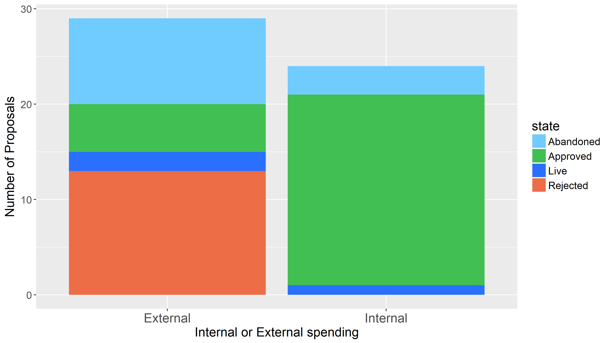
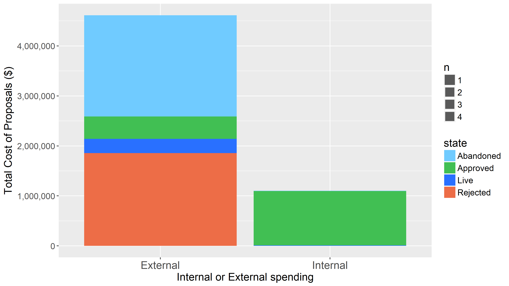

Politeia has been live for one year now, and I have been reflecting on how it has gone in relation to what I was [expecting and hoping](https://blockcommons.red/post/politeia-launch/) when it launched. For a more quantitative view see this [report](/publications/politeia-at-1/).

## Voting to make decisions

As a Decred contributor, having Politeia available is great because now issues where there is no clear consensus among the community can be resolved by a stakeholder vote. For anyone who has not experienced participating in a decentralized peer production effort where there is no hierarchical structure determining who can overrule who - it can be difficult to make decisions in the absence of clear consensus among the contributors. More frustratingly, it can be difficult to draw a line under contentious issues and avoid spending inordinate amounts of time discussing them in a stalemate. 

For decisions relating to Treasury spending or policy, there is now a well-defined method of making them. Someone makes a proposal, when the discussion has run its course there is a week-long ticket vote and the decision is made.

One of the most interesting things about the year has been getting to know what kind of work or service provision the stakeholder community values and wants to fund. Given that the system is entirely opt-in, it is perhaps not surprising that there is strong support for proposals that are seen as being core parts of the broader Decred project. 13 of the 25 proposals to be approved had 90% or greater approval from the tickets that voted. 

This included core work like [Decentralizing Treasury Spending](https://proposals.decred.org/proposals/c96290a2478d0a1916284438ea2c59a1215fe768a87648d04d45f6b7ecb82c3f), funding to prepare a block header commitments [DCP and consensus rule change proposal](https://proposals.decred.org/proposals/0a1ff846ec271184ea4e3a921a3ccd8d478f69948b984445ee1852f272d54c58), and a [policy](https://proposals.decred.org/proposals/fa38a3593d9a3f6cb2478a24c25114f5097c572f6dadf24c78bb521ed10992a4) for clearing new Decred contractors (all with >95% approval). Perhaps more surprisingly, each of the 3 proposals related to the [DEX](https://proposals.decred.org/proposals/417607aaedff2942ff3701cdb4eff76637eca4ed7f7ba816e5c0bd2e971602e1
), which had seemed like a more controversial subject based on community discussions, passed with 90%+ approval.

In addition to the equality of peers, decentralized projects have another set of issues to address in the form of permissionless participation. When the discussion is on a public platform and anyone can join in, it's easy for saboteurs, provocateurs and misguided people to wander in and voice loud support for some sub-optimal course of action. Arguments with people who are just there to cause trouble and misdirection can be exhausting, especially when the decisions are being made within the discussion itself. With a sybil-resistant method of actually making the decisions and assurance that the people voting have skin in the game, this takes some of the weight and heat out of discussions.

The proposals with 90%+ approval relate to software development, policy and research, and all but one of them came from a proposer who was already a contractor. This indicates a high degree of stakeholder support for the contractors working in those domains, who are making those proposals. Outside these domains, looking at marketing, integration and market making proposals, the response from stakeholders is more mixed.

The question of whether Decred should spend Treasury funds on marketing type activities, and how much, has been a contentious one in discussions for a long time. With Politeia we have seen that there is clearly support among the stakeholders for this kind of spending, with substantial [Marketing](https://proposals.decred.org/proposals/c84a76685e4437a15760033725044a15ad832f68f9d123eb837337060a09f86e) and [Events](https://proposals.decred.org/proposals/d3e7f159b9680c059a3d4b398de2c8f6627108f28b7d61a3f10397acb4b5e509) budgets for 2019 being approved (83% and 89% approval respectively). The question of whether to hire a PR firm proved more contentious, with Ditto's first [proposal](https://proposals.decred.org/proposals/27f87171d98b7923a1bd2bee6affed929fa2d2a6e178b5c80a9971a92a5c7f50
) passing with just 62% approval, and the highest voter turnout (51%) of any proposal in the first year.

## Request for Proposals

The first Ditto proposal was interesting because it was also the first "competitive" proposal.  Another PR firm ([Wachsman](https://proposals.decred.org/proposals/bc8776180b5ea8f5d19e7d08e9fcc35f0d1e3d16974963e3e5ded65139e7b092)) had also been invited to submit a proposal, and so the stakeholders had a choice of which firm to hire (if any). In this case it was Dustorf the led the effort to screen PR firms and invited these two to submit proposals, briefing them on where the project was at and how he saw the objectives of their role. The approach to market makers later followed a similar pattern, where jz, Max Bronstein and Chris Burniske screened and invited a number of liquidity providers to submit proposals that conformed to a specific type of offer.

This kind of Request for Proposals (RFP) process seems to work well, in that competition between proposal owners motivates them to make more competitive offers. Observing this kind of ad hoc competition between proposals has allowed us to identify a number of ways in which Politeia can be efficiently augmented to better support this kind of RFP process. A new type of RFP proposal is in development which will group the competing proposals together and allow for the rules of the particular RFP to be specified in detail.

## Watching the votes come in

It surprised me how engaging it can be to watch proposal votes play out. When you are interested in the proposal and have participated in discussions about it for some time, there's a real sense of curiosity about how the votes will go. The competitive proposals have been quite exciting, with the difference between proposals tending to be quite narrow in the early part of the week before one proposal started to stretch out a lead. 

It was also fun to build up [charts](https://twitter.com/slices_of_pi/status/1101580340076924930?s=20) (with s_ben and snr01) so that we could look at the detail of how the votes came in following the hourly updates from the public data [repository](https://github.com/decred-proposals/mainnet). A version of the proposal voting charts was subsequently done properly by [dcrdata](https://explorer.dcrdata.org/proposals), so that these are available on demand for anyone who wants to check them.

One character emerged from looking at these charts, "the 4k whale", a chunk of around 4,000 tickets that voted all at once in the same direction in the same commit (so probably but not definitely the same stakeholder) on many of the proposals. The 4k whale tended to vote near the end of the week, and in the same way as the majority had already voted. Towards the end of the year they seem to have adopted vote trickling to make it less obvious that all of their tickets are controlled by the same stakeholder. RIP 4k whale, by adopting privacy tools we will no longer be able to see how many tickets they're voting with, whether they will retain that impressive stack or even add to it.

## Internal and External spending

The post I wrote one year ago talked a lot about "internal" (expanding the contractor collective to do more "in house") and "external" spending (hiring external parties with a more fixed-term and transactional relationship to the project).

I have labelled each proposal as "Internal" or "External", the labels don't always fit very well but here are the results of looking at proposals through this lens. There were 24 Internal proposals and 29 External proposals according to my categorizations.

Proposals that are Internal (the work will be conducted by contractors or people who intend to become contractors and contribute to the project on an ongoing basis) were much more likely to be approved. The major External proposals to be approved concerned PR (Ditto are an external entity that the Treasury has contracted with) and market making (i2 Trading is also an external entity). However, in practice the Ditto employees who work on Decred have integrated with the other contributors quite seamlessly, joining and participating in the relevant discussion channels. i2 Trading are an external entity but it is operated by stakeholders who have been contributing to the Decred ecosystem in a number of ways over a sustained period of time.

The idea that Decred Treasury funds should be going to people who have a long term relationship with the project seems to be shared by many of the stakeholders and contributors. 

## Rejection and Abandonment

In the early part of the year there were a number of proposals from people who were unknown to the project, some requesting large budgets (two proposals from REUM stand out, requesting more than $1 million each, and the Baeond card game looking for $220,000). After a number of these proposals were roundly rejected with approval rates of < 5%, this kind of highly speculative proposal became less common. 

In the first few months, it became clear that proposals would not always make it to a vote. Some proposal owners stopped responding to comments and did not authorize their proposal to begin voting. A method whereby admins can mark a proposal as abandoned was added, this moves the proposal to a tab where all of the Abandoned proposals are displayed, and keeps them out of the way on the main tabs.

In some cases later on, proposal owners decided to abandon their proposal in response to critical comments, rather than proceed to a vote they thought was unlikely to pass. This is quite interesting, as it indicates that some proposal owners care about how they are perceived by the stakeholder community and will try to avoid embarrassment or stigma associated with a proposal that gains few yes votes. At this point proposal owners have already paid their 0.1 DCR, which they're not getting back in any case, so there is no other reason to avoid pushing the button to allow voting to commence, other than perhaps a desire to avoid wasting stakeholder time.

## Immutable Public Record

One thing I didn't fully anticipate until I started contributing on Pi is that it can be quite intimidating to know that all of your proposals and comments will forever be preserved in the immutable public record of Decred's governance. Proposals can be edited, and although the previous versions are preserved in the history and viewable through the interface, mistakes can be corrected or pushed out of view. 

Comments have no edit or delete option as of now, if you spot a typo of change your mind there's not much you can do except leave another comment to clarify. Capacity to edit the displayed version of comments would be a nice feature, and I would guess it will be added at some point after the migration to a new data storage system (underway), although it's probably not a high priority.

Community members discuss proposals in places other than the proposals site. It is much more comfortable to chat about a proposal in a discussion channel than to leave comments on Pi, so that's what many people do. The downside is that many stakeholders are not in the discussion channels and the information is not well stored, so we make an effort to capture more important questions or comments on the proposals site, sometimes reminding each other to do so.

## After Approval

For proposals that are approved, this marks the start or continuation of a relationship with the Treasury where the responsible parties deliver on what they proposed, and then get paid. This usually seems to go fairly smoothly, although there have been a few bumps in the road with proposals that went over budget or did not follow through with what they had proposed.

What's happening behind the scenes here is a migration away from a more manual pre-Politeia way of doing things. The Contractor Management System (CMS) is a big part of this, and it has been used for handling contractor billing since April. The next major component that will be added is functionality to support the DCC process whereby contractors within a domain will approve new contractors or revoke clearance where it isn't working out. 

The CMS will also be able to produce spending figures per proposal and domain, when the necessary code has been written. Tracking progress of proposals and whether they have been completed/paid is an area where there is room for improvement.

Proposal owners give varying levels of commentary on how they are progressing or what they are achieving. In some cases they may not say much, but usually proposal owners are responsive to questions and give progress reports of some type in some location. The problem is that this information can be scattered around and difficult to locate for someone who is interested in a specific proposal. The [Decred Journal](https://github.com/xaur/decred-news) and [Politeia Digest](https://blockcommons.red/politeia-digest/) are aiming to fill this gap to some degree by capturing relevant news as it comes out. Politeia itself will also I believe be extended to allow for greater tracking of proposal progress and relevant information - or this could be covered by a supporting site. I think it's important that, for every proposal which is approved, there is a standard place where you can go to find all of the relevant outputs or news about progress. 

Decred's culture is one of showing what you can do and assessing work product on its merits. With this in mind, it is interesting to look at proposals which seek renewal or extension of an established project, so far there have only been 3 of these (Ditto, Bounty Program and Open Source Research) but they have all been approved, usually with a higher approval level than the original proposal. So far, the stakeholders have been happy to extend all of the funded proposals that have sought extension. This is in a way the ad hoc solution to proposal reporting - people do it when they come back to Politeia to seek further funding. 

The "contribute first" philosophy has also resulted in a number of proposals which seek payments for work that has already been completed, either [in](https://proposals.decred.org/proposals/78b50f218106f5de40f9bd7f604b048da168f2afbec32c8662722b70d62e4d36
) [part](https://proposals.decred.org/proposals/f0d1bd7447182328b44c691de88cb660b63df17f1f3a94990af19acea57c09bb
) of in [full](https://proposals.decred.org/proposals/20e967dad9e7398901decf3cfe0acf4e0853f6558a62607265c63fe791b8b124). This kind of request for payment in arrears has been discussed on each of the proposals, with some people feeling it is not appropriate and others seeing it as aligned with the Decred approach. When stakeholders have appreciated the work, it already being completed has not been an issue in approving the proposals, some like this have been approved with >90% Yes votes. [TinyDecred](https://proposals.decred.org/proposals/20e967dad9e7398901decf3cfe0acf4e0853f6558a62607265c63fe791b8b124) is a good example, a whole python library that started as a casual project to learn Decred was overwhelmingly approved  when the proposer (who has also been working on other projects for Decred) asked for payment some time later. 

## Politeia's Place

Politeia is a place for finding out whether the stakeholders support a particular course of action. Proposals may look for approval to fund something that the contributor or contractor community has already decided is a good idea, they may seek to resolve an issue of contention, or they may present a brand new idea (and proposer) to the stakeholder community.

For people who are considering getting involved in Decred, it's a good idea to start by talking to the contributors who are already active in the relevant domain(s). In many cases (particularly software development) there are open projects that are looking for contributions and have budgets available to pay people. If what you want to do fits into one of these projects you don't need to go to Politeia at all.

If what you want to do is not already covered by a proposal, it's worth finding out whether contributors in that domain see value in your plans before going to Politeia. There is probably already some relevant work going on in the project, and proposals that integrate well with the existing effort are more likely to be approved. There are people who have been working on Decred for years and are very well known to the stakeholders, my impression is that this counts for quite a lot when it comes to proposal outcomes.

If you decide a Politeia proposal is the best way to try and move the Decred project in the direction you want to see it go in, this [guide](https://medium.com/@decreddragon/writing-proposals-on-politeia-pi-e345621652a2) has a lot of good tips on how to put one together.